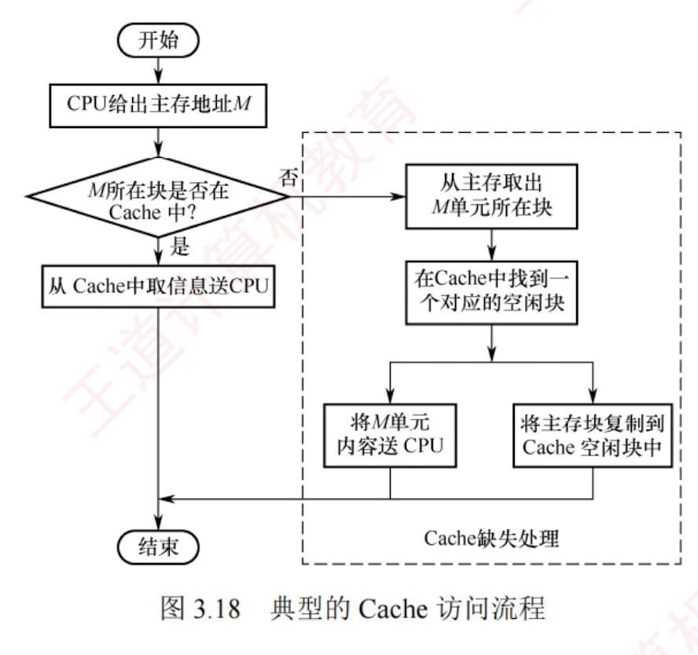

---

### 3.5.2 Cache 的基本工作原理

为便于 Cache 与主存交换信息，Cache 和主存都被划分为**大小相等的块**，Cache 块也称 **Cache 行**，每块由若干字节组成，块的长度称为 **块长**（也称行长）。  
因为 Cache 的容量远小于主存的容量，所以 Cache 中的块数要远少于主存中的块数，Cache 中仅保存主存中最活跃的若干块的副本。  
因此，可按照某种**策略**预测 CPU 在未来一段时间内待访存的数据，将其装入 Cache。

#### 1. Cache 的访问过程

图 3.18 所示为典型的 Cache 访问流程。CPU 执行程序时，每当需要从主存取指令或读/写数据，

首先访问 Cache。若所需信息已在 Cache 中（称为 **Cache 命中**），则直接从 Cache 读取，无须访问主存；  
若未命中（也称缺失），则需从主存中将该地址所在的一个主存块整体调入 Cache，并将该块写入一个 Cache 行（若 Cache 已满，则按替换算法选择被替换块）。  
此后，CPU 再从 Cache 中获取所需数据。  
整个访问过程（包括命中判断、块调入、替换等）必须在单条指令执行周期内完成，因此**完全由硬件实现**。  
Cache 机制对程序员是**透明**的。

上述访问流程是**先查 Cache，未命中再访主存**，这是统考真题遵循的方式。  
部分系统采用“**并行访问**”策略（同时查 Cache 和主存），若命中，则提前终止主存访问，但考试中通常不涉及。

---

#### 2. Cache 的命中率分析

**CPU 所需访问的信息已在 Cache 中的概率称为 Cache 命中率**。  
设某程序执行期间，Cache 命中次数为 $N_c$，访问主存的次数为 $N_m$（未命中次数），则命中率 $H$ 定义为

$$H = N_c / (N_c + N_m)$$

命中时：CPU 直接从 Cache 读取数据，耗时为命中时间 $T_c$（访问 Cache 的时间）。

未命中时：需先从主存读取包含目标数据的一个主存块送入 Cache，再将所需数据送至 CPU，总耗时为 $T_m + T_c$。  
其中 $T_m$ 称为缺失损失，即从主存调入一个块所需的时间。

因此，Cache-主存系统的平均访问时间 $T_a$ 为

$$T_a = HT_c + (1 - H)(T_m + T_c) = T_c + (1 - H)T_m$$

**【例 3.2】** 假设 Cache 的速度是主存的 5 倍，且 Cache 的命中率为 95%，则采用 Cache 后，存储器性能提升多少（假设系统先访问 Cache，未命中时才访问主存）？

**解：** 设 Cache 的存取时间为 $t$，则主存的存取时间为 $5t$。系统的平均访问时间 $T$ 为

$$\begin{aligned}

T &= \text{命中时的访问时间} \times \text{命中率} + \text{缺失时的访问时间} \times \text{缺失率} \

&= 0.95 \times t + 0.05 \times (t + 5t) = 1.25t

\end{aligned}$$

或等价地

$$T = \text{命中时的访问时间} + \text{缺失时的访存开销} \times \text{缺失率} = t + 0.05 \times 5t = 1.25t$$

可见，采用 Cache 后，存储器性能提升至原来的 $5t / 1.25t = 4$ 倍。

根据 Cache 的读、写流程可知，实现 Cache 时需解决以下关键问题：

1. **数据查找**。如何快速判断所需数据是否在 Cache 中。
    
2. **地址映射**。主存块如何存放在 Cache 中，以及如何将主存地址转换为 Cache 地址。
    
3. **替换策略**。当 Cache 已满时，采用何种策略选择被替换的 Cache 行。
    
4. **写入策略**。如何在保证主存与 Cache 数据一致性的前提下，尽可能提升写操作效率。
    

