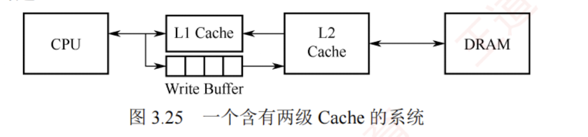

---

### Cache 的应用

#### 分离 Cache

随着指令流水技术的发展，现代处理器通常将指令 Cache 和数据 Cache 分开设计，形成分离的 Cache 结构。  

统一 Cache 的优点在于其设计和实现相对简单，但在流水线执行中，取指部件和执行部件同时访问同一 Cache 时容易产生冲突。  

通过采用分离 Cache 结构，不仅可以消除这类冲突，还能针对指令和数据的不同局部性特征进行优化，从而提升整体性能。

#### 多级 Cache

现代计算机普遍采用多级 Cache 结构。以两级为例，按距离 CPU 的远近分别称为 L1 Cache 和 L2 Cache：L1 离 CPU 最近，速度最快、容量较小；L2 则较远，速度较慢、容量较大。通常情况下，L1 级会采用分离的指令 Cache 和数据 Cache 设计，其中 L1 数据 Cache 在写操作中采用写分配法（写不命中时加载块）与回写法（写命中时不立即写主存）相结合的策略。

图 3.25 展示了一个典型的两级 Cache 系统。通常，L1 和 L2 Cache 均采用回写法，当 L1 发生写命中时，仅更新 L1；当 L1 块被替换时，若为脏块，则写回 L2；L2 同理，在替换时写回主存。由于 L2 Cache 的访问速度远高于主存，L1 无须在写命中时访问主存，仅更新本地 Cache 即可快速完成写操作；后续的脏块写回由 L2 高效承接，从而有效避免因频繁写操作导致的写缓冲饱和或溢出问题。

