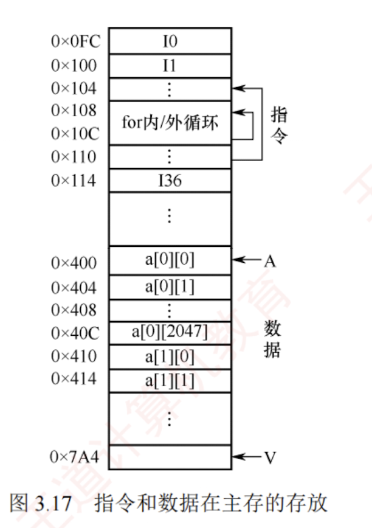

---

程序的转移概率通常较高，数据分布也较为离散，因此单纯依赖并行主存系统来提升主存效率是有限的。高速缓存（Cache）具有比主存更快的访问速度，因此在 CPU 与主存之间设置 Cache 可以显著提升存储系统的整体效率。  

**Cache 由 SRAM 组成，通常集成在 CPU 内部**。
### 程序访问的局部性原理

#### 时间局部性和空间局部性

Cache 的设计基于程序访问的局部性原理，包括**时间局部性和空间局部性**。


**时间局部性**是指如果某条指令或数据项当前被访问，则在不久的将来很可能再次被访问。这源于程序中存在循环、重复调用的子程序，以及对同一数据的多次操作。  

**空间局部性**是指如果某个存储单元被访问，则其邻近的存储单元在不久的将来很可能也被访问。这是因为指令通常顺序存放并顺序执行，而数据（如数组、向量）也往往以连续块的形式存储。

高速缓冲技术正是利用**局部性原理**，将程序当前活跃的部分数据暂存于容量小但速度极快的 Cache 中，使 CPU 的多数访存操作直接在 Cache 中完成，从而显著提升程序执行效率。

#### 举例

**【例 3.1】** 假设数组元素按行优先方式存储，对于以下两个程序：

程序 A：


```c
1   int sumarrayrows(int a[M][N])
2   {
3       int i, j, sum = 0;
4       for (i = 0; i < M; i++)
5           for (j = 0; j < N; j++)
6               sum += a[i][j];
7       return sum;
8   }
```

程序 B：


```c
1   int sumarraycols(int a[M][N])
2   {
3       int i, j, sum = 0;
4       for (j = 0; j < N; j++)
5           for (i = 0; i < M; i++)
6               sum += a[i][j];
7       return sum;
8   }
```

1. 对于数组 a 的访问，哪个程序的空间局部性更好？哪个时间局部性更好？
    
2. 对于指令访问，for 循环体的空间局部性和时间局部性如何？
    

**解：** 假设 M 和 N 均为 2048，按字节编址，每个数组元素占 4 字节，则指令和数据在主存中的存放情况如图 3.17 所示。



1. 对于数组 a，程序 A 和程序 B 的空间局部性差异显著。
    
    程序 A 按行访问：a[0][0], a[0][1], $\cdots$, a[0][2047], a[1][0], a[1][1], $\cdots$, a[1][2047] $\cdots$。访问顺序与存放顺序是一致的，由于连续访问的元素位于相邻地址，空间局部性良好。
    


程序 B 按列访问：a[0][0], a[1][0], $\cdots$, a[2047][0], a[0][1], a[1][1], $\cdots$, a[2047][1], $\cdots$。访问顺序与存放顺序不一致，每次访问均需跨越 2048 个元素，即 8192 字节，若主存与 Cache 的交换单位小于 8KB，则每次访问几乎都落在不同的 Cache 行中，空间局部性极差。

两个程序中，数组 a 的时间局部性均较差，因为每个数组元素仅被访问一次。


2. 对于 for 循环体的指令访问，程序 A 与程序 B 的局部性表现相同。因为循环体内的指令在内存中连续存放，顺序执行，空间局部性良好；整个循环共执行 $2048 \times 2048$ 次，时间局部性良好。
    

综上，尽管程序 A 与程序 B 功能完全相同，但由于内外循环顺序不同，导致对数组 a 访问的空间局部性存在巨大差异，进而造成实际执行效率的显著不同。