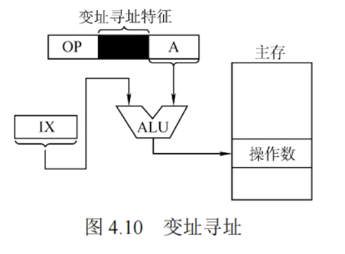

---

###  变址寻址

变址寻址是指将变址寄存器（IX）的内容与指令中的形式地址 A 相加，形成操作数的有效地址，即 $EA = (IX) + A$，如图 4.10 所示。IX 可以是专用变址寄存器或指定的通用寄存器。

变址寄存器面向用户，其内容（作为偏移量）可以在程序执行中由用户动态修改，而形式地址 A（作为基地址）保持不变。该方式不仅扩大了寻址范围，还特别适用于数组等数据结构的处理——通过调整 IX 的值，可高效访问数组中任意元素，非常适合编写循环程序。例如，假设数组 B 首地址为 1000H，存储在形式地址 A 中；变址寄存器 IX 初始为 0。要访问 B[3] 元素（每个元素占 4B），可将 IX 置为 0CH ($3 \times 4 = 12$)，则该元素 $EA = (IX) + A = 0CH + 1000H = 100CH$。

尽管变址寻址与基址寻址均通过“寄存器内容 + 形式地址”生成有效地址，但二者本质不同：基址寻址面向系统，基址寄存器（BR）的内容由操作系统设定且运行时不可变，用于支持多道程序和存储分配；而变址寻址面向用户，IX 的值可由程序动态调整，用于灵活的数据访问。

相对寻址、基址寻址和变址寻址均属于偏移寻址，其共同特点是通过某个寄存器的值与形式地址相加来确定操作数的有效地址，便于统一理解和应用。
