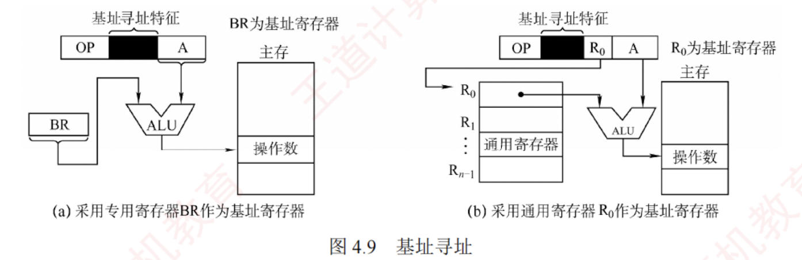

---

### 基址寻址

基址寻址是指将**基址寄存器**（BR）的内容与指令中的**形式地址** A 相加，形成操作数的有效地址，即 $EA = (BR) + A$，如图 4.9 所示。  

BR 可以是**专用基址寄存器或指定的通用寄存器**。  

在多道程序环境下，基址寄存器的内容由**操作系统**设定，在程序执行期间保持不变（作为基地址），而形式地址 A 作为偏移量，由用户程序指定并可根据需要变化。  

当使用**通用寄存器**作为基址寄存器时，尽管**用户可选择**哪个寄存器扮演此角色，但其内容仍由**操作系统**控制。

**优点**是：可扩大寻址范围（因基址寄存器位数通常大于形式地址 A），能访问更大的地址空间；  
简化编程，用户无须关注程序在主存的具体位置，有利于多道程序设计和浮动程序的实现。  
**缺点**是：形式地址 A 的位数较短，**限制了偏移量的范围**。

---
作为你的 **“408 计算机组成原理复习助手”**，我为你精准拆解现代操作系统实现多道程序并发和动态重定位的底层硬件基石——**基址寻址（Base Addressing）**。

在 408 统考中，它几乎必定和“变址寻址”放在一起考查“概念辨析”与“透明性”陷阱。

### 结论

**基址寻址**是指将**基址寄存器（BR）**的内容与指令中的**形式地址 $A$** 相加，形成操作数的真正的有效物理地址。 **核心公式：$EA = (BR) + A$**。

---

### 关键点：核心机制与宏观作用

根据资料，你必须掌握基址寻址的以下 4 个核心设定：

**1. 角色分工（谁提供起点，谁提供偏移）**

- **基址寄存器 `(BR)`**：提供程序的“起点”（基地址）。在程序执行期间，其内容**保持不变**，并且由**操作系统**负责设定。
- **形式地址 `A`**：提供数据距离起点的“相对偏移量”。它由用户程序指定，并可根据程序的执行需要发生变化。

**2. 硬件实现**

- 基址寄存器既可以是计算机中专门设置的**专用基址寄存器**，也可以由用户程序指定的某个**通用寄存器**来充当。

**3. 核心目的：实现“动态浮动”与“多道程序设计”**

- **机制**：在多道程序环境下，程序每次被加载到内存的物理位置都是不确定的。有了基址寻址，程序员编写代码时完全无须关心程序将来存放在主存的具体位置。操作系统在加载程序时，只需给程序分配一个起始地址并塞进 `BR` 中，程序就能正常运行。这极大地有利于**多道程序设计和程序的动态浮动（重定位）**。

**4. 性能考点**

- **扩大寻址范围**：由于基址寄存器的位数通常远大于指令中较短的形式地址 $A$，基址寻址可以有效扩大程序的寻址范围。
- **访存次数**：经过一次加法运算算出有效地址后，在指令的执行阶段仅需 **1 次**访存即可取到操作数。

---

### ⚠️ 易错点 / 易混点（408 必考排雷区）

这是第四章选择题中最致命的考点，请务必将以下对比刻入脑海：

**1. 致命高频对比：基址寻址 vs 变址寻址（谁变谁不变？）** 命题人极其喜欢把这两个公式一模一样（都是加法）的寻址方式拿来让你辨析：

- **基址寻址（面向操作系统）**：在程序执行过程中，**基址寄存器 `(BR)` 的内容不变**（起点固定），**形式地址 `A` 改变**（偏移量在变）。
- **变址寻址（面向用户程序员）**：形式地址 `A` 保持不变（通常作为数组首地址），而变址寄存器 `(IX)` 的内容不断改变（作为循环的步长或索引）。

**2. 透明性陷阱：基址寄存器对谁可见？**

- **分配权的归属**：无论使用哪种寄存器，基址寄存器里面的具体数值始终由**操作系统**分配，用户无权干涉。
- **对程序员的透明性**：
    - 如果硬件采用的是**专用基址寄存器**，那么它对用户程序员是**完全透明（不可见）**的。
    - 如果硬件采用的是**通用寄存器**充当基址，用户程序员可以在指令中明确指定“用哪个通用寄存器（如 `R1`）”来作为基址，此时这部分选择权对用户是可见的，但其中的具体基地址值仍由操作系统决定。

---

### 💡 记忆提示（万达广场搬家模型）

你可以把基址寻址想象成**“在万达广场找店铺”**：

- **基址寄存器 `(BR)`** = 万达广场在城市里的**绝对经纬度坐标**。这个坐标由市长（操作系统）规划决定，一旦建好（程序运行期间）就不会变。
- **形式地址 `A`** = 广场内部的**相对店铺号**（比如“往里走 50 米”）。这个是由商场图纸（程序员）写死在指令里的。
- **动态浮动（重定位）的好处**：如果有一天万达广场整体搬迁到了城市的另一个区，市长只要把新的经纬度更新到基址寄存器 `BR` 里就行了。商场内部每一家店铺的相对位置 `A` 完全不需要重新喷漆重写！这就完美解释了为什么基址寻址能适应程序在主存中的任意浮动。