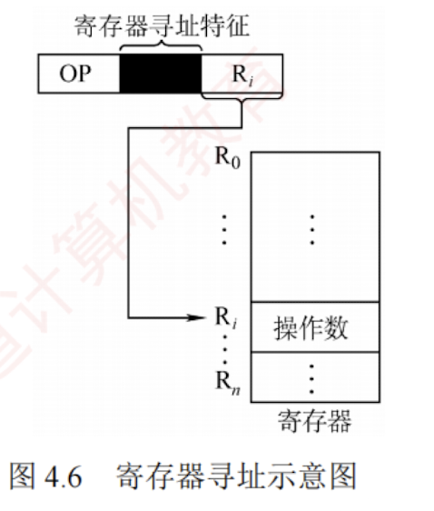

---

### 寄存器寻址

与直接寻址类似，寄存器寻址将操作数存放在寄存器中，指令的地址字段给出的是操作数所在寄存器的编号，即 $EA = R_i$，操作数位于由 $R_i$ 指定的寄存器内，如图 4.6 所示。例如，若 CPU 有 32 个通用寄存器，则寄存器编号需 5 位，形式地址字段仅需 5 位即可寻址全部寄存器。

优点是执行阶段无须访存，仅访问寄存器，执行速度快；且因寄存器数量远少于内存单元，地址码位数较少，有助于缩短指令字长；缺点是寄存器成本高，CPU 中可用寄存器数量有限。
