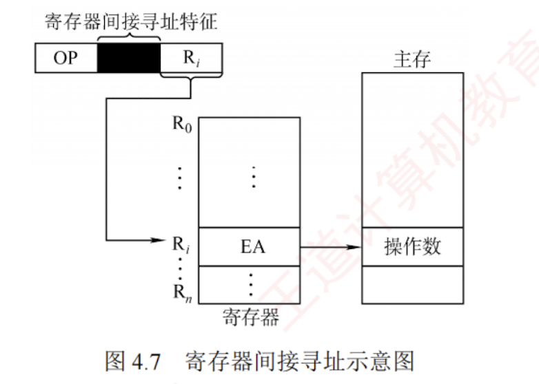

---

### 寄存器间接寻址

寄存器间接寻址结合了**间接寻址**和**寄存器寻址**的特点，指令中的 $R_i$ 所指寄存器中存放的不是一个操作数，而是操作数所在主存单元的地址，即 $EA = (R_i)$，如图 4.7 所示。

相比间接寻址，寄存器间接寻址在执行阶段**只需一次访存**，减少了访存开销；同时，由于该方式使用寄存器来存储有效地址，其寻址范围不受形式地址字段位数限制，从而扩大了寻址范围。相比寄存器寻址，这种方式在执行阶段需要从主存获取操作数，增加了访存需求。

---

作为你的 **“408 计算机组成原理复习助手”**，我来为你串联我们之前讲过的“寄存器寻址”与“间接寻址”，为你精准拆解它们两者的结合体——**寄存器间接寻址（Register Indirect Addressing）**。

这也是 408 指令系统选择题中考查“访存次数计算”和“寻址范围”的绝对高频考点。

### 结论

**寄存器间接寻址**是指指令字中的地址字段给出了一个寄存器编号（$R_i$），但这个寄存器里装的**不是操作数本身，而是操作数所在主存单元的有效物理地址**。 用 408 必考的公式表达就是：**$EA = (R_i)$**。 简单来说，就是 CPU 内部的寄存器里存放了一个指向主存的“指针”。

---

### 关键点：机制与性能优势

根据资料，你需要从以下 3 个维度彻底掌握它的核心物理设定：

**1. 核心机制：借道寄存器找内存**

- **执行逻辑**：CPU 译码后，先去访问内部极快的通用寄存器 $R_i$，从中读出一个地址值（有效地址 $EA$）。然后，CPU 把这个 $EA$ 送入 MAR（存储器地址寄存器），去主存中把真正的操作数取回来。

**2. 核心考点：执行阶段仅需 1 次访存**

- **推导**：因为去找“指针”这一步是在 CPU 内部的寄存器完成的（不属于访问主存），所以整条指令在**执行阶段只需要 1 次主存访存**（拿着指针去主存取真实数据）。

**3. 核心优势：兼顾速度与寻址范围**

- **扩大寻址范围**：指令字里的地址码很短（只需指明寄存器编号），但通用寄存器的字长很长（例如 32 位）。因此，寄存器里存放的主存地址可以覆盖高达 4GB 的空间，完美突破了指令字长的限制。
- **提升速度**：相比于纯粹的“主存间接寻址”（执行期需要 2 次访存），寄存器间接寻址把找指针的动作移到了 CPU 内部，成功省去了一次主存访问，大幅减少了访存开销。

---

### ⚠️ 易错点 / 易混点（408 必考对比陷阱）

在 408 考场上，命题人极其喜欢把你搞晕。请务必在脑海中建立以下“访存次数”的对比肌肉记忆：

**致命陷阱：看到“寄存器”或“间接”就想当然**

- **寄存器寻址 $EA = R_i$**：数据就在寄存器里。执行阶段访存 **0** 次。速度最快，但数据量受限。
- **寄存器间接寻址 $EA = (R_i)$**：寄存器里是内存指针。执行阶段访存 **1** 次。速度适中，寻址范围极大。
- **（主存）间接寻址 $EA = (A)$**：内存里套着内存指针。执行阶段访存 **2** 次。速度最慢。

_考场防坑提示_：做题时，务必看清题目问的是“执行阶段的访存次数”还是“完成该指令的总访存次数”。如果是“总访存次数”，对于单操作数指令，记得把**取指阶段的 1 次访存**也加上。

---

### 💡 记忆提示（办公寻宝模型）

结合我们之前的模型，你可以这样完美区分：

- **寄存器寻址**：文件就在你办公桌的 **1号抽屉** 里。伸手就拿，不用出门（0次访存）。
- **间接寻址**：你去档案室（主存）的 101号柜找，打开发现是一张纸条写着“去 8086号柜”。你得在档案室里**跑两趟**（2次访存）。
- **寄存器间接寻址**：你拉开办公桌的 **1号抽屉**（极快的内部访问），里面放了一张纸条写着“去档案室 8086号柜”。你拿着纸条去档案室，**只需跑一趟**就拿到了文件（1次访存）。