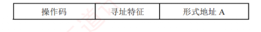

---

寻址方式是指确定指令或操作数有效地址的方法，包括确定下一条待执行指令的地址以及本条指令所需操作数 Adelaide 的地址。寻址方式分为**指令寻址**和**数据寻址**两大类。

### 指令寻址和数据寻址

确定下一条将要执行的指令地址称为指令寻址；  

确定本条指令操作数地址称为数据寻址。

#### 指令寻址

指令寻址有两种方式：顺序寻址和跳跃寻址。

##### 顺序寻址

通过程序计数器 (PC) 加上当前指令的字节长度，自动形成下一条指令地址。

**注意**

PC 自增的大小与编址方式和指令字长有关。  
现代计算机通常按字节编址，若指令字长为 16 位 (2 字节)，则 PC 自增为 $(PC) + 2$；  
若指令字长为 32 位 (4 字节)，则 PC 自增为 $(PC) + 4$。

##### 跳跃寻址

通过**转移类指令**实现。  
是否发生转移通常由状态寄存器中的条件码决定，转移目标地址由指令给出。  
转移方式分为：  
1. **绝对转移**，地址码直接给出目标地址；
2. **相对转移**，地址码给出相对于当前 PC 值的偏移量。  
   无论何种方式，转移指令的执行结果都是修改 PC 的值，CPU 随后根据新的 PC 从主存取出下一条指令。

#### 数据寻址

数据寻址指如何在指令中表示或计算操作数的地址。为区分不同寻址方式，**指令字中通常设有寻址特征字段**，其位数决定了可支持的寻址方式种类。典型指令格式如下：

|**操作码**|**寻址特征**|**形式地址 A**|
|---|---|---|

指令中的地址码字段所包含的地址称为形式地址 (A)，它不代表操作数的真实地址；真实地址需通过寻址方式由形式地址计算得出，称为有效地址 (EA)。

- 若为立即寻址，则形式地址 A 的位数决定了操作数的取值范围。
    
- 若为直接寻址，则形式地址 A 的位数决定了可寻址的存储空间大小。
    
- 若为寄存器寻址，则形式地址 A 的位数决定了通用寄存器的最大数量。
    
- 若为寄存器间接寻址，则寄存器的位数决定了可寻址空间大小。
    

**注意**

$(A)$ 表示地址 A 处所存放的内容，A 可以是寄存器编号或内存地址。