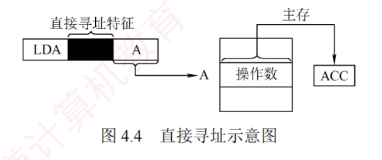

---

### 直接寻址

直接寻址是指指令中的形式地址 $A$ 就是操作数的真实地址 $EA$，即 $EA = A$，如图 4.4 所示。

优点是**实现简单**，无须额外计算操作数地址，执行阶段只需访存一次；缺点是形式地址 $A$ 的位数限制了寻址范围，且地址固定，难以动态修改。

例如，若形式地址字段占 24 位，则直接寻址范围为 $2^{24} = 16\text{M}$。

---

作为你的 **“408 计算机组成原理复习助手”**，我为你拆解指令系统中极其重要、也是访存计算题最爱考的基础寻址方式——**立即寻址（Immediate Addressing）**。

### 结论

**立即寻址**是指指令字中的地址字段（$A$）指出的不再是操作数的物理地址，而是**操作数的真实数据本身（即立即数）**。 简而言之，你需要运算的数值被直接“硬编码”嵌在了这条指令里。

---

### 关键点：机制与性能影响

根据资料，在 408 统考中你必须掌握立即寻址的以下 3 个核心设定：

**1. 核心机制与数据表示**

- **机制**：指令的地址字段即为操作数（形式地址 $A$ = 操作数）。
- **数据表示**：在计算机底层硬件中，这个直接给出的立即数通常采用**补码**表示。

**2. 性能优势：执行速度极快**

- **推导**：因为在“取指阶段”，CPU 已经把整条指令（包括嵌在里面的立即数）取到了 CPU 内部的指令寄存器（IR）中。
- **结论**：在指令的**执行阶段不需要访问主存**，因此这种寻址方式的指令执行时间最短。

**3. 主要缺点：数值范围严重受限**

- **限制**：立即数的大小严格受限于指令中地址字段 $A$ 的位数。
- _(举例说明)_：假设指令字长 16 位，操作码占 8 位，剩下 8 位作为地址字段 $A$。那么这条指令能包含的立即数范围只能是 $-128 \sim +127$（8位补码范围），你绝对无法在这条指令里放一个大小为 1000 的立即数。

---

### ⚠️ 易错点 / 易混点（408 核心排雷区）

在 408 的计算大题和选择题中，命题人极其喜欢在“立即寻址的访存次数”上给你挖致命陷阱：

**1. 极高频陷阱：立即寻址 = 0 次访存？**

- **错觉**：既然资料上写了“不访问主存”，那完成这条指令就不需要访存。
- **纠错（大坑！）**：资料原文说的是**“在执行阶段不访问主存”**！在指令刚开始的**取指阶段**，CPU 仍然必须访问 1 次主存，把这条指令从内存里捞出来。
- **考场实战**：如果题目问“采用立即寻址的单操作数指令，完成该指令共需几次访存？”答案必须是 **1 次**（取指 1 次 + 执行 0 次）。千万不要填 0！

**2. C 语言代码对应的底层辨析**

- 在 408 第二道综合大题（C语言与汇编对应）中，当你在 C 语言里写下类似 `int a = a + 5;` 这样的代码时，这个常数 `5` 在编译到底层汇编（如 x86 的 `add eax, 5`）时，大概率就会被当作**立即数**，直接嵌在机器码中，采用立即寻址方式被 CPU 极速执行。

---

### 💡 记忆提示（购物模型）

你可以把寻址方式想象成去超市买东西付款的过程：

- **直接寻址 / 间接寻址**：相当于你给收银员一张**储物柜的条形码**（内存物理地址），收银员必须自己跑去对应的储物柜（主存）把现金拿出来，非常耗时。
- **立即寻址**：你直接把一张 **100 元钞票（操作数本身）** 拍在收银台上。收银员看到指令的同时就拿到了钱（执行期 0 访存），当场就能完成交易，速度最快！代价是你的钱包（地址字段 $A$ 的位数）只有那么大，装不下太大的钞票。