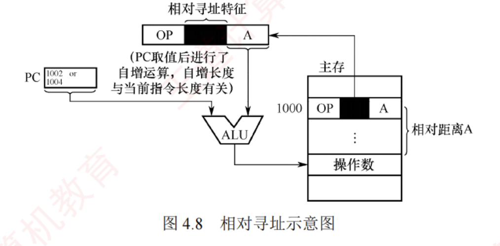

---

### 相对寻址

相对寻址是指将**程序计数器**（PC）的内容与指令中的**形式地址** A 相加，形成**转移目标地址**，

即 $EA = (PC) + A$，如图 4.8 所示。其中，PC 为取指完成后自动更新的值，指向下一条指令的地址；A 是相对于该 PC 值的偏移量，可正可负，通常以补码表示。

**相对寻址**主要用于**转移类指令**，形式地址 A 的位数决定了转移范围。  
例如，假设某机器按字节编址，指令长度为 2B。  
一条相对转移指令（JMP A）位于地址 1000H，其形式地址 A = 0005H（补码表示），则取指完成后 PC = 1002H，实际转移目标地址为 1002H + 0005H = 1007H。

优点是目标地址不固定，而是相对于当前指令位置偏移，因此程序可在内存中任意浮动而不影响转移正确性，便于实现重定位和共享代码。

---

作为你的 **“408 计算机组成原理复习助手”**，我为你精准拆解与“控制流跳转（如 if/for 循环底层的汇编实现）”息息相关的核心寻址方式——**相对寻址（Relative Addressing）**。

在 408 统考中，相对寻址是历年**计算“转移指令偏移量（Offset）”**的绝对核心，几乎每年必考！

### 结论

**相对寻址**是指把**程序计数器（PC）**的内容与指令中的**形式地址 $A$** 相加，从而形成操作数真正的有效物理地址。 **核心公式：$EA = (PC) + A$**。

简而言之，它表达的是一种**“相对当前位置的距离（偏移量）”**。

---

### 关键点：核心机制与宏观作用

根据资料，你必须掌握相对寻址的以下 4 个核心设定：

**1. 角色分工与数据表示**

- **程序计数器 `(PC)`**：提供当前执行流所在的“基准坐标”。
- **形式地址 `A`**：作为相对于 PC 值的**偏移量**。因为程序可能向后跳（跳到前面的地址），也可能向前跳，所以 $A$ **可正可负，通常以补码表示**。

**2. 最典型的应用场景**

- 相对寻址主要用于**转移指令**（如 `JMP` 无条件转移、`BEQ` 条件转移等），用来改变程序的执行顺序。

**3. 核心优势：实现代码浮动与共享**

- **机制**：由于跳转的目标地址不是固定死锁的绝对地址，而是“相对于当前指令位置的偏移”，这意味着一段程序无论被装载到内存的 1000H 还是 8000H，只要这段代码内部的相对距离不变，跳转指令就依然完全正确。
- **结论**：这种特性使得程序可以在内存中任意浮动，**便于实现程序的动态重定位和代码共享**。

---

### ⚠️ 易错点 / 易混点（408 极高频必背陷阱）

这是 408 指令系统计算题中**最容易死人的坑**，请务必在脑海中建立钢铁般的防线：

**1. 致命陷阱：公式里的 PC 到底等于几？**

- **错觉**：很多人以为执行当前跳转指令时，PC 就是这条跳转指令本身的地址。
- **真相（大坑！）**：根据 CPU 的指令执行流程，在“取指阶段”完成后，**PC 会立刻自动加上当前指令的长度**。因此，在执行阶段计算 $EA = (PC) + A$ 时，参与相加的 PC 值**必定是“下一条指令的首地址”**，绝不是当前指令的地址！
- _实战推导_：假设当前跳转指令的地址是 `1000H`，指令长 `2` 字节，要求跳转到 `1010H`。那么取完指令后，PC 已经变成了 `1002H`。你必须用 `1010H - 1002H` 来逆推偏移量 $A$，而不是减去 `1000H`。

**2. 概念辨析：相对寻址 vs 基址寻址** 命题人最喜欢用“都能让程序浮动”来混淆这两者：

- **基址寻址 $EA = (BR) + A$**：基准点 $BR$ 指向的是**整个程序的起始物理位置**（由操作系统控制）。它解决的是整个程序放在哪里的问题。
- **相对寻址 $EA = (PC) + A$**：基准点 $PC$ 指向的是**程序内部下一条指令的位置**（由硬件自动更新）。它解决的是程序内部代码块之间互相跳转的问题。

---

### 💡 记忆提示（GPS 导航模型）

你可以把相对寻址想象成**“手机地图的语音导航”**：

- **直接寻址**：导航说“请前往北京市海淀区王道大厦”（给的是绝对物理地址）。
- **相对寻址**：导航说“请**从你当前的位置（PC），向前直行 500 米（偏移量 A）**”。
- **为什么便于程序浮动？** 无论你是在北京还是在上海（程序被加载到内存的不同位置），“向前直行 500 米”这个相对口令永远是有效的，它只跟你的当前位置有关，这就是相对寻址能实现“位置无关代码（PIC）”的底层直觉。