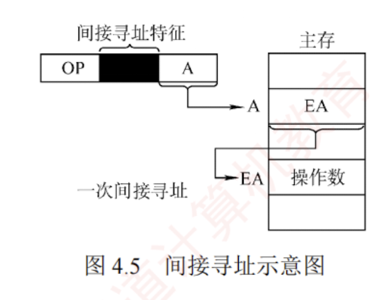

---

### 间接寻址

间接寻址是相对于直接寻址而言的，指令中的形式地址 $A$ 并不直接给出操作数的有效地址，而是指向一个主存单元，该单元中存放操作数的有效地址，即 $EA = (A)$，如图 4.5 所示。

优点是可扩大寻址范围（有效地址 $EA$ 的位数通常大于形式地址 $A$ 的位数，由存储字长决定），并支持地址动态生成（如实现指针和转移表）；缺点是指令执行阶段需多次访存（一次间址需 2 次访存）。由于访存开销较大，若需兼顾寻址范围与执行效率，通常采用寄存器间接寻址。

---

作为你的 **“408 计算机组成原理复习助手”**，我来为你拆解指令系统中与“指针”底层原理直接对应的核心寻址方式——**间接寻址（Indirect Addressing）**。

在 408 统考中，间接寻址常常作为“扩大寻址范围”的典型方案，以及“访存次数计算”的重点陷阱出现。

### 结论

**间接寻址**是指指令字中的形式地址（$A$）给出的不是操作数本身，也不是操作数的真实地址，而是**操作数有效地址所在的存储单元的地址**。 用 408 必考的公式表达就是：**$EA = (A)$**。简单来说，指令里藏着的是一个“指向数据地址的指针”。

---

### 关键点：机制与性能考点

根据资料，你需要从以下 3 个维度彻底掌握间接寻址的设定：

**1. 核心机制：二次寻址**

- CPU 拿着指令里的地址 $A$ 去主存中访问，拿到的不是需要运算的数据，而是该数据真正的物理有效地址 $EA$。CPU 必须拿着这个 $EA$ 再去主存访问一次，才能取回真正的操作数。

**2. 核心考点：极高的访存开销**

- **执行期访存**：一次间接寻址，在指令的**执行阶段需要 2 次访存**（第 1 次去主存取 $EA$，第 2 次去主存取真实操作数）。
- _(综合计算)_：如果这是一条单操作数指令，完成它总共需要 **3 次访存**（取指 1 次 + 执行 2 次）。因此，间接寻址的**指令执行速度较慢**。

**3. 最大优势：扩大寻址范围**

- 既然速度慢，为什么还要用？因为它可以突破指令字长对地址位数的限制。
- **推导**：假设指令字中分配给 $A$ 的长度只有 8 位（直接寻址只能访问 $2^8=256$ 个单元）。但如果主存字长是 16 位，那么存放在 $(A)$ 里面的真实地址 $EA$ 就有 16 位。这样通过间接寻址，寻址范围瞬间就被扩大到了 $2^{16} = 65536$ 个单元。

---

### ⚠️ 易错点 / 易混点（408 致命陷阱）

在综合大题和选择题中，命题人极其喜欢将普通的“间接寻址”和它的变种——“寄存器间接寻址”混在一起考访存次数：

**1. 极易混淆：间接寻址 vs 寄存器间接寻址（访存次数大坑）**

- **（主存）间接寻址 $EA=(A)$**：有效地址藏在**主存**里。执行阶段需要 **2 次**主存访存。
- **寄存器间接寻址 $EA=(R_i)$**：有效地址藏在 CPU 内部的**寄存器**里。CPU 直接从极快的寄存器拿到有效地址后，去主存拿数据。执行阶段只需要 **1 次**主存访存！
- _考场直觉_：看到“间接寻址”四个字，必须先瞪大眼睛看清楚地址是存在主存里还是寄存器里，选错直接导致访存次数算错。

**2. 多重间接寻址**

- 间接寻址还可以是多次的（比如主存里存的还是下一个主存地址）。每次寻址都会导致执行阶段的访存次数 $+1$。

---

### 💡 记忆提示（寻宝游戏模型）

你可以把寻址方式想象成一场**“寻找宝藏（操作数）”**的解谜游戏：

- **直接寻址**：纸条上直接写着“宝藏在 101 号储物柜”。你跑去 101 号柜子，打开直接拿到宝藏（执行期 1 次跑腿/访存）。
- **间接寻址（套娃）**：纸条上写着“线索在 101 号柜子”。你跑去 101 柜子打开一看，里面没有宝藏，而是另一张纸条写着“真正的宝藏在 8086 号柜子”（$EA$）。你不得不**再跑一趟** 8086 号柜子拿宝藏（执行期 2 次跑腿/访存）。
    - _虽然多跑了一趟，但小小的纸条（较短的形式地址 $A$）成功指引你找到了位于极远处、编号极大的柜子（扩大了寻址范围）_。