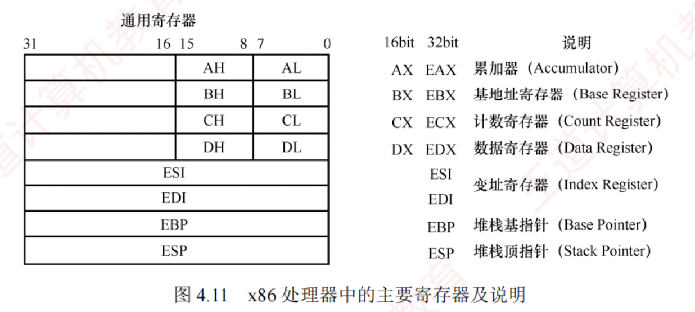

---
### 相关寄存器

x86 处理器中有 8 个 32 位通用寄存器，主要寄存器及说明如图 4.11 所示。  
为向后兼容早期的 16 位和 8 位架构，EAX、EBX、ECX 和 EDX 的低 16 位可作为独立寄存器使用（分别记为 AX、BX、CX、DX），而每个 16 位寄存器又可进一步拆分为两个 8 位寄存器（如 AX 分为 AH 和 AL）。  
其中，E 表示 Extended，用于标识 32 位寄存器。



除 EBP（基址指针）和 ESP（栈指针）外，其余通用寄存器的用途是比较灵活的。

### 2. 常用指令

汇编指令通常可分为数据传送指令、算术与逻辑运算指令和控制流指令，下面以 Intel 格式为例，介绍一些常用指令。以下用于操作数的标记分别表示寄存器、内存和常数。

- `<reg>`：表示任意寄存器，若其后带有数字，则指定其位数，如 `<reg32>` 表示 32 位寄存器（eax, ebx, ecx, edx, esi, edi, esp 或 ebp）；`<reg16>` 表示 16 位寄存器（ax, bx, cx 或 dx）；`<reg8>` 表示 8 位寄存器（ah, al, bh, bl, ch, cl, dh, dl）。
    
- `<mem>`：表示内存地址（如 `[eax]`、`[var + 4]` 或 `dword ptr [eax + ebx]`）。
    
- `<con>`：表示 8 位、16 位或 32 位常数。`<con8>` 表示 8 位常数；`<con16>` 表示 16 位常数；`<con32>` 表示 32 位常数。
    


x86 指令采用变长编码，其操作码通常为 1 字节，但整条指令长度可变。同一指令（如 mov）因操作数类型或寄存器不同，可能对应多种机器码编码，例如：

Plaintext

```
mov ax, <con16>                         #机器码为 B8H
mov al, <con8>                          #机器码为 B0H
mov <reg16>, <reg16>/<mem16>            #机器码为 89H
mov <reg8>/<mem8>, <reg8>               #机器码为 8AH
mov <reg16>/<mem16>, <reg16>            #机器码为 8BH
```

> **考点追踪** ▶ 模仿写出简单语句的机器级指令（2012）

（1）数据传送指令

1）**mov 指令**。将第二个操作数（寄存器内容、内存内容或常数值）复制到第一个操作数（寄存器或内存）。其语法如下：

Plaintext

```
mov <reg>,<reg>
```

---

Plaintext

```
mov <reg>,<mem>
mov <mem>,<reg>
mov <reg>,<con>
mov <mem>,<con>
```

举例：

Plaintext

```
mov eax, ebx                 #将 ebx 寄存器的值复制到 eax
mov byte ptr [var], 5        #将常数 5 存入地址 var 处的 1 字节内存单元
```

双操作数指令的两个操作数不能同时为内存，即 mov 指令不能用于直接从内存复制到内存。若需在内存之间复制，可先将源内存内容加载到寄存器，再从该寄存器写入目标内存。

2）**push 指令**。将操作数压入栈中，常用于函数调用和现场保护。ESP 是栈顶，入栈前先将 ESP 减 4（栈向低地址方向增长），再将操作数压入 ESP 所指地址。其语法如下：

Plaintext

```
push <reg32>
push <mem>
push <con32>
```

举例（注意，栈中元素固定为 32 位）：

Plaintext

```
push eax                     #将 eax 的值压入栈
push [var]                   #将地址 var 处的 4 字节内容压入栈
```

3）**pop 指令**。与 push 指令相反，从栈中弹出数据。出栈前先将 ESP 所指地址的内容读出，再将 ESP 加 4。其语法如下：

Plaintext

```
pop eax                      #弹出栈顶元素并存入 eax
pop [ebx]                    #弹出栈顶元素并存入 ebx 所指的 4 字节内存地址
```

---

（2）算术和逻辑运算指令

1）**add/sub 指令**。add 指令将两个操作数相加，sub 指令将第一个操作数减去第二个操作数，结果均保持在第一个操作数中。其语法如下：

Plaintext

```
add <reg>,<reg> / sub <reg>,<reg>
add <reg>,<mem> / sub <reg>,<mem>
add <mem>,<reg> / sub <mem>,<reg>
add <reg>,<con> / sub <reg>,<con>
add <mem>,<con> / sub <mem>,<con>
```

举例：

Plaintext

```
sub eax, 10                  #eax ← eax-10
add byte ptr [var], 10       #将地址 var 处的 1 字节内容与 10 相加，结果存回该地址
```

2）**inc/dec 指令**。分别对操作数执行自增 1 或自减 1 操作。其语法如下：

Plaintext

```
inc <reg> / dec <reg>
inc <mem> / dec <mem>
```

举例：

Plaintext

```
dec eax                      #eax 值自减 1
inc dword ptr [var]          #将地址 var 处的 4 字节内容自增 1
```

3）**imul 指令**。有符号整数乘法指令，支持两种格式：① 双操作数，将第二、第三操作数相乘，结果存入第一个操作数（必须为寄存器）；② 三操作数，将第二、第三操作数相乘，结果存入第一个操作数（必须为寄存器）。其语法如下：

Plaintext

```
imul <reg32>,<reg32>
imul <reg32>,<mem>
imul <reg32>,<reg32>,<con>
imul <reg32>,<mem>,<con>
```

举例：

Plaintext

```
imul eax, [var]              #eax ← eax * [var]
imul esi, edi, 25            #esi ← edi * 25
```

无符号整数乘法由 mul 指令实现，仅支持单操作数格式，被乘数隐含在 eax 中，乘积结果存放在 edx:eax 中。当 $edx \neq 0$ 时，表示结果无法用 32 位无符号数表示，CPU 置 CF = 1 和 OF = 1。imul

---

在结果溢出时，同样置 CF = 1 和 OF = 1。无符号乘法以 CF 判断溢出，有符号乘法则以 OF 为准。

4）**idiv 指令**。有符号整数除法指令，仅指定除数。被除数为 edx:eax 组成的 64 位有符号数（edx 为高 32 位，eax 为低 32 位）。执行后，商存入 eax，余数存入 edx。其语法如下：

Plaintext

```
idiv <reg32>
idiv <mem>
```

举例：

Plaintext

```
idiv ebx
idiv dword ptr [var]
```

无符号整数除法指令 div 的格式与 idiv 的完全一致，仅对操作数的解释不同。

5）**and/or/xor 指令**。分别执行按位与、或、异或操作，结果存入第一个操作数。其语法如下：

Plaintext

```
and <reg>,<reg> / or <reg>,<reg> / xor <reg>,<reg>
and <reg>,<mem> / or <reg>,<mem> / xor <reg>,<mem>
and <mem>,<reg> / or <mem>,<reg> / xor <mem>,<reg>
and <reg>,<con> / or <reg>,<con> / xor <reg>,<con>
and <mem>,<con> / or <mem>,<con> / xor <mem>,<con>
```

举例：

Plaintext

```
and eax, 0fH                 #将 eax 的高 28 位置 0，低 4 位保持不变
xor edx, edx                 #将 edx 清零
```

6）**not 指令**。按位取反指令，将操作数的每一位 0 变 1、1 变 0。其语法如下：

Plaintext

```
not <reg>
not <mem>
```

举例：

Plaintext

```
not byte ptr [var]           #将地址 var 处的 1 字节内容按位取反
```

7）**neg 指令**。取负指令，计算操作数的二进制补码（-x）。其语法如下：

Plaintext

```
neg <reg>
neg <mem>
```

举例：

Plaintext

```
neg eax                      #eax ← -eax
```

8）**shl/shr 指令**。逻辑移位指令：shl 为逻辑左移，shr 为逻辑右移，第一个操作数为被移位数，第二个操作数为移位位数。其语法如下：

Plaintext

```
shl <reg>,<con8> / shr <reg>,<con8>
shl <mem>,<con8> / shr <mem>,<con8>
shl <reg>,<cl> / shr <reg>,<cl>
shl <mem>,<cl> / shr <mem>,<cl>
```

举例：

Plaintext

```
shl eax, 1                   #eax 逻辑左移 1 位
shr ebx, cl                  #ebx 逻辑右移 n 位（n 为 cl 中的值）
```

---

（3）控制流指令

x86 处理器通过指令指针寄存器 EIP（相当于程序计数器即 PC）指示当前执行指令的地址。每条指令执行后，EIP 自动指向下一条指令。EIP 不能直接访问，但可通过控制流指令修改。程序中常用标签（label）标记指令地址，例如：

Plaintext

```
      指令①
begin:指令②
      指令③
```

此处标签 begin 指向第二条指令，控制流指令通过标签实现转移。

> **考点追踪** ▶ 无条件转移指令的指令格式（2021）

1）**jmp 指令**。无条件转移到 label 标签所指示的地址继续执行。其语法如下：

Plaintext

```
jmp <label>
```

---

举例：

Plaintext

```
jmp begin                    #转移到 begin 标记处执行
```

> **考点追踪** ▶ 条件转移指令与标志位的结合（2013）

2）**jcondition 指令**。条件转移指令，根据程序状态字寄存器中的状态标志（如零标志 ZF、符号标志 SF 等）决定是否转移。常见指令包括：

Plaintext

```
je <label>                   #相等时转移 (jump when equal)
jz <label>                   #结果为零时转移 (jump when last result was zero)
jne <label>                  #不相等时转移 (jump when not equal)
jg <label>                   #大于时转移 (jump when greater than)
jge <label>                  #大于等于时转移 (jump when greater than or equal to)
jl <label>                   #小于时转移 (jump when less than)
jle <label>                  #小于等于时转移 (jump when less than or equal to)
```

举例：

Plaintext

```
cmp eax, ebx
jle done                     #若 eax <= ebx，则转移到 done；否则顺序执行下一条指令
```

3）**cmp/test 指令**。cmp 指令执行减法运算但不保存结果，仅根据结果设置标志位；test 指令执行按位与运算但不保存结果，仅更新标志位（特别是 ZF）。其语法如下：

Plaintext

```
cmp <reg>,<reg> / test <reg>,<reg>
cmp <reg>,<mem> / test <reg>,<mem>
cmp <mem>,<reg> / test <mem>,<reg>
cmp <reg>,<con> / test <reg>,<con>
```

cmp 和 test 指令通常与 jcondition 指令配合使用。cmp 指令举例：

Plaintext

```
cmp dword ptr [var], 10      #将 var 处的 4 字节内容，与 10 比较
jne loop                     #若不相等则顺序执行；否则转移到 loop
```

test 指令举例：

Plaintext

```
test eax, eax                #测试 eax 是否为零
jz xxxx                      #若 eax 为零 (ZF=1)，则转移到 xxxx
```

> **考点追踪** ▶ call 指令的功能（2019）

4）**call/ret 指令**。分别用于实现子程序调用与返回。其语法如下：

Plaintext

```
call <label>
ret
```

call 指令将下一条指令的地址（返回地址）压入栈，然后转移到 label 处执行；ret 指令从栈顶弹出返回地址，并转移到该地址继续执行。call 和 ret 是函数调用机制的核心指令。

掌握上述指令的语法与功能，有助于解答相关考题。建议读者在学习 C 语言程序时，结合调试工具（如 GDB）查看其对应的汇编代码，以加深对机器级指令的理解。