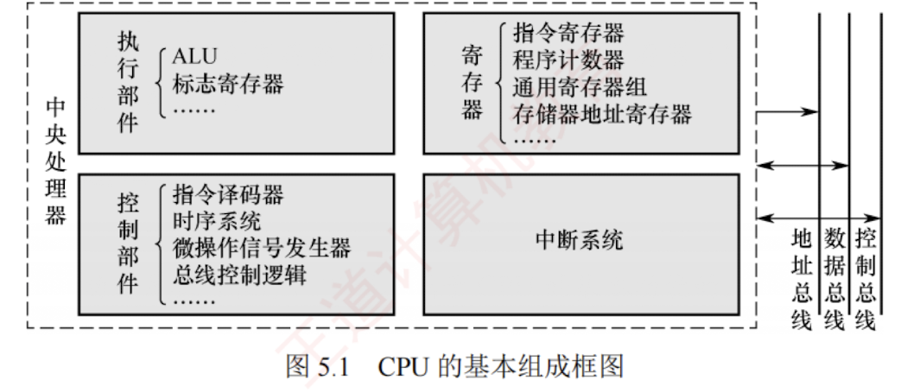

---

## 5.1.2 CPU 的基本结构

上述功能需求决定了 CPU 的内部结构组成。为实现完整的指令执行流程，CPU 必须包含若干关键功能部件：

- 为支持指令控制，需要设置**程序计数器（PC）**，用于存放即将执行指令的地址；
- 为完成指令译码，需要配备**指令寄存器（IR）**暂存当前指令，并由**指令译码器（ID）**解析操作码；
- **控制单元（CU）**综合译码结果、时序信号与状态标志，生成微操作控制信号序列，驱动各部件协同工作；
- **算术逻辑单元（ALU）**和**通用寄存器组（GPRs）**共同构成数据通路，负责操作数的暂存与运算；
- **中断机构**用于响应异常与外部中断请求；
- 此外，为协调 CPU 与主存之间的数据交换，还需要设置**存储器地址寄存器（MAR）**和**存储器数据寄存器（MDR）**。

图 5.1 展示了 CPU 的基本组成框图，其主要部件说明如下。

### 1. 程序计数器（PC）

存放即将执行的指令地址。顺序执行时自动递增（增量为当前指令所占的字节数）；遇到转移类指令时，更新为目标地址。程序启动前，首条指令地址被装入 PC。其**位数由地址总线宽度决定**，反映了 CPU 可直接寻址的内存空间大小。

### 2. 指令寄存器（IR）

暂存当前正在执行的指令。指令从主存取出后首先送入 IR，供**指令译码器**使用。其**位数等于指令字长**。[[什么是指令译码器]]

### 3. 通用寄存器组（GPRs）

供用户程序灵活使用，用于暂存操作数、中间结果或地址指针，减少对主存的频繁访问，提升执行效率。

### 4. 标志寄存器（FR）

也称**程序状态字寄存器**（PSWR）。保存 ALU 运算产生的状态信息，用于**条件判断与转移控制**。这些标志位通常由**触发器**实现，整体构成程序状态字。[[什么是触发器]]

### 5. 存储器地址寄存器（MAR）

存放当前要访问的主存地址。取指或数据读/写时，地址先送入 MAR，再通过地址总线传至存储器。其位数同样由**地址总线宽度**决定。

### 6. 存储器数据寄存器（MDR）

暂存从主存读出的数据或将要写入主存的数据，起到**缓冲与同步**作用，缓解 CPU 与主存之间的速度差异。

### 7. 指令译码器（ID）

对 IR 中的操作码进行分析，识别指令类型，并输出对应的译码信号。

### 8. 算术逻辑单元（ALU）

执行数据运算的核心部件，完成**算术与逻辑运算**。运算结果送回寄存器，状态标志则写入标志寄存器，供后续条件转移指令使用。

### 9. 时序信号产生部件

以系统时钟为基础，生成指令执行所需的周期、节拍和工作脉冲，为整个 CPU 提供时序基准。

### 10. 操作控制信号形成部件

综合译码信号、时序信号和状态标志，生成微操作控制信号。

### 11. 总线控制逻辑

实现对总线传输的控制，包括对数据和地址信息的缓冲与控制。

### 12. 中断机构

实现对异常情况和外部中断请求的处理。

