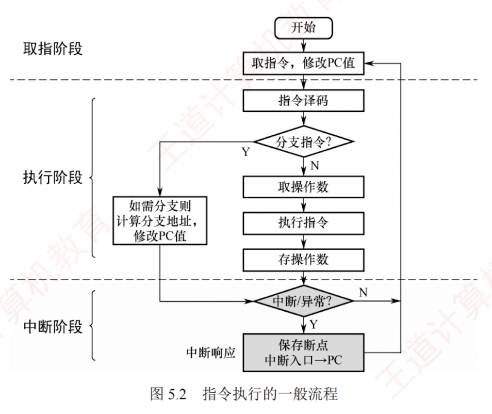

---

## 5.2.1 指令执行的一般流程

计算机执行程序的本质，是**控制器**依据指令序列**协调各功能部件协同工作**的过程。  
CPU 启动后，将持续循环执行"**取指令**"与"**执行指令**"两个基本操作。  
每条指令执行完毕后，还要进行**中断与异常检测**，[[这里表述有误]]以确保系统能够及时响应外部事件或内部异常。  
指令执行的**一般流程**如图 5.2 所示。

指令执行的**基本流程**如下：

首先，CPU 以**程序计数器**（PC）的当前值为地址，从主存中取出**下一条指令**；  
与此同时，PC 通常被自动更新为下一条顺序指令的地址（增量等于当前指令的长度），为后续取指做准备。

随后，进入**译码与执行阶段**：CPU 对指令进行**译码**，识别其类型，并据此确定执行路径。  
为简化分析，可将指令分为**分支指令**与**非分支指令**两类：
[[分支指令和非分支指令是什么]]
- 为**分支指令**时，在执行阶段判断**分支条件**；条件满足时，PC 将被更新为分支目标地址。
- 为**非分支指令**时，依次完成取操作数、执行运算、写回结果等基本操作。

无论执行哪类指令，执行完成后，CPU 均需要进行**中断与异常检测**：

- 未检测到中断或异常时，继续以更新后的 PC 地址取指，进入下一条指令的执行阶段。
- 检测到中断或异常时，进入**中断响应阶段**：**屏蔽可屏蔽中断**，**保存返回地址**（通常为下一条指令地址或当前指令地址，具体取决于中断/异常的类型），并**将 PC 设置为对应中断服务程序的入口地址**，随后转移执行该服务程序。

