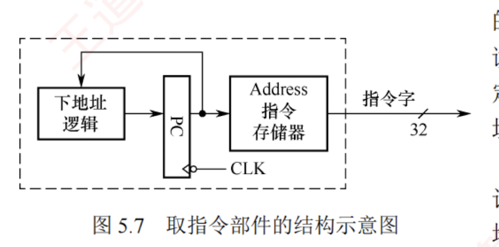
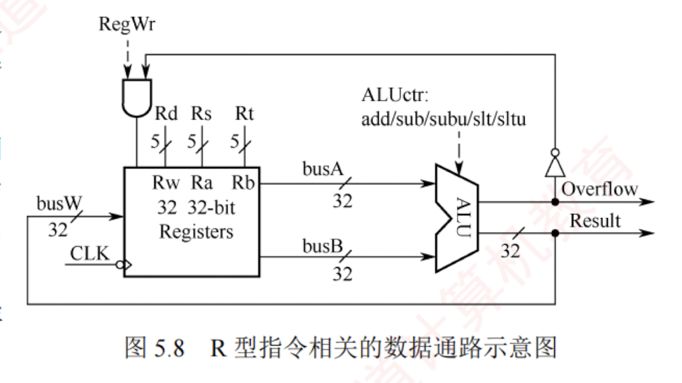
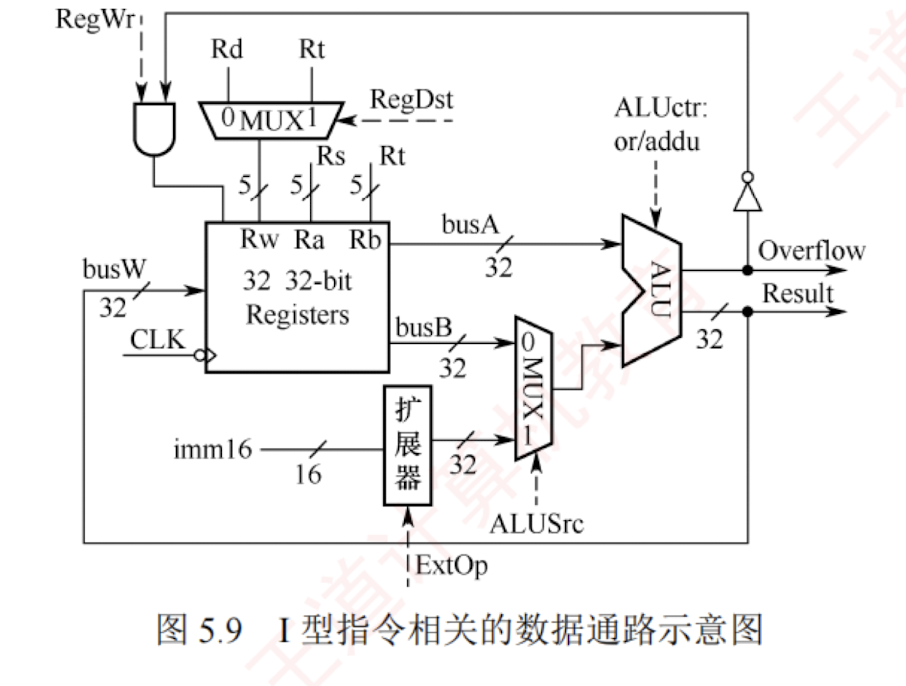
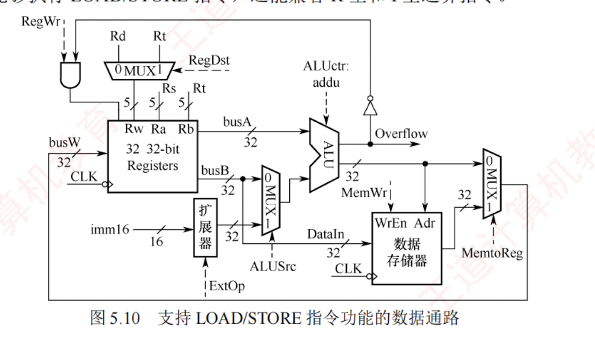
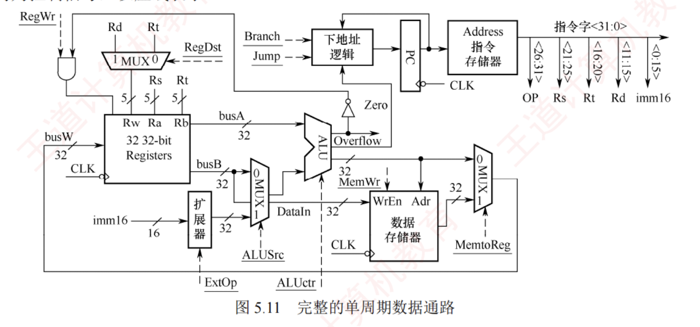

---
### 5.3.4 专用结构的数据通路

本节以**单周期数据通路**为例，介绍专用数据通路的设计原理。  
在单周期数据通路中，每条指令的取指与执行均在一个时钟周期内完成，CPU 的时钟周期必须以最耗时的指令为准。  
此外，由于**资源无法复用**，系统需要为频繁使用的功能单元（如加法器）配置多组独立的实例。

同时，为避免指令获取与数据访问冲突，**指令和数据被分别存储在独立的存储器中**，确保两者可在同一时钟周期内并行处理。  

鉴于完整单周期数据通路结构较复杂，以下将结合具体指令执行过程，逐步拆解其关键设计要点。  
尽管**基于单周期模型**，但其中的控制逻辑与数据通路设计思想同样适用于多周期、流水线等更复杂的结构。

**1. 取指令部件的设计**

每条指令的第一步都是完成取指令并计算下一条指令地址的过程。  
图 5.7 展示了取指令部件的结构示意图。  
指令存储在**指令存储器**中，仅支持读操作。  
读取指令时，只需提供指令地址，经过固定的延迟后即可输出对应的 32 位指令字。  
指令地址由程序计数器（PC）提供。

取指令部件包含专用的下地址逻辑电路，用于计算并更新 PC 值，以确定下一条指令的地址。  
下地址逻辑根据当前指令类型区分不同的执行路径：

- **顺序执行：** 当指令为普通顺序指令时，直接计算 $PC + 4$ 得到下一条指令的地址。
    
- **转移执行：** 对于分支或转移指令，需要根据指令类型计算转移目标地址。例如，beq 指令（相等转移）通过比较两个寄存器的内容决定是否转移，并根据偏移量计算新的 PC 值。
    

**2. R 型运算类指令数据通路**

R 型指令指的是**操作数全部来自通用寄存器**、**运算结果也写回通用寄存器**的算术/逻辑运算指令。  
以加法指令为例：


```c
add rd, rs, rt    # R[rs] + R[rt] → R[rd]
```


图 5.8 展示了 R 型指令相关的数据通路示意图。  

该数据通路能够对两个寄存器 Rs 和 Rt 的内容进行运算，并将结果写回 Rd 寄存器。  
例如，add 和 sub 等指令还需判断运算结果是否溢出，仅当不溢出时才将结果写回 Rd 寄存器；  
**发生溢出时，会触发异常处理**。


指令中的 Rs 和 Rt 是两个源操作数寄存器的编号，Rd 是目的寄存器的编号。因此，

- 寄存器堆的两个读地址端 Ra 和 Rb 应分别与 Rs 和 Rt 相连。
    
- 写地址端 Rw 应与 Rd 相连。
    
- ALU 的运算结果通过总线 busW 连至寄存器堆的写数据端。
    

控制信号 RegWr 作为寄存器堆的写使能信号，在 RegWr 为 1 且无溢出的情况下，运算结果才被写入寄存器堆。具体来说，RegWr 信号和溢出标志位 Overflow 通过“与”门组合后，决定是否允许写入寄存器堆。显然，在 R 型指令执行期间，RegWr 信号始终为 1。

此外，ALU 的操作类型由控制信号 ALUctr 决定。假设 ALU 支持 $N$ 种不同的运算，则 ALUctr 至少需要 $\lceil \log_2 N \rceil$ 位来选择具体的运算类型。

由于单周期处理器必须在一个时钟周期内完成指令，其数据通路中不设置指令寄存器（IR），而直接从指令存储器中取指令并解析执行，否则仅取指令到 IR 就需一个时钟周期。

**3. I 型运算指令的数据通路**

I 型运算指令（立即数运算类指令）的核心执行逻辑是，先将指令中的 16 位立即数扩展为 32 位，再将寄存器 Rs 的内容送入 ALU 运算，结果写回目的寄存器 Rt。以有符号加法指令为例：


```c
addi rt, rs, imm16    # R[rs] + SignExt[imm16] → R[rt]
```

其中，$SignExt[imm16]$ 表示对 16 位立即数进行符号扩展。

图 5.9 是在 R 型指令数据通路（见图 5.8）基础上，增加支持 I 型指令的功能模块（如立即数扩展器和多路选择器）后形成的通用数据通路。该通路可同时执行 R 型和 I 型运算指令。


与图 5.8 相比，数据通路主要有以下三处改动，以同时兼容 R 型和 I 型运算指令的执行。

1. **目的寄存器选择：** R 型指令使用目的寄存器 Rd，而 I 型指令使用目的寄存器 Rt。因此，在寄存器堆的写地址端 Rw 处增设多路选择器，由控制信号 RegDst 控制：
    
    - RegDst = 1（执行 R 型指令）时，选择 Rd 为目的寄存器。
        
    - RegDst = 0（执行 I 型指令）时，选择 Rt 为目的寄存器。
        
2. **立即数扩展：** I 型指令的 16 位立即数需扩展为 32 位才能送入 ALU。数据通路中新增一个立即数扩展器，其输入为指令的 imm16 字段。由控制信号 ExtOp 决定扩展方式：
    
    - 对于算术类指令，采用符号扩展。
        
    - 对于按位逻辑操作指令，采用零扩展。
        
3. **ALU 第二操作数选择：** R 型指令的第二操作数来自寄存器 Rt，I 型指令则使用扩展后的立即数。因此，在 ALU 的第二输入端增设多路选择器，由控制信号 ALUSrc 控制：
    
    - ALUSrc = 0（执行 R 型指令）时，选择寄存器 Rt 的数据。
        
    - ALUSrc = 1（执行 I 型指令）时，选择扩展后的立即数。
        

**4. 访存指令的数据通路**

MIPS 访存指令属于 I 型指令（需要进行立即数运算），包括以下两类：


```
lw rt, imm16(rs)    # M[ R[rs] + SignExt(imm16) ] → R[rt]
sw rt, imm16(rs)    # R[rt] → M[ R[rs] + SignExt(imm16) ]
```

LOAD 和 STORE 指令的访存地址计算逻辑完全一致：首先对指令中的 16 位立即数 imm16 进行符号扩展，然后将其与寄存器 Rs 的内容相加，得到访存地址。二者区别在于数据传输方向：

- LOAD 指令从该地址读取 32 位数据，并将数据写入寄存器 Rt。
    
- STORE 指令则将寄存器 Rt 中的 32 位数据写入该地址对应的存储单元。
    

图 5.10 是在图 5.9 的基础上增加支持 LOAD/STORE 指令功能模块后的数据通路示意图。该数据通路不仅能够执行 LOAD/STORE 指令，还能兼容 R 型和 I 型运算指令。



与图 5.9 相比，数据通路主要有以下两处改动，以支持 LOAD/STORE 指令的执行：

1. **写回寄存器的数据选择：** 为了处理运算类指令与 LOAD 指令写回寄存器的不同数据来源，在寄存器堆的写端口 busW 处增设一个多路选择器，由控制信号 MemtoReg 控制：
    
    - MemtoReg = 0（运算类指令）时，选择 ALU 的运算结果。
        
    - MemtoReg = 1（LOAD 指令）时，选择数据存储器读出的数据。
        
2. **新增数据存储器模块：** 以满足 LOAD/STORE 指令对数据存储器的读/写需求。
    
    - 数据存储器的地址端 Adr 直接连接到 ALU 的输出端（访存地址由 ALU 计算得出）。
        


- STORE 指令需要将寄存器 Rt 的内容写入存储器，因此将寄存器堆的第二读端口 busB（对应寄存器 Rt）连接到数据存储器的输入端 DataIn。
    
- 数据存储器的输出端接入 busW 处的多路选择器，用于 LOAD 指令的结果写回。
    
- 控制信号 MemWr 作为数据存储器的写使能信号（控制数据存储器的读/写操作）。
    
- LOAD/STORE 指令计算访存地址时，需要对 16 位立即数 imm16 进行符号扩展，并通过 ALU 执行不判溢出的加法（addu），此时控制信号 ALUctr 被配置为对应的操作码。
    

**5. 完整的单周期数据通路结构图**

综合前述各功能模块，可构建如图 5.11 所示的完整单周期数据通路。图中所有加下划线的信号均为控制信号，以虚线表示。



其中，取指令部件在图 5.7 的基础上，还需接收三类关键外部控制信号：

- 控制信号 Branch 在执行分支指令时置 1。
    
- 控制信号 Jump 在执行无条件转移指令时置 1。
    
- 标志位 Zero 用于判断分支条件是否成立，该信号由 ALU 输出。例如，执行 beq 指令（相等转移）时，ALU 执行减法操作，若结果为 0，则 Zero 置 1，表示满足转移条件。
    

基于以上分析，单周期处理器具有以下重要特点：

1. **存储器分离设计：** 指令存储器与数据存储器相互独立，使得取指令与数据访存操作可并行进行，避免冲突，确保在一个时钟周期内同时完成指令读取与数据读/写。
    
2. **无指令寄存器（IR）：** 指令从存储器取出后，其各字段（如 rs、rt、rd、imm）直接用于生成控制信号或地址输入，指令解析与执行在同一个时钟周期内同步完成。
    
3. **时钟周期由最慢指令决定：** 时钟周期必须满足执行时间最长的指令（如访存指令），导致简单指令（如 R 型加法）的执行效率受限。
    
4. **数据通路资源专用：** 由于所有操作需要在一个周期内并发完成，关键功能单元（如用于 PC 更新和地址计算的加法器）需要配置多个独立的实例，硬件无法复用，开销较大。
    
5. **控制信号单周期有效：** 所有控制信号（如 RegWr、MemWr 等）在一个时钟周期内保持有效，指令“取指、执行、写回”的完整流程在单个时钟脉冲内完成，无流水线分段。