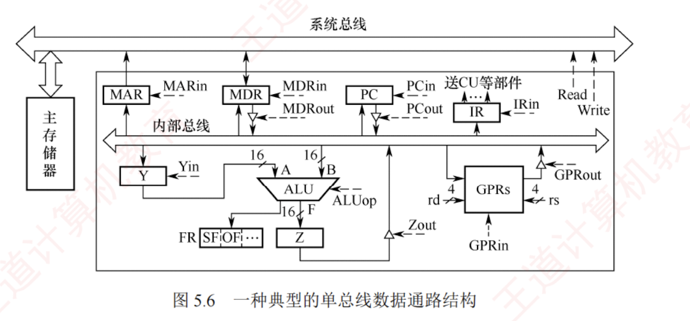
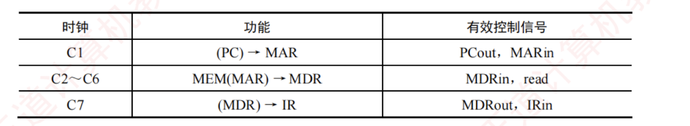
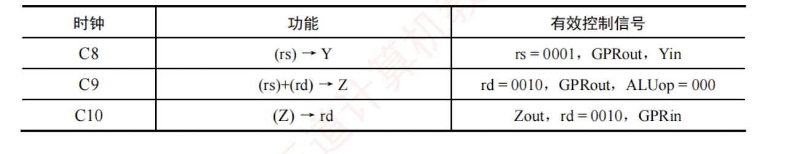
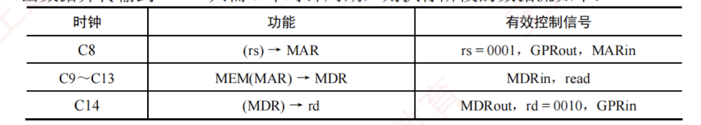

---

## 5.3.4 单总线结构的数据通路

单总线数据通路结构简洁，所有数据传输共享一条内部总线，同一时刻仅允许一个部件向总线输出数据，导致操作需要分步进行。图 5.6 所示为一种典型的单总线数据通路结构。

在图 5.6 中：

- $GPRs$ 为通用寄存器组，$rs$ 和 $rd$ 分别是源寄存器和目的寄存器的编号，各占 4 位，可寻址 $2^4 = 16$ 个通用寄存器；
- $Y$ 和 $Z$ 为**暂存寄存器**（简称暂存器），用于暂存从总线读取的操作数；
- $FR$ 为**标志寄存器**，用于保存 ALU 运算产生的状态标志。

所有可向内部总线输出数据的部件（如寄存器、MDR、PC 等）均通过各自的**三态门**与总线相连，以控制其与总线之间的通断，避免多个输出同时驱动总线造成冲突。图中带箭头的虚线表示控制信号，控制信号的命名采用"**部件名+in/out**"的方式：

- **in**：表示允许向该部件写入（如 $PC_{in}$ 表示将内部总线上的数据写入 PC）；
- **out**：表示允许该部件输出到总线（如 $PC_{out}$ 表示将 PC 的内容送至内部总线）。

ALU 的操作类型由控制信号 ALUop 决定。  
若 ALUop 为 $n$ 位，则最多支持 $2^n$ 种操作。  
在以下分析中，假设 ALUop 为 3 位，且约定执行加法操作时 $\text{ALUop} = 000$。

**总线**是一组**共享**的**传输信号线**，**不能存储信息**，任一时刻只能有一个部件将信息发送到总线上。 

下面以图 5.6 所示的单总线数据通路为例，介绍两条常见指令的指令周期数据流。  
**数据流**是指令执行过程中，根据操作要求依次访问的**数据序列**。  
该序列因指令执行的不同阶段而异，也随指令类型的不同而变化。  

为简化分析，此处将指令周期分为**取指**和**执行**两个阶段。

### **加法指令**

**指令功能**：将 $rs$ 和 $rd$ 寄存器中的值相加，并将结果写入 $rd$ 寄存器。

#### 1. 取指阶段

根据 PC 中的内容从主存储器中取出指令代码并存放在 IR 中。  
假设从发出主存读命令到主存读出数据并传输到 MDR 共需 5 个时钟周期，则取指阶段的数据流如下（不考虑 PC 增量操作）：

**解释**：
- 将 PC 的内容写入 MAR（1 个时钟周期）；
- 读主存并将读出的数据写入 MDR（5 个时钟周期）；
- 将 MDR 的内容写入 IR（1 个时钟周期）。

#### 2. 执行阶段

根据 $rs$ 和 $rd$ 寄存器的编号（假设分别为 0001 和 0010），将两个操作数取出，送入 ALU 进行加法运算，并将运算结果送回 $rd$ 寄存器。执行阶段的数据流如下：

**解释**：
- ① 将 $rs$ 寄存器的内容写入暂存寄存器 Y（1 个时钟周期）；
- ② 将 $rd$ 寄存器中的值取出并与 Y 暂存寄存器中的值相加，结果送入 Z 暂存寄存器（1 个时钟周期）；
- ③ 将暂存寄存器 Z 中的加法结果送回 $rd$ 寄存器（1 个时钟周期）。

> **注意**：在单总线数据通路中，任一时刻总线上仅允许一个数据传输。由于 ALU 是无存储能力的组合逻辑电路，运算时需要两个输入同时有效，因此需要先将一个操作数经总线送入暂存寄存器 Y；下一周期再将另一个操作数送至 ALU 的另一个输入端，Y 的输出即作为其第一个操作数。此外，ALU 输出不能直接连到总线，否则可能通过总线反馈至输入端，干扰运算结果，故需要暂存于暂存寄存器 Z 中。

### **取数指令**

**指令功能**：将主存地址为 $rs$ 寄存器中的值的主存单元内容取出送回 $rd$ 寄存器。

#### 1. 取指阶段

所有指令取指阶段的数据流都是相同的，此处不再赘述。

#### 2. 执行阶段

假设 $rs$ 和 $rd$ 寄存器的编号分别为 0001 和 0010，从发出主存读命令到主存读出数据并传输到 MDR 共需 5 个时钟周期，则执行阶段的数据流如下：

**解释**：
- ① 将 $rs$ 的内容写入 MAR（1 个时钟周期）；
- ② 读主存并将读出的数据写入 MDR（5 个时钟周期）；
- ③ 将 MDR 的内容写入 $rd$ 寄存器（1 个时钟周期）。

