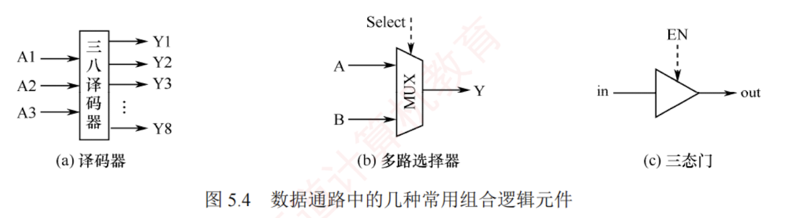
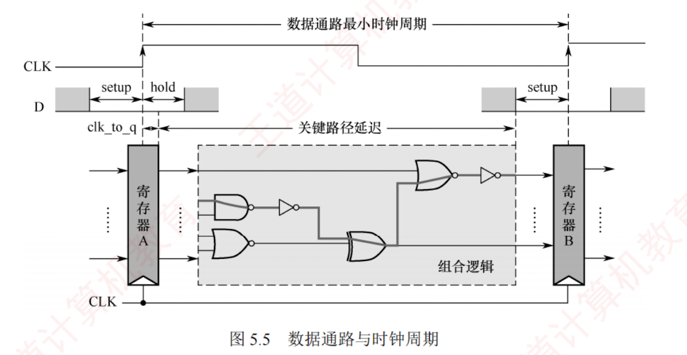

---

## 5.3.2 数据通路的组成

数据通路的基本构成元件可分为**组合逻辑元件**和**时序逻辑元件**两大类。

### 1. 组合逻辑元件（操作元件）

组合逻辑元件主要用于执行数据运算与路径选择，也称**操作元件**。其特征是：

- 任意时刻的输出仅由当前输入决定，不依赖历史状态；
- 内部不含记忆单元，不受时钟控制；
- 无输出到输入的反馈通路，因而具有**确定性**和**即时响应性**。

数据通路中常用的组合逻辑元件包括**加法器**、**算术逻辑单元（ALU）**、**译码器**、**多路选择器（MUX）**和**三态门**等，如图 5.4 所示。

图中虚线表示控制信号，各元件功能如下：

- **译码器**：常用于操作码译码或地址码译码，对于 $n$ 位输入，可产生 $2^n$ 个互斥输出。
- **多路选择器（MUX）**：根据控制信号 Select 从多路输入中选择一路输出，若输入路数为 $N$，则需 $\lceil \log_2 N \rceil$ 位控制信号。
- **三态门**：可视为一种受控的总线开关，由控制信号 EN 决定信号线的通断。当 $\text{EN}=1$ 时，三态门被打开，输出（out）信号等于输入（in）信号；当 $\text{EN}=0$ 时，输出端呈高阻态（隔断态），所连寄存器与总线断开。

### 2. 时序逻辑元件（状态元件）

时序逻辑元件的输出不仅取决于当前输入，还依赖于电路的历史状态，因此其内部必然包含用于存储信息的记忆单元。此外，这类元件必须在时钟的同步控制下工作。常见的时序逻辑元件包括各类寄存器和存储器，例如**通用寄存器组**、**程序计数器（PC）**、**状态/暂存寄存器**等。

数据通路的基本结构可抽象为时序逻辑元件与组合逻辑元件交替连接的形式，即"**……-状态元件-操作元件-状态元件-……**"，如图 5.5 所示。

为简化分析，假设寄存器 A 和 B 的写使能信号一直有效，当时钟上升沿到来时，两个寄存器同时锁存各自的新值。从时钟上升沿开始到寄存器 A 输出稳定的时间称为**寄存器延迟** $T_{\text{clk\_to\_q}}$；随后，其输出数据经组合逻辑电路处理，经历一个**关键路径延迟** $T_{\max}$（所有输出信号达到稳定所需的最长时间）。为确保寄存器 B 能在下一个时钟上升沿正确采样该数据，其输入必须在时钟沿到来前至少提前 $T_{\text{setup}}$（**寄存器建立时间**）保持稳定。

因此，数据通路的最小时钟周期必须不小于：

$$T_{\text{clk\_to\_q}} + T_{\max} + T_{\text{setup}}$$

其中组合逻辑延迟 $T_{\max}$ 是关键因素。可见，在 CPU 设计中，**缩短组合逻辑的关键路径延迟是提升系统频率的关键手段**。

[[组合逻辑元件和时序逻辑元件]]