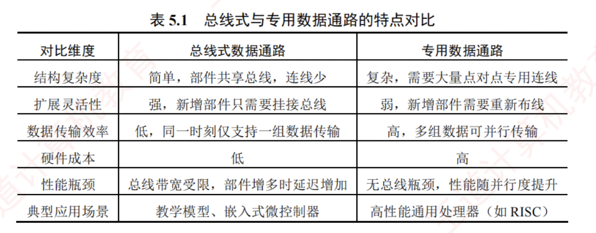

---

## 5.3.3 数据通路的组织与分类

数据通路可根据其内部部件的连接方式和指令执行的时序组织方式进行分类。

### 1. 按部件连接方式划分

#### **（1）总线式数据通路**

总线式数据通路将通用寄存器、ALU 和内部寄存器等主要部件连接至一条或多条 CPU 内部总线（注意，此总线为**片内总线**，不同于系统总线）。根据总线数量的不同，可分为如下两类：

- **单总线结构**：所有数据传输共享一条内部总线，ALU 的输入与输出均通过该总线分时传送。
- **多总线结构**（如双总线、三总线）：提供多条独立总线，例如分别用于两个源操作数和结果写回，以支持更高的并行度。

> **优点**：硬件简洁、易于扩展  
> **缺点**：同一时刻仅能传输一组数据，存在总线竞争问题

#### **（2）专用数据通路**

专用数据通路采用**点对点专用连线**连接寄存器、ALU 等部件，而非共享总线。各数据通路可并行传输，避免了总线冲突。

> **优点**：数据传输效率高、延迟低  
> **缺点**：布线复杂、扩展性差、成本较高

总线式与专用数据通路的特点对比如表 5.1 所示。

### 2. 按时序组织方式划分

#### **（1）单周期数据通路**

在单周期数据通路中，每条指令的所有操作（取指、译码、执行、访存、写回等）都在**一个时钟周期内完成**。时钟周期长度由最慢的指令（通常是访存指令）决定。

> **特点**：控制简单，资源利用率低，可基于总线式或专用通路实现  
> **注意**：单周期处理器（$\text{CPI} = 1$）不能采用单总线结构的数据通路，因为单总线将所有寄存器都连接到一条公共总线上，一个时钟周期内只允许一次操作，无法完成一条指令的所有操作。

#### **（2）多周期数据通路**

多周期数据通路将一条指令的执行划分为**多个阶段**，每个阶段在一个时钟周期内完成。典型阶段包括取指、译码与读寄存器、执行/地址计算、访存、写回等。

> **特点**：各阶段的结果在时钟沿被锁存到寄存器中；时钟周期长度通常以一次存储器访问时间为基准；相比单周期设计，提高了硬件复用率，缩短了时钟周期。

#### **（3）流水线数据通路**

流水线数据通路将指令执行过程分解为若干独立、可重叠的阶段，不同指令在不同阶段并发推进。每个阶段由专用功能部件完成，并通过流水段寄存器隔离和传递中间结果。

> **特点**：时钟周期长度由最长阶段决定；理想情况下，每个周期可以完成一条指令。

---
