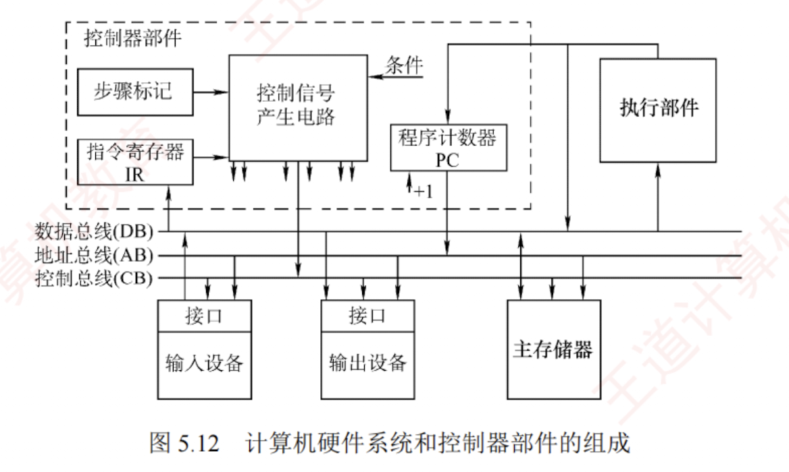

---

### 5.4.1 控制器的结构和功能

在计算机硬件系统中（见图 5.12），主要由**执行部件**、**主存储器**、**输入/输出设备**及**控制器**组成。  
各组件通过数据总线、地址总线和控制总线相互连接，其中虚线框内为控制器。

#### 各部件的主要连接关系

1. **执行部件**经由**数据总线**与**主存**及 **I/O 设备**交换数据。
    
2. **输入/输出设备**通过**接口电路**接入**系统总线**。
    
3. 主存及 I/O 设备根据**地址总线**上的**地址信号**判断是否被选中，  
   并依据**控制总线**上的**读/写等控制信号**，  
   通过**数据总线**完成**数据传输**。
    
4. 控制器通过**地址总线**发送指令地址（PC 的值）访问主存，并将获取的指令通过数据总线送入指令寄存器（IR），由控制器解析并控制执行。
    

#### 控制器是计算机的指挥中心，其主要职责包括：

1. 取出待执行的指令并计算下一条指令的位置（更新 PC）。
    
2. 对指令的操作码进行解码，产生对应的**时序信号**和**控制信号**，以协调各部件工作。
    
3. 管理 CPU、主存和 I/O 设备间的**数据流向**及**时序**，确保指令正确执行。
    

依据**微操作控制信号的生成方式不同**，控制器可分为**硬布线控制器**和**微程序控制器**。  
尽管两者都包含 PC 和 IR，但在指令执行步骤的表现形式以及控制信号的生成机制上有着本质区别。

---

