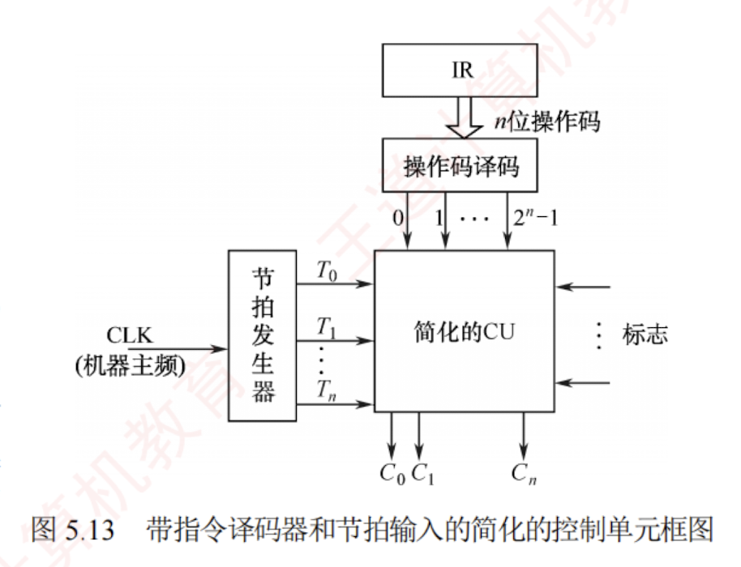

---

### 5.4.2 硬布线控制器

**硬布线控制器** 由复杂的组合逻辑电路和触发器构成，也称**组合逻辑控制器**。  
它根据指令需求、当前时序和内部状态，按时间顺序生成一系列微操作控制信号，以完成指令的执行。

指令的**操作码**是决定控制单元（CU）行为的关键：  
CU 作为处理器的"指挥中心"，依据操作码生成相应的控制信号，协调寄存器、ALU、存储器等硬件组件的工作。

为简化 CU 的设计，通常将指令寄存器（IR）中的 $n$ 位**操作码**通过**译码电路**转换为 $2^n$ 个输出信号。  
每种操作码经译码后，会唯一地激活一条输出信号线，用于触发对应的控制逻辑。  
若将操作译码器和节拍发生器从 CU 中分离，则可得到如图 5.13 所示的简化控制单元结构。

**CU 的输入主要包括三类信号**：

1. **操作译码器输出的指令信息**，与节拍信号共同用于生成相应的微操作控制信号。
2. **时钟脉冲**，其频率即机器主频，用于划分节拍，确保控制信号按时发出。
3. **执行单元反馈的状态标志**，使 CU 能根据 CPU 当前状态动态调整控制逻辑。

---

在图 5.13 中，节拍发生器在每个时钟周期内产生节拍信号，使不同的微操作控制信号 $C_i$ 能够按序发出。  
由于某些指令（如条件转移）的执行不仅取决于操作码，还受状态标志影响，CU 必须综合**操作码译码结果**、**节拍信号**和**状态标志**，生成相应的控制信号，并发送至 CPU 内部数据通路或外部控制总线。

**硬布线控制器通过组合逻辑电路实现**，其性能主要受限于**电路延迟**。  
设计时，先用逻辑表达式描述各控制信号，经化简后实现为硬件电路。  
该方法虽响应速度快，但**灵活性差**：修改或新增指令需重新设计电路，复杂且耗时。  
同时，随着指令系统功能增强，微操作控制信号的数量急剧增加，导致电路规模庞大、调试困难。  
为克服这些缺点，**微程序**设计方法应运而生。

