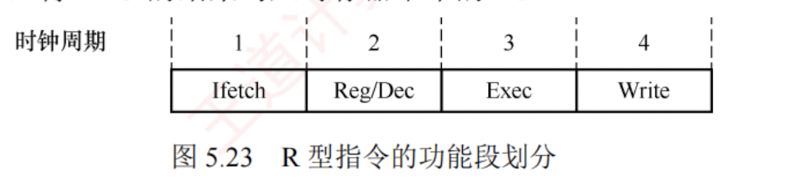
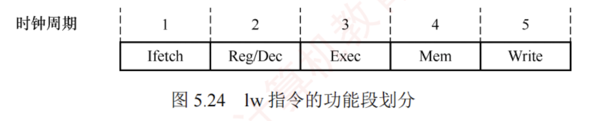
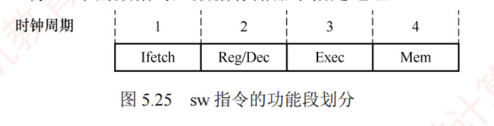

---
### 5.6.3 MIPS 指令集的流水段分析

每条 MIPS 指令的前两个功能段相同：

- **取指（IFetch）**：从指令存储器中取出指令并计算 $PC + 4$。
    
- **寄存器/译码（Reg/Dec）**：从寄存器堆中读取操作数并对指令进行译码。
    

后续功能段则根据具体指令类型有所不同。

#### 1. R 型指令的功能段划分

R 型指令属于**寄存器-寄存器型**（RR 型）指令，其操作数和结果均位于**通用寄存器**中。  
典型的 R 型指令从寄存器 Rs 和 Rt 读取源操作数，在 ALU 中完成指定运算，并将结果写入目的寄存器 Rd。  
如图 5.23 所示，R 型指令在流水线中经过 IFetch 和 Reg/Dec 阶段后，进入：

- **执行（Exec）**：在 ALU 中完成运算。
    
- **写回（Write）**：将 ALU 的结果写入寄存器堆中的 Rd。
    

#### 2. I 型指令的功能段划分

I 型指令包含 **16 位立即数**，用于立即数运算、内存访问或条件分支，是 RISC 处理器实现常量操作和地址计算的重要手段。  [[为什么I型指令包含的是16位立即数]]

I 型运算类指令先对 16 位立即数进行**符号扩展**（或**零扩展**），再与 Rs 的内容在 ALU 中运算，结果写入寄存器 Rt。  
其功能段划分与 R 型指令的完全相同。

#### 3. lw 指令的功能段划分

lw 指令的功能为 $R[Rt] \leftarrow M[R[Rs] + SEXT(imm16)]$，即从内存中读取一个字并写入寄存器 Rt。它将 Rs 的值与符号扩展（Sign Extension）后的 16 位立即数相加，形成有效地址，再从该地址读取数据。如图 5.24 所示，lw 指令在流水线中经过 IFetch 和 Reg/Dec 阶段后，进入：

- **执行（Exec）**：计算内存地址 ($R[Rs] + SEXT(imm16)$)。
    
- **访存（Mem）**：从数据存储器中读取一个字。
    
- **写回（Write）**：将读取的数据写入寄存器堆中的 Rt。
    

#### 4. sw 指令的功能段划分

sw 指令的功能为 $M[R[Rs] + SEXT(imm16)] \leftarrow R[Rt]$，即将寄存器 Rt 中的数据写入内存。如图 5.25 所示，sw 指令在流水线中经过 IFetch 和 Reg/Dec 阶段后，进入：

- **执行（Exec）**：计算内存地址 ($R[Rs] + SEXT(imm16)$)。
    
- **访存（Mem）**：将 Rt 中的数据写入数据存储器中指定地址。
    

#### 5. beq 指令的功能段划分

beq 指令的功能为：若 $R[Rs] = R[Rt]$，则 $PC \leftarrow PC + 4 + SEXT(imm16) \times 4$。它比较两个寄存器的值，若相等，则转移至目标地址，否则顺序执行。目标地址由当前 $PC$ 加 4 后，再加上符号扩展并左移 2 位的 16 位立即数得到。beq 指令在流水线中经过 IFetch 和 Reg/Dec 阶段后，进入：

- **执行（Exec）**：比较 Rs 与 Rt，并计算分支目标地址 ($PC + 4 + SEXT(imm16) \times 4$)。
    
- **访存（Mem）**：若比较结果为相等，则将目标地址写入 PC。
    

需要注意的是，beq 指令的 Mem 段并非真正的内存访问，而是将 PC 操作安排在该段，以便与 lw、sw 等指令对齐。  
**由于写 PC 的延迟小于存储器访问，因此可在 Mem 段完成。**

#### 6. j 指令的功能段划分

j 指令是无条件转移指令，其功能是直接将目标地址送入 PC。除两个公共功能段外，j 指令仅需一个功能段用于更新 PC，该操作可合并到 Exec 段完成。具体如下：

- **执行（Exec）**：计算目标地址并更新 PC。
    

从上述分析可见，**lw 指令最复杂，需 5 个功能段**。  
为统一流水线结构，其他指令通过**插入“空”段**（不执行实际操作的阶段）对齐至 5 段。  
插入空段需遵循两个原则：

- 每条指令对任一功能部件至多使用一次（如同一条指令不能多次使用寄存器的写口）。
    
- 相同功能部件必须在固定阶段使用（如寄存器写回总在第 5 阶段）。
    

因此，R 型和 I 型运算指令在 Write 前插入空 Mem 段，使其 Write 段与 lw 指令对齐；sw 和 beq 指令在 Exec 后插入空 Write 段；j 指令插入空 Mem 和 Write 段。通过上述对齐，所有指令均适配于 5 个功能段，因此该处理器可采用 5 段流水线设计。