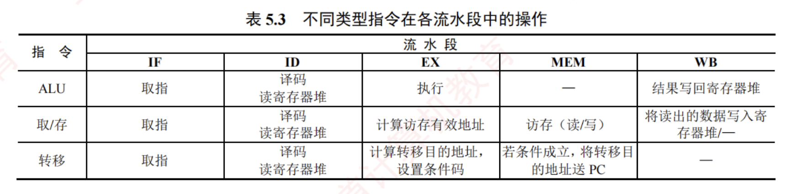
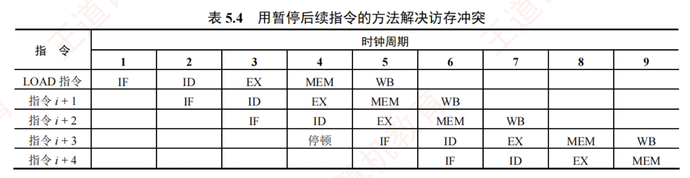
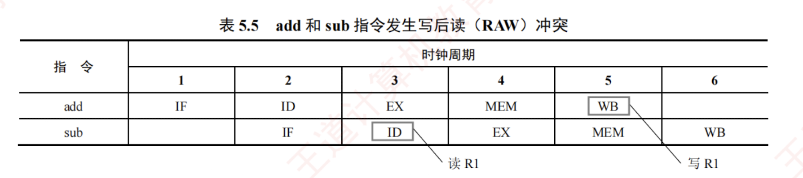
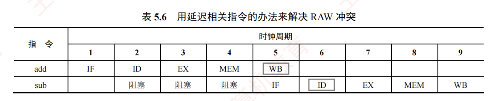
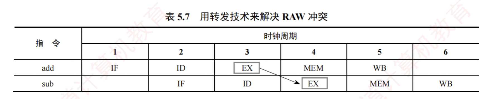
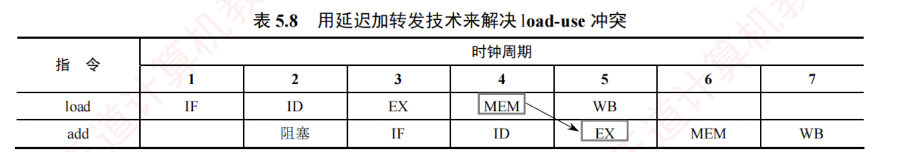
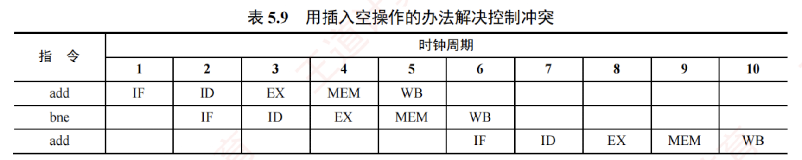

---

### 5.6.4 流水线的冒险与处理

在指令流水线中，某些情况可能导致后续指令无法正确执行，从而引起流水线阻塞，这种现象称为流水线冒险。根据成因不同，可分为结构冒险、数据冒险和控制冒险三种类型。

不同类型指令在各流水段的操作如表 5.3 所示。



这几类指令将在下面介绍流水线冲突时涉及。

#### 1. 结构冒险


结构冒险（又称资源冲突）是指不同指令在同一时刻争用同一功能部件所引发的冲突，其本质是硬件资源的物理限制。  
例如，在指令与数据共享同一存储器的系统中，第 $i$ 条 LOAD 指令在第 4 个时钟周期处于 MEM 段（访问数据存储器），而第 $i+3$ 条指令在同一周期处于 IF 段（取指令），两者同时访存，引发冲突。此时可暂停后续指令的取指操作一个周期，如表 5.4 所示。

当然，若第 $i$ 条指令不是访存指令，则其在 MEM 段不访问存储器，也就不会发生访存冲突。



解决结构冒险的主要方法有：

1. **遵循功能部件使用原则**：确保每个功能部件在每条指令中至多使用一次，且总在固定阶段使用（如寄存器写回操作统一安排在 WB 段），可避免部分结构冲突。
    
2. **增加硬件资源**：例如，将寄存器堆的读口与写口分离，支持在一个周期的前半拍写、后半拍读；或将指令存储器与数据存储器分离。现代处理器的 L1 Cache 通常采用指令 Cache 与数据 Cache 分离的设计，从根本上消除取指与数据访存之间的资源竞争。
    

#### 2. 数据冒险


数据冒险又称数据相关，其根本原因是：后面指令用到前面指令的结果时，前面指令的结果还未产生或写回。在按序发射、按序完成的流水线中，所有数据冒险都是因为前一条指令写结果之前，后面指令就需要读取而造成的，称为写后读（Read After Write, RAW）冲突。

> **注意**
> 
> 在非乱序执行$^{(1)}$的流水线中（统考常涉及这种方式），只可能出现 RAW 冲突。

例如，考虑下列两条指令：


```c
I1  add R1, R2, R3    # (R2) + (R3) -> R1
I2  sub R4, R1, R5    # (R1) - (R5) -> R4
```

在 RAW 冲突中，I2 的源操作数 R1 正是 I1 的目的操作数。在非流水线中，I1 先写入 R1，I2 再读取 R1，顺序自然成立。但在流水线中，I2 在 ID 流水段就要读取 R1，而 I1 要到 WB 段才将结果写回寄存器堆，导致 I2 读取的是 R1 的旧值，如表 5.5 所示。



可采用以下方法解决 RAW 冲突。


#### **(1) 延迟执行相关指令**

将数据相关的指令及其后续指令都暂停若干时钟周期，直至前一条指令的结果可被安全读取。  
可分为**软件插入空操作**（nop）指令和**硬件自动插入气泡**（阻塞）两种方法。

由表 5.5 可见，add 指令在第 5 个时钟周期才将结果写回 R1，而 sub 指令在第 3 个时钟周期就需要读取 R1，发生 RAW 冲突。若不采取措施，sub 指令将使用错误的旧值。  
为此，可让 sub 指令延迟 3 个时钟周期，使其 ID 段发生在 add 指令的 WB 段之后，如表 5.6 所示。



此外，若寄存器堆支持**在一个时钟周期的前半个时钟周期写入、后半个时钟周期读出**，则 add 指令在 WB 段写入的值可在同一个时钟周期被 sub 指令在 ID 段读取。  
此时，add 指令的 WB 段与 sub 指令的 ID 段可重叠执行，从而**仅需延迟 2 个时钟周期**。

#### **(2) 采用转发（旁路）技术**

设置相关转发通路，使后续指令无须等待前一条指令将计算结果写回寄存器堆，而是将其在执行阶段生成的中间结果直接转发至 ALU 的输入端。  
如表 5.7 所示，add 指令在 EX 段结束时已计算出 R1 的新值，并暂存于 EX/MEM 流水段寄存器中。当 sub 指令进入 EX 段时，其所需的 R1 值可直接从该流水段寄存器转发至 ALU，从而确保使用的是最新结果。



增加转发通路后，相邻的两条运算类指令之间，以及相隔一条无关指令的两条运算类指令之间的数据相关所引发的 RAW 冲突，均可通过转发有效消除。

#### **(3) load-use 数据冒险的处理**

若 load 指令与其后紧邻的运算类指令存在数据相关，则无法通过转发技术解决，这种情况称为 load-use 数据冒险。  
考虑以下两条指令：


```c
I1  load r2, 12(r1)    # M[(r1)+12] -> (r2)
I2  add  r4, r3, r2    # (r3) + (r2) -> (r4)
```

load 指令在 MEM 段结束时才从存储器读出数据，并暂存于 MEM/WB 流水段寄存器；  
而紧随其后的 add 指令在其 EX 段（与 load 指令的 MEM 段处于同一周期）就需要 R2 的值。  
由于此时 load 指令尚未完成访存，结果不可用，因此 add 指令只能读取 R2 的旧值。

对于 load-use 数据冒险，最简单的做法是由编译器在 add 指令前插入一条 nop 指令。  
这样，add 指令的 EX 段就能通过**转发机制**，从 MEM/WB 流水段寄存器中获取 load 指令的最新结果，如表 5.8 所示。  
当然，最好的办法是在程序编译时进行优化，通过**调整指令顺序**以避免 load-use 相关发生。



#### 3. 控制冒险


指令通常按顺序执行，但在遇到转移、返回、中断或异常等事件时，程序计数器（PC）的值会被修改，导致流水线断流，这种现象称为**控制冒险**（又称控制冲突）。

对于由分支指令引起的冲突，最简单的处理方法是推迟后续指令的执行。通常将因流水线阻塞产生的延迟时钟周期数称为延迟损失时间片 $C$。在下列指令中，假设 R2 存放常数 N，R1 的初值为 1。bne 指令在 EX 段完成条件计算，但直到 MEM 段结束（第 5 个时钟周期末）才确定是否更新 PC，因此从分支指令进入流水线到转移决策完成，共产生 3 个时钟周期延迟（记位 $C=3$）。

为避免错误执行后续指令，可在分支指令后插入 $C$ 条 nop 指令，如表 5.9 所示。


```c
I1  loop: add R1, R1, 1    # (R1) + 1 -> R1
I2        bne R1, R2, loop # if (R1) != (R2) goto loop
```



解决控制冒险的主要方法包括：

1. **延迟分支处理**：对于由分支指令引起的冲突，可由软件在分支指令后插入若干 nop 指令，或由硬件自动阻塞（插入气泡）。插入 nop 指令的数量等于分支延迟周期数。
    
2. **分支预测技术**：尽早生成转移目标地址并预测转移方向，以减少流水线清空。静态预测采用简单规则，总是预测转移发生或不发生；动态预测根据程序运行时的转移历史动态调整预测策略，准确率更高。若预测错误，则需清空已进入流水线的错误路径指令，并从正确目标地址重新取指；若分支延迟周期数为 3，此时将损失 3 个时钟周期。
    

> **注意**
> 
> Cache 缺失、中断或异常的发生也会引起流水线阻塞。

