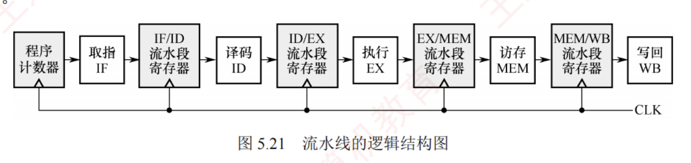
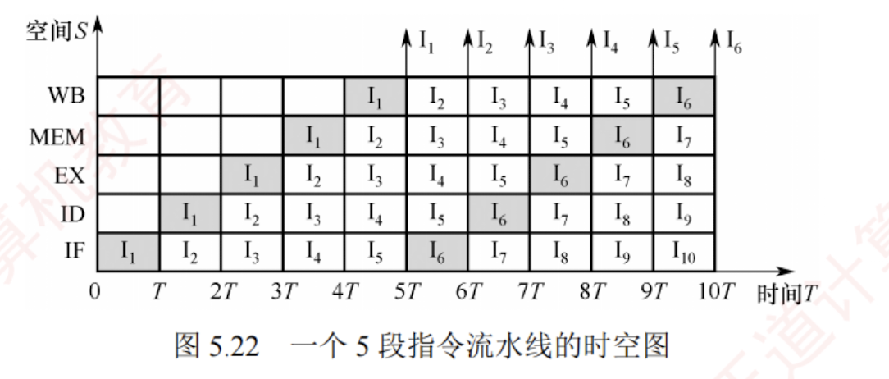

---

### 5.6.2 流水线的基本实现

#### 1. 流水线设计的原则

在单周期实现中，尽管并非所有指令都需要完整经历全部 5 个阶段，但时钟周期必须以**执行时间最长的指令路径为基准**。  
因此，单周期 CPU 的时钟频率受限于**数据通路中的最长路径**。
[[如何理解这段话]]

流水线设计遵循以下原则：

1. 流水段的数量以最复杂指令所需的功能段数为准。
    
2. 每个流水段的时长以最耗时的操作为准。
    

例如，某指令的各阶段延迟如下：  
① 取指 200ps；② 译码 100ps；③ 执行 150ps；④ 访存 200ps；⑤ 写回 100ps，该指令在单周期处理器中的总执行时间为 750ps。  
按流水线设计原则，时钟周期需要取各段的最大延迟，即 200ps。  
因此，每条指令从进入流水线到流出需经历 5 个周期，总延迟为 1000ps，大于单周期实现的 750ps。  
这表明：**流水线并不能缩短单条指令的执行延迟**。  
然而，对于包含 $N$ 条指令的程序，单周期处理器总耗时为 $N \times 750\text{ps}$，而流水线处理器总耗时为 $(N + 4) \times 200\text{ps}$。当 $N$ 较大时，流水线的吞吐率显著更高，整体执行效率大幅提升。

---

#### 2. 流水线的逻辑结构

每个流水段之后都需设置一个**流水段寄存器**，用于锁存该段的输出结果，确保其能在下一个时钟周期供下一流水段使用，如图 5.21 所示。  
所有寄存器和数据存储器均采用**统一时钟 CLK** 同步：  
每来一个时钟脉冲，各段处理完成的数据便锁存至段尾寄存器，作为**后续段的输入**；  
同时，当前段接收前一段经寄存器传递过来的数据，从而实现指令在流水线中的逐级推进。

一条指令依次流经 IF、ID、EX、MEM、WB 五个流水段。  
当第一条指令进入 WB 段时，各流水段分别包含一条不同的指令，此时流水线达到**满载**状态，最多可同时有 5 条指令处于不同的执行阶段。

> **注意**
> 
> 流水段寄存器本身也引入一定时延。但在考试中，若无明确说明，则可忽略寄存器时延。

#### 3. 流水线的时空图表示

流水线的执行过程常用时空图直观表示，如图 5.22 所示。

图中，横轴表示时间（单位为时钟周期 $T$），纵轴表示流水段（空间）。  
指令 $I_1$ 在时刻 0 进入流水线，于时刻 $5T$ 完成；  
指令 $I_2$ 在时刻 $T$ 进入流水线，于时刻 $6T$ 完成；  
以此类推，从时刻 $5T$ 起，每个周期结束时均有一条指令完成。  
例如，到时刻 $10T$ 时，已有 $I_1$ 至 $I_6$ 共 6 条指令完成执行。  
相比之下，若采用单周期实现（每条指令需约 3.75 个时钟周期，因 $750\text{ps} \div 200\text{ps} = 3.75$），在 $10T$ 内仅能完成约 2~3 条指令。  
可见，**流水线通过重叠执行，显著提升了指令吞吐率**。

值得注意的是，流水线的高效性依赖于**连续**、**无中断**的指令流。  
而程序执行天然具有**顺序性和连续性**，因此非常适合采用流水线技术。

#### 4. 流水线的吞吐率分析

**流水线的吞吐率**（Throughput, **TP**）是指单位时间内流水线完成的任务数（或输出结果的数量），是衡量流水线性能的重要指标。其基本定义式为

$$TP = n / T_k$$

其中，$n$ 为任务总数，$T_k$ 为完成这 $n$ 个任务所需的总时间。

设流水线共有 $k$ 段，时钟周期为 $\Delta t$。  
在理想条件下（任务连续输入、无阻塞），完成 $n$ 个任务所需的时间为 $(k+n-1)\Delta t$，因此吞吐率可表示为 $TP = n / [(k+n-1)\Delta t]$。  
当任务数量 $n$ 趋于无穷大时，启动阶段（前 $k-1$ 个周期）的影响可忽略不计，此时吞吐率达到理论最大值 $1/\Delta t$。
