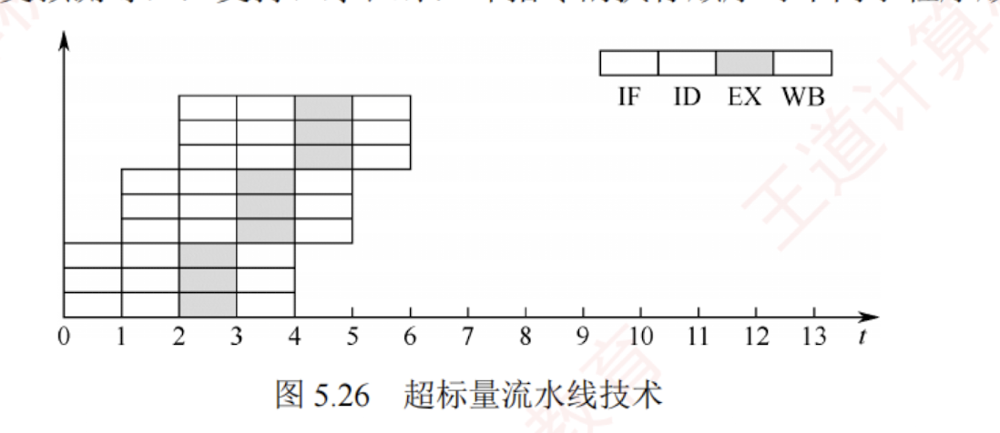

---

### 5.6.5 高级流水线技术

有两种主要策略可用于提升指令级并行度：  
一是**多发射技术**，通过配置多个内部功能部件，使流水线在每个时钟周期能同时处理多条指令，处理器一次可发射多条指令进入流水线执行；  
二是**超流水线技术**，通过增加流水线级数，使更多指令在流水线中重叠执行。

#### 1. 超标量流水线技术（动态多发射）

每个时钟周期可并发发射**多条独立指令**，为此需配置**多个功能部件**，如图 5.26 所示。  
在简单的超标量处理器中，**指令按顺序发射**。  
但为了提升并行性能，多数现代超标量处理器结合**动态调度**技术（如动态分支预测等），支持乱序执行，即指令的执行顺序可不同于程序顺序。

#### 2. 超长指令字技术（静态多发射）

由编译器挖掘指令间的并行性，并将多条可**并行执行的指令打包成一条超长指令字**，其中包含多个操作码字段，分别控制不同的处理部件。  
由于并行性由软件静态确定，控制相对简单。

#### 3. 超流水线技术

超流水线通过进一步**细分流水段**来缩短时钟周期，从而提高主频和指令吞吐率。  
然而，流水级数增加会带来更大的**流水段寄存器开销**和更高的**控制复杂度**，因此流水线深度并非越多越好。

在**理想情况**下：超流水线 CPU 在流水线充满后，**每个时钟周期完成一条指令**，$CPI = 1$，但主频更高；  
多发射 CPU **每个时钟周期可完成多条指令**，$CPI < 1$，但硬件成本更高、控制更复杂。