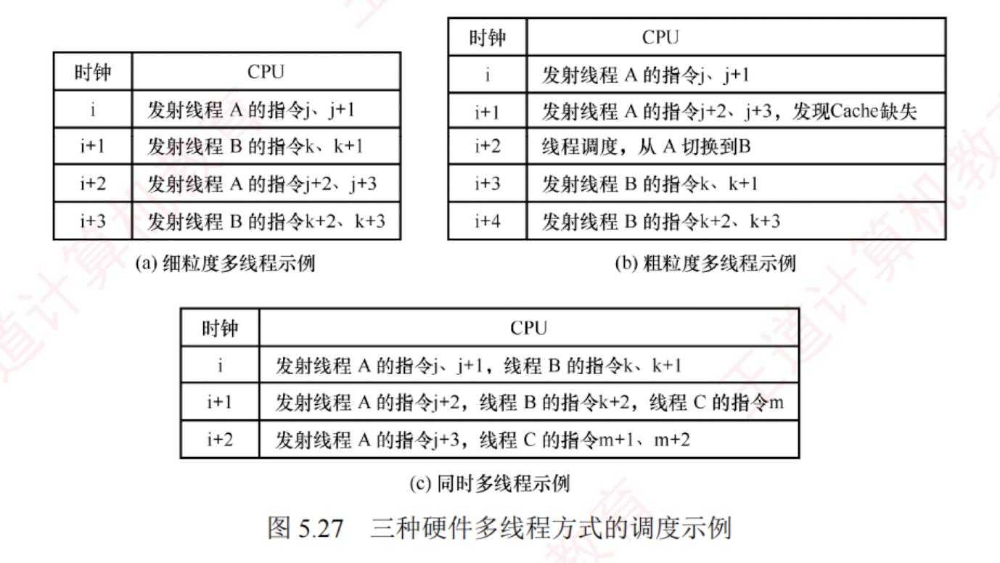

---

### 5.7.2 硬件多线程的基本概念

在传统 CPU 中，线程切换涉及保存和恢复寄存器上下文等操作，频繁切换将引入显著性能开销。为减少这一开销，硬件多线程技术应运而生。支持该技术的处理器为每个线程配备独立的通用寄存器组、程序计数器（PC）等关键状态部件。线程切换时，只需激活对应线程的寄存器组，无须将上下文写入或从内存读出，从而大幅降低切换延迟。

硬件多线程主要有三种实现方式：**细粒度多线程、粗粒度多线程和同时多线程（SMT）**。

#### 1. 细粒度多线程

处理器在每个时钟周期切换线程，交替执行不同线程的指令。由于各线程彼此独立，其指令可在连续周期中交错执行，有效提升功能部件的利用率。例如，在时钟周期 $i$ 执行线程 A 的指令，在周期 $i+1$ 执行线程 B 的指令。

#### 2. 粗粒度多线程

处理器连续执行同一线程的指令序列，仅当该线程因高延迟事件（如 Cache 缺失）导致流水线阻塞时，才切换至另一线程。此时需清空被阻塞的流水线，并为新线程重新填充流水线，因此切换开销通常大于细粒度多线程。

上述两种方式均在同一时刻仅执行一个线程的指令，不支持真正的指令级并行，其核心目标是通过线程切换隐藏长延迟操作，提升资源利用率。

#### 3. 同时多线程

SMT 在单个时钟周期内可同时发射并执行来自多个不同线程的多条指令，既利用了指令级并行，又实现了线程级并行。它通常构建于支持超标量和乱序执行的现代微架构之上，通过共享执行单元、缓存等硬件资源，在维持高单线程性能的同时，显著提升整体吞吐率。

图 5.27 给出了三种硬件多线程实现方式的调度示例。

Intel 处理器中的超线程（Hyper-Threading）技术是 SMT 的典型代表。它在一个物理核心中维护两套完整的线程状态部件（包括寄存器组、程序计数器等），而高速缓存、ALU 等执行资源则由两个逻辑核心共享，从而在单核上实现接近双核的并发处理能力（实际提升 $10\% \sim 30\%$）。
