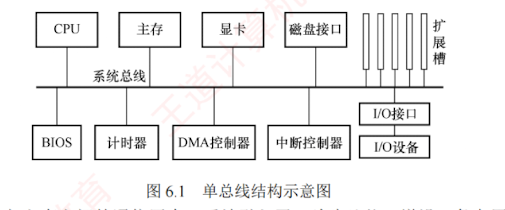
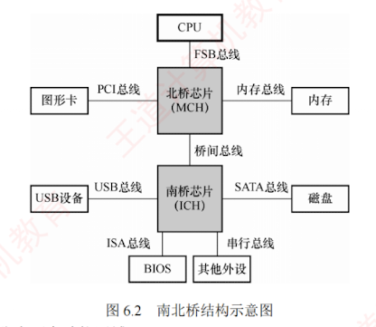

---

### 6.1.4 总线的结构

总线是计算机系统中各功能部件之间传递信息的公共通道，其结构设计直接影响系统的整体性能和扩展能力。随着处理器速度的不断提升，总线结构经历了从简单共享到分层并行，再到高度集成的演进过程，核心目标始终是**提升带宽、降低延迟、打破通信瓶颈**。
#### 早期共享总线结构

在计算机发展的早期阶段，普遍采用**单总线结构**：CPU、主存储器和各类 I/O 设备均挂接在同一条系统总线上，如图 6.1 所示。  
这种结构实现简单、成本低廉，但所有设备必须**分时竞争总线使用权**，导致频繁的传输冲突，效率低下，难以满足高速外设的数据吞吐需求。

为缓解 CPU 与主存之间的通信压力，后续引入了**双总线结构**，增设一条专用的**存储总线**，使 CPU 与主存的数据交换独立于 I/O 通路。  
尽管主存访问效率有所提升，但 I/O 设备若需要与主存交换数据，仍要通过 CPU 中转，形成了新的性能瓶颈。

进一步改进的三总线结构增加了 **DMA（直接内存访问）总线**，允许高速 I/O 设备通过 DMA 控制器直接与主存通信，无须 CPU 干预。  
这一设计显著提升了 I/O 的吞吐能力。  
然而，传统总线固有的共享式、广播式特性，仍然限制了系统的并发性和可扩展性。

#### 传统分层总线：南北桥结构

为突破早期共享总线的性能瓶颈，主流 PC 系统逐步转向分层次的多总线结构，典型代表是 Intel 在 Pentium 4 及早期 Core 系列处理器平台上广泛采用的南北桥结构，如图 6.2 所示。

该结构将系统划分为两个功能区域：

1. 北桥芯片（Memory Controller Hub, MCH）作为高速枢纽，连接 CPU、主存和显卡，负责高带宽数据传输。
    
2. 南桥芯片（I/O Controller Hub, ICH）是一个 I/O 控制器集线器，负责管理 USB、SATA、以太网等低速 I/O 接口，并提供扩展槽支持。
    
    在这一结构中，CPU 与北桥之间的互连通道称为前端总线（Front Side Bus, FSB），也称系统总线。CPU 通过 FSB 连接至北桥，再经由北桥分别与主存（通过存储器总线）和显卡通信。而各类 I/O 设备（如 USB 设备、网卡、磁盘等）则通过各自的设备控制器接入南桥，北桥与南桥之间通过专用的桥间总线互连，最终形成从 I/O 到 CPU 和主存的完整数据通路。
    
    尽管该结构实现了存储通路与 I/O 通路的物理分离，但所有数据（包括内存访问、显卡通信以及 I/O 传输）最终仍需要通过前端总线汇聚至 CPU。因此，FSB 成为整个系统的唯一高性能通道，其共享式特性反而演变为新的性能瓶颈，严重制约了系统整体吞吐能力的进一步提升。
    

#### 现代集成化总线结构

自 Intel Core i7 处理器起，总线结构迎来新的转变：北桥芯片的核心功能（如内存控制器）被集成到 CPU 内部，传统北桥随之消失，系统互连方式转向片上集成与点对点互连。

这一转变带来三大重要优势：

1. 内存访问路径缩短。CPU 可通过片上存储器控制器直接访问主存，无须经过北桥中转。同时，普遍支持多通道 DDR 内存（如双通道、三通道），各通道并行工作，理论带宽近似为单通道的整数倍。例如，三通道 DDR3-1333 的峰值带宽可达单通道的 3 倍。
    
2. 处理器间高速互连。多核 CPU 内核之间、多 CPU 芯片之间通过 QPI（QuickPath Interconnect）等点对点高速串行链路实现数据交换。QPI 不仅用于 CPU 间通信，还用于连接 CPU 与 IOH（输入/输出集线器，类似于早期的南桥），大幅提升了互连效率。
    
3. I/O 通路直连。高速外设（如显卡、SSD）通过 PCIe 通道直接接入 CPU，绕过南桥；低速设备则由集成度更高的 PCH（Platform Controller Hub, 新一代南桥）统一管理。