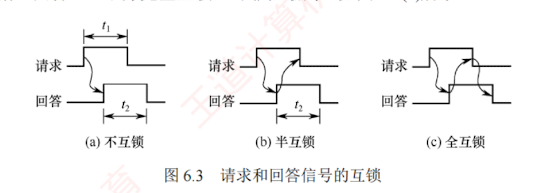

---

### 6.2.2 总线定时

总线定时是指总线上主设备与从设备在交换数据时，用于协调双方操作时序的控制协议。其实质是一种时序规则，主要有同步、异步、半同步和分离式四种方式。

**1. 同步定时方式**

同步定时方式采用系统统一的时钟信号来协调发送方和接收方的传送定时关系。时钟产生相等的的时间间隔，每个间隔构成一个**总线周期**，每次数据传送在**一个总线周期**内完成。由于采用统一时钟，所有操作必须严格在固定周期内进行，总线周期连续进行。

**优点**：传送速度快，具有较高的传输速率；总线控制逻辑简单。

**缺点**：主从设备之间属于**强制性同步**，所有操作严格受时钟节拍约束；缺乏应答或握手机制，无法根据从设备的实际状态动态调整时序，可靠性较差。

**适用场景**：适用于**总线长度较短**，且所连接**各部件的存取时间比较接近**的系统。

**2. 异步定时方式**

异步定时方式不依赖统一的时钟信号，而是通过主从设备之间的**握手信号**实现定时控制：主设备发出“请求”信号；从设备准备就绪后，发出“回答”信号。

**优点**：**总线周期长度可变**，能可靠连接工作速度差异较大的设备，自适应性强。

**缺点**：控制逻辑复杂，因多次信号交互，整体传输速率较低。

根据“请求”与“回答”信号的撤销是否互锁，异步定时可分为三类：

1. **不互锁方式**。主设备发出“请求”后，在预设时延 $t_1$ 后自行撤销；从设备收到请求后立即发出“回答”，并在时延 $t_2$ 后自动撤销。双方无互锁关系，如图 6.3(a) 所示。
    
2. **半互锁方式**。主设备必须收到“回答”后才撤销“请求”（存在互锁）；但从设备发出“回答”后，无须确认“请求”是否撤销，在时延 $t_2$ 后自动撤销（无互锁），如图 6.3(b) 所示。
    
3. **全互锁方式**。主设备需收到“回答”才撤销“请求”；从设备需确认“请求”已撤销后才撤销“回答”。双方完全互锁，可靠性最高，如图 6.3(c) 所示。
    

**适用场景**：适用于连接速度差异大、对可靠性要求较高而对速率要求不苛刻的系统。

**3. 半同步定时方式**

半同步定时方式结合了同步与异步的优点：地址、命令、数据的发送严格参照系统时钟前沿（如上升沿）；接收方通常在时钟后沿（如下降沿）进行识别；同时增设一条 `Wait` 信号线，允许慢速从设备反馈准备状态。主设备在时钟上升沿检测 `Wait` 信号状态。若 `Wait` 无效（高电平），表示数据未就绪，主设备将插入等待周期；直到 `Wait` 有效（低电平），才从数据线读取数据。

**优点**：在统一时钟下工作，控制比异步方式简单，可靠性较高。

**缺点**：系统时钟频率受限于最慢设备，整体速度不高。

**适用场景**：适用于包含多种速度差异较大设备、但性能要求不高的简单系统。

上述三种定时方式均采用“独占式事务模型”：从主设备发起请求到传送结束，总线全程被该事务占用。然而，在从设备准备数据阶段，总线虽被占用却处于空闲状态，造成资源浪费。

**4. 分离式定时方式**

分离式定时方式将一个总线事务拆分为两个独立子阶段：请求阶段与应答阶段，两阶段之间释放总线。

- **请求阶段**：主设备 A 获得总线使用权，发送地址和命令后立即释放总线，供其他设备使用。
    
- **应答阶段**：从设备 B 准备好数据后，主动申请总线，并以主设备身份将数据发回给 A。
    
    两个子阶段均为单向信息流，且总线在准备期间可被其他事务使用。
    
    **优点**：显著减少总线空闲等待时间，提高总线利用率。
    
    **缺点**：控制逻辑复杂，协议开销大，对总线仲裁和事务管理机制要求高。
    
    **适用场景**：适用于多主设备竞争激烈且从设备响应延迟较大的高性能系统。