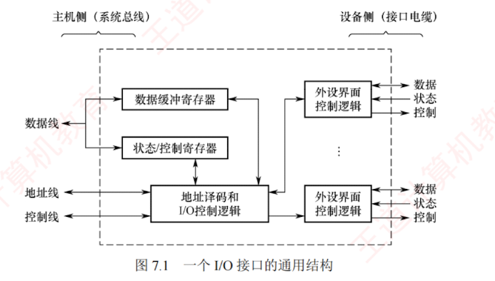

---

### 7.2.2 I/O 接口的基本结构

图 7.1 所示为 I/O 接口的**通用结构**。  
I/O 接口在主机侧通过 I/O 总线与 CPU 和内存相连，其内部主要包括**三类寄存器**：  
**数据缓冲寄存器**用于暂存 CPU 与外设之间传送的**数据**；  
**状态寄存器**用于记录接口及外设的**当前状态**；  
**控制寄存器**用于保存 CPU 发给外设的**控制命令**。  
由于状态寄存器仅被 CPU 读取，控制寄存器仅被 CPU 写入，二者的访问方向相反且访问时间错开，因此在某些设计中可**复用**同一端口地址：**读操作访问状态，写操作访问控制**。

I/O 接口中的**数据线**传送的是**读/写数据**、**状态信息**、**控制信息**以及**中断类型号**（在向量中断中）；  
**地址线**指定要访问的 **I/O 接口内部寄存器的端口地址**；  
**控制线**传送的是**读/写控制信号**（用于区分寄存器访问方向），以及**中断请求**与**响应信号**、**总线仲裁信号**和**设备握手信号**。

I/O 接口中的 **I/O 控制逻辑的功能**：  
1. 对**控制寄存器**中的**命令字**进行**译码**，并将生成的**控制信号**经外设界面控制逻辑送至**外设**。
2. 输出时，将数据缓冲寄存器的内容发送给外设；输入时，将外设数据写入数据缓冲寄存器。
3. 实时采集外设状态，并更新至**状态寄存器**。

对上述寄存器的访问通过**专用指令**完成，这类指令称为 **I/O 指令**。  
在采用独立 I/O 地址空间的体系结构（如 x86），**I/O 指令通常为特权指令**，仅限操作系统内核使用。[[为什么IO 指令通常为特权指令]]
