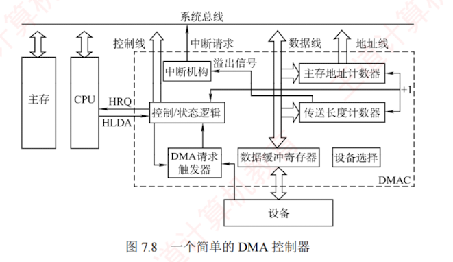
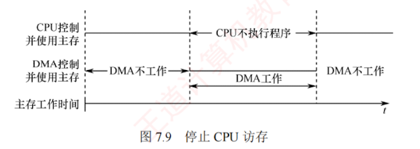

---

### 7.3.3 DMA 方式

DMA 方式是一种完全由硬件控制的数据传输方法，它具有程序中断方式的优点，即在数据准备阶段，CPU 与外设可并行工作。DMA 在外设与内存之间建立了一条直接的数据通路，使得信息传送无须经过 CPU，从而显著降低 CPU 在数据传输过程中的负担。正因如此，该方式被称为直接存储器存取，并避免了保存与恢复 CPU 现场等复杂操作。

DMA 特别适用于磁盘、显卡、声卡、网卡等高速设备的大批量数据传输，但其硬件实现开销较高。在 DMA 方式中，中断的作用仅限于处理故障和正常传输完成的通知。

#### 1. DMA 方式的特点

DMA 机制在主存与 DMA 控制器之间建立了一条直接的数据通路。由于数据传输不经过 CPU，因此无须中断现行程序，从而实现 I/O 操作与 CPU 计算的并行执行。

DMA 方式的主要特性包括：

1. 打破主存与 CPU 的固定关联，主存既可被 CPU 访问，又可被外设直接访问。
    
2. 在块数据传输过程中，主存地址的生成与传送字数的计数均由硬件电路自动完成。
    
3. 主存中需设置专用缓冲区，以支持高效的数据交换。
    
4. 支持高速数据传输，且 CPU 与外设可并行工作，显著提升系统效率。
    
5. 传输开始前需由软件进行预处理，结束后则通过中断机制完成后处理。
    

---

#### 2. DMA 控制器的组成

在 DMA 方式中，对数据传送过程进行控制的硬件称为 DMA 控制器（DMA 接口）。当 I/O 设备需要进行数据传送时，通过 DMA 控制器向 CPU 提出 DMA 请求，CPU 响应后即让出系统总线，由 DMA 控制器接管总线并执行数据传送。其主要功能如下：

1. 接收外设发出的 DMA 请求，并向 CPU 发出总线请求信号。
    
2. 在 CPU 发出总线响应信号后，DMA 控制器接管总线控制权，进入 DMA 操作周期。
    
3. 确定数据传送的主存起始地址及长度，并自动更新主存地址计数器和传送长度计数器。
    
4. 指定数据在主存与外设间的传送方向，发出读/写等控制信号，完成数据传送。
    
5. 在 DMA 操作结束后，向 CPU 报告传送完成。
    
    图 7.8 给出了一个简单的 DMA 控制器。
    

- **主存地址计数器：** 存放待传送数据的主存地址。传送前，保存整批数据的起始地址；每传送一个字，其内容自动加 1，直至该批数据传送完毕。
    
- **传送长度计数器：** 记录待传送数据的总长度。传送前，存入整批数据的总字数；每传送一个字，计数值减 1，当计数器为 0 时，表示传送结束。
    
- **数据缓冲寄存器：** 暂存每次传送的数据。通常，DMA 控制器与主存之间以字为单位传送，而与外设之间可能以字节或字为单位。
    
- **DMA 请求触发器：** 当 I/O 设备准备好数据时，发出 DMA 请求信号，使其置位。
    
- **控制/状态逻辑：** 用于设定传送方向、更新传送参数，并协调 DMA 请求与 CPU 响应信号。
    
- **中断机构：** 当一批数据传送完毕后，触发中断并向 CPU 发出中断请求。
    
    在 DMA 传送过程中，DMA 控制器接管系统总线；传送结束后，将总线控制权交还给 CPU，由 CPU 继续执行后续操作。因此，DMA 控制器必须具备控制系统总线的能力。
    

#### 3. DMA 的传送方式

主存与 I/O 设备之间交换信息时不经过 CPU。然而，当 I/O 设备和 CPU 同时访问主存时，可能发生冲突。为高效利用主存，DMA 与 CPU 通常采用以下三种方式共享主存。

**(1) 停止 CPU 访存**

当 I/O 设备发出 DMA 请求时，DMA 控制器向 CPU 发送停止信号，使 CPU 放弃总线控制权并暂停访存，直至 DMA 完成整块数据的传送（见图 7.9）。数据传送结束后，DMA 控制器通知 CPU 恢复主存访问，并交还总线控制权。

**优点：** 控制逻辑简单，适用于数据传输速率很高的 I/O 设备进行成组数据传送。

**缺点：** DMA 访存期间，CPU 基本处于空闲状态，资源利用率较低。

**(2) 周期挪用**

对于高速 I/O 设备，若不及时访存可能导致数据丢失，因此其访存请求具有较高优先级。周期挪用允许 I/O 设备挪用一个主存储周期，传送完一个数据字后立即释放总线（见图 7.10），属于单字传送方式。当 I/O 设备发起 DMA 请求时，可能出现以下三种情况：① CPU 当前不在访存，I/O 请求无冲突，可直接使用总线；② CPU 正在访存，则需等待当前存储周期结束，再释放总线控制权；③ I/O 与 CPU 同时请求访存，发生冲突，此时 CPU 暂时放弃总线控制权。

---

**优点：** 既满足了 I/O 数据传送需求，又较好地发挥了 CPU 与主存的效率。

**缺点：** 每次挪用均需申请并释放总线控制权，带来一定开销。

**(3) DMA 与 CPU 交替访存**

将 CPU 工作周期划分为两个子周期：一个供 CPU 访存，另一个供 DMA 访存。这样，在每个 CPU 周期内，两者可以轮流访问主存（见图 7.11）。该方式适用于 CPU 工作周期长于主存存储周期的场景。例如，若 CPU 工作周期为 $1.2\mu\text{s}$，主存存储周期小于 $0.6\mu\text{s}$，则可将其分为 $C_1$ 和 $C_2$ 两个子周期，其中 $C_1$ 专供 DMA 访存，$C_2$ 专供 CPU 访存。总线控制权通过 $C_1$ 和 $C_2$ 分时固定分配，无须动态申请或释放。

**优点：** 无须总线控制权的申请与释放过程，数据传送速率高。

**缺点：** 硬件控制逻辑较为复杂。

---

**【例 7.4】** 假定计算机的主频为 $500\text{MHz}$，CPI 为 4，某外设的数据率为 $40\text{MB/s}$，I/O 接口中

---

308 2027 年计算机组成原理考研复习指导

的数据端口为 32 位，采用 DMA 方式，每次 DMA 传送块大小为 1000B，且 DMA 预处理和后处理的总时钟周期数为 500，则 CPU 用于该外设 I/O 的时间占 CPU 总时间的百分比是多少？

**解：**

DMA 每秒次数为 $40\text{MB/s} \div 1000\text{B} = 40000$，在 DMA 方式中，只有预处理和后处理需要 CPU 处理，数据传送全程由 DMA 控制。CPU 用于外设 I/O 的总时间为 $40000 \times 500 = 2 \times 10^7$ 个时钟周期，占 CPU 总时间的百分比为 $2 \times 10^7 \div 500\text{M} = 4\%$。

#### 4. DMA 的传送过程

图 7.12 所示为 DMA 的数据传送流程，分为预处理、数据传送和后处理三个阶段。

---

**(1) 预处理**

由 CPU 完成必要的初始化工作，包括设置 DMA 控制器中的主存起始地址、传送方向、传送数据个数，并启动 I/O 设备。随后，CPU 继续执行原程序。当 I/O 设备准备好待发送（输入）或接收（输出）的数据时，会向 DMA 控制器发出 DMA 请求；DMA 控制器随即向 CPU 发出总线请求，申请总线控制权。

**(2) 数据传送**

DMA 以数据块为单位进行传送。一旦获得总线控制权，DMA 控制器便通过硬件循环自动完成数据的输入或输出操作，整个过程无须 CPU 干预。

**(3) 后处理**

数据块传送完成后，DMA 控制器向 CPU 发出中断请求。CPU 响应后执行中断服务程序进行后处理工作，如校验数据完整性，若出错则转入诊断程序等。

在 DMA 方式下，整个数据块的传送过程均由硬件完成，CPU 仅在预处理阶段进行初始化，在后处理阶段响应中断，因此用于 I/O 的开销极小。

---

#### 5. DMA 方式和中断方式的区别

DMA 方式和中断方式的主要区别如下：

① 中断方式涉及程序切换，需保存和恢复 CPU 现场；而 DMA 方式不中断现行程序，无须保存现场，除预处理和后处理外，完全不占用 CPU 资源。

② 中断请求只能在每条指令执行结束后被响应；而 DMA 请求可在当前总线周期结束后立即获得响应，无须等待指令完成。

③ 中断方式的数据传送依赖 CPU 执行指令完成；DMA 方式则由专用硬件直接在主存与外设间传送数据，传输速率高，适用于高速外设的成组数据传输。

④ 当 CPU 和 DMA 控制器同时访问主存时，DMA 请求的优先级通常更高。

⑤ 中断方式具备处理异常事件的能力，而 DMA 方式仅用于大批量数据的高效传输。

⑥ 从数据传送来看，中断方式由软件控制传送，DMA 方式由硬件直接完成。