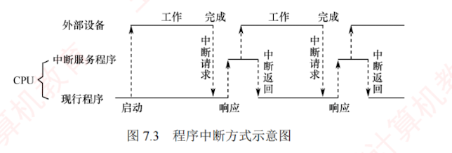

---

### 7.3.2 程序中断方式

#### 1. 程序中断的基本概念

程序中断是指在计算机执行程序的过程中，当出现某些急需处理的外部事件或内部异常时，CPU 暂停当前程序的执行，转去处理该事件或异常；处理完毕后，再返回到原程序的断点处继续执行。  
中断技术最初被用于实现主机与 I/O 设备之间的**异步通信**。

随着计算机系统的发展，中断技术被赋予了多种重要功能，主要包括：

① 实现 CPU 与 I/O 设备的并行工作。

② 处理硬件故障和软件异常。

③ 支持人机交互（如键盘输入、鼠标点击）。

④ 支撑多道程序与分时操作系统的任务切换。

⑤ 满足实时系统对快速响应的需求。

⑥ 实现用户程序向操作系统的切换（如通过软中断或系统调用指令）。

⑦ 在多处理器系统中协调各处理器间的通信与任务迁移。

**中断的基本工作思想**：当前进程发起 I/O 操作时，会启动相应外设，并主动进入阻塞状态；CPU 随即转而执行就绪队列中的另一进程，实现外设与 CPU 的并行工作。外设完成数据准备后，主动向 CPU 发出中断请求。CPU 响应后，暂停当前指令流，保存现场，并转入中断服务程序，完成主机与外设之间的数据传送。数据传送结束后，CPU 恢复被中断进程的现场，并返回断点处继续执行。此后，外设与 CPU 再次并行工作，如图 7.3 所示。

【例 7.2】 假定计算机主频为 $500\text{MHz}$，CPI 为 4，某外设的数据传输速率为 $40\text{MB/s}$，其 I/O 接口配备一个 32 位数据缓冲寄存器。在中断 I/O 方式下，若每次中断响应与中断处理共需至少 400 个时钟周期，则该外设能否采用中断 I/O 方式？为什么？

解：

中断响应与中断处理所需时间为 $400 \times 1/500\text{M} = 0.8\mu\text{s}$。外设填满（4B）缓冲区所需时间为 $4\text{B} \div 40\text{MB/s} = 0.1\mu\text{s}$。由于外设准备数据的时间（$0.1\mu\text{s}$）远小于中断处理时间（$0.8\mu\text{s}$），若采用每 32 位触发一次中断的方式，则新数据将在 CPU 处理完前次中断前就已到达，导致缓冲区被覆盖而丢失数据。因此，该高速外设不适合直接使用单字中断方式。

#### 2. 程序中断的工作流程

（1）中断请求

中断源是能够向 CPU 发出中断请求的设备或事件。一台计算机允许多个中断源同时存在，且各中断源发出请求的时间具有随机性。为记录并区分不同的中断请求，中断系统为每个中断源设置一个中断请求标记触发器：当其状态为“1”时，表示该中断源有中断请求。这些触发器可组成中断请求标记寄存器，该寄存器可集中置于 CPU 内部，也可分散在各个中断源中。

通过 INTR 信号线发出的是可屏蔽中断，通过 NMI 信号线发出的是不可屏蔽中断。可屏蔽中断的优先级较低，在关中断状态下不被响应；不可屏蔽中断用于处理紧急且关键的硬件事件（如电源掉电、总线错误等），其优先级最高，且不受中断允许标志的影响。

（2）中断响应判优

中断响应优先级是指 CPU 响应多个同时发生的中断请求的先后顺序。由于中断请求具有随机性，当多个中断源同时提出请求时，需通过中断判优逻辑确定优先响应哪个中断源的请求。中断响应的判优通常由硬件排队器（或中断查询程序）实现。

一般来说，①不可屏蔽中断 > 可屏蔽中断；②在 I/O 传送类中断请求中，高速设备 > 低速设备；输入设备 > 输出设备；实时设备 > 普通设备。

---

> 注意
> 
> 中断优先级包括响应优先级和处理优先级。响应优先级由硬件线路或查询顺序固定决定，不可动态更改；处理优先级可通过中断屏蔽技术动态调整，以支持多重中断（中断嵌套）。二者的关系可概括为：只有未被屏蔽的中断请求，才会被送入中断判优电路参与响应优先级的判定。

（3）CPU 响应中断的条件

CPU 仅在满足特定条件时才会响应中断请求，并经过一些特定的操作，转去执行中断服务程序。CPU 响应中断必须满足以下三个条件：

① 存在有效的中断请求。

② CPU 处于开中断状态（中断允许标志为 1；异常和不可屏蔽中断不受此限制）。

③ 当前指令已执行完毕（异常不受此限制），且无更高优先级任务待处理。

> 注意
> 
> I/O 设备的就绪时间是随机的，而 CPU 仅在每条指令执行结束时统一采样中断请求信号（前提是开中断）。因此，CPU 响应 I/O 中断的时机总是发生在某条指令执行完成之后。此处所述中断特指 I/O 中断，不包括异常。

（4）中断响应过程

CPU 响应中断后，由硬件自动完成一系列操作（称为中断隐指令），随后转入中断服务程序。中断隐指令并非指令系统中的真实指令，而是对硬件自动操作的统称，主要包括以下步骤：

1. 关中断。CPU 响应中断后，首先关闭中断允许标志，禁止响应任何可屏蔽中断（包括更高优先级者），以防止在保存断点和现场时被新中断打断；否则，现场信息可能不完整，导致中断返回后无法正确恢复原程序的执行。
    

---

2. 保存断点。为保证中断返回后能正确恢复原程序执行，需将程序计数器（PC）和程序状态字（PSW）等关键现场信息保存至栈或专用寄存器中。
    
    中断与异常的差异：中断发生于指令执行完成后，断点为下一条指令地址；故障类异常（如缺页、除零）因指令未完成，处理后需重新执行当前指令，断点为当前指令地址；陷阱类异常（如系统调用）在指令成功执行后触发，断点为下一条指令地址。
    
3. 引出中断服务程序。通过识别中断源，将对应中断服务程序的入口地址送入程序计数器 PC。识别方法主要有硬件向量法和软件查询法，本节主要讨论更常用的硬件向量中断法。
    

（5）中断向量

中断识别分为向量中断和非向量中断两类。非向量中断采用软件查询法，已在第 5 章介绍。

在向量中断中，每个中断源被分配一个唯一的中断类型号，该类型号对应一个中断服务程序的入口地址，此地址称为中断向量。系统将所有中断向量集中存放在内存的特定区域，该区域称为中断向量表。

CPU 响应中断后，首先在中断响应阶段从数据总线获取该中断源的中断类型号，然后据此计算出对应中断向量在中断向量表中的地址；接着从中断向量表中读取该中断向量，并送入程序计数器 PC，从而转入对应的中断服务程序。这种基于中断向量表实现转移的方法称为中断向量法，采用该方法的中断即为向量中断。

> 注意
> 
> 中断请求和响应信号通过 I/O 总线的控制线传输，而中断类型号则在中断响应阶段由中断控制器经数据总线提供给 CPU，用于定位中断向量表中的相应表项。

（6）中断处理过程

不同计算机的中断处理过程各具特色，图 7.4 所示为一个支持中断嵌套的典型处理流程。

---

中断处理流程如下：

① 关中断。防止在保存关键信息过程中被新中断打断。

② 保存断点。由硬件自动将断点信息保存至栈或专用寄存器。

③ 中断服务程序寻址。通过中断类型号获取服务程序入口地址，并送入 PC。

④ 保存现场和中断屏蔽字。通过软件指令将现场信息和中断屏蔽字压入栈中，以便后续恢复。现场信息是指 CPU 中可能被中断服务程序修改且需恢复的寄存器内容。

> 注意
> 
> 断点与现场信息均不可被中断服务程序破坏。由于现场信息用指令可直接访问，因此由软件在进入中断服务程序时显式保存。而断点信息由硬件在中断响应阶段自动保存。

⑤ 开中断。由开中断指令实现，允许更高优先级的中断请求被响应，从而实现中断嵌套。

⑥ 执行中断服务程序。

⑦ 关中断。由关中断指令实现，确保在恢复现场和中断屏蔽字的过程中不被中断。

⑧ 恢复现场和中断屏蔽字。从栈中恢复寄存器内容及中断屏蔽状态。

⑨ 开中断、中断返回。中断服务程序的最后一条指令通常为中断返回指令，用于恢复断点现场并返回原程序继续执行。

> 
> 其中，①～③由中断隐指令（硬件自动）完成；④～⑨由中断服务程序（软件）完成。

> 注意
> 
> 对于单重中断（不支持嵌套），上述流程中省略⑤（开中断）和⑦（关中断）即可。

#### 3. 多重中断和中断屏蔽技术

在 CPU 执行中断服务程序的过程中，若出现新的更高优先级中断请求，而 CPU 不予响应，则称为单重中断，如图 7.5(a) 所示；若 CPU 暂停当前中断服务程序，转去处理新中断，则称为多重中断（也称中断嵌套），如图 7.5(b) 所示。

---

在图 7.5(b) 中，CPU 执行主程序时收到中断请求 1。由于主程序未屏蔽任何中断，CPU 响应中断请求，将主程序断点保存至栈中，并转入中断服务程序 1。在执行中断服务程序 1 期间，若发生优先级更高的中断请求 2，CPU 会暂停中断服务程序 1，将其断点保存至栈中，并转入中断服务程序 2。

---

类似的，更高优先级的中断请求 3 可打断中断服务程序 2。当中断请求 3 处理完毕后，CPU 从栈顶恢复断点，返回至中断服务程序 2 的断点 ($K3+1$) 处继续执行。以此类推，直至所有中断处理完毕，最终返回主程序的断点 ($K1+1$) 处继续执行。

中断处理优先级是指多重中断的实际处理顺序，可通过中断屏蔽技术动态调整。若不使用屏蔽技术，则处理优先级与响应优先级（中断请求被 CPU 识别的先后顺序）一致。现代计算机普遍采用中断屏蔽技术，通过设置中断屏蔽字寄存器实现灵活的优先级控制。

图 7.6 所示为一个简单的可编程中断控制器。来自 I/O 总线的外设中断请求信号 ($IR_i$) 首先被记录在中断请求寄存器中。中断屏蔽字寄存器的每一位对应一个中断源：置 1 时屏蔽对应的中断请求，置 0 时允许其通过。在送入中断判优电路前，每个中断请求信号会与其对应屏蔽位的取反值进行逻辑“与”操作——仅当屏蔽位为 0 时，该中断请求才被允许参与仲裁。因此，被屏蔽的中断无法进入判优电路，而未被屏蔽的中断则按固定的响应优先级次序处理。

---

需要注意的是：中断屏蔽字通常在进入中断服务程序时由软件加载，用于控制后续中断的嵌套行为。因此，中断屏蔽仅在 CPU 执行中断服务程序期间生效；而在主程序运行阶段，中断响应仍由主程序所设置的屏蔽状态决定（通常为全开放）。此外，即使在中断服务程序执行期间，若有多个未屏蔽中断同时到达，其处理顺序仍由中断判优电路的响应优先级决定。

关于中断屏蔽字的设置及多重中断程序执行的轨迹，下面通过实例说明。

**【例 7.3】** 假设某机有 4 个中断源 A、B、C、D，其硬件响应优先级为 $A > B > C > D$。现要求通过中断屏蔽技术，将实际中断处理优先级调整为 $A > D > C > B$。

1. 写出每个中断源对应的中断屏蔽字。
    
2. 若 CPU 在执行用户程序时，A、C、D 同时发出中断请求；随后在执行 C 的中断服务程序期间，B 又发出中断请求。试分析 CPU 的程序执行轨迹。
    
    **解：**
    
3. 中断处理优先级调整为 $A > D > C > B$ 后，A 的处理优先级最高，需要屏蔽所有中断（包括自身），屏蔽字设为 1111；D 的次高，只允许被 A 中断，屏蔽 B、C 和自身，屏蔽字是 0111；C 的第三，允许被 A 和 D 中断，屏蔽 B 和自身，屏蔽字为 0110；B 的最低，允许被 A、D、C 中断，仅屏蔽自身，屏蔽字为 0100；结果如表 7.1 所示。
    

---

2. CPU 执行用户程序时，A、C 和 D 同时发出中断请求。根据响应优先级，先响应 A。进入 A 的服务程序前，系统保存现场，加载 A 的屏蔽字 1111，并开中断。由于所有中断均被屏蔽，A 的服务程序独占 CPU 直至完成，随后返回用户程序。重回用户程序后，C 和 D 尚未处理，根据响应优先级，先响应 C。但在执行 C 的服务程序前，系统加载其屏蔽字 0110，即允许 D 打断 C，于是 CPU 响应 D。D 的处理过程中未出现更高处理优先级的中断请求，D 顺利完成后返回被中断的 C 继续执行。在 C 的处理过程中，B 发出中断请求，但由于 C 的屏蔽字为 0110，B 被屏蔽，该请求不予响应。C 处理完后返回用户程序。最后，CPU 响应 B，B 处理完后，再次返回用户程序。整个执行轨迹如图 7.7 所示。
    

---

从宏观上看，程序中断方式克服了程序查询方式中 CPU 的忙等待现象，显著提高了 CPU 利用率。但从微观操作分析，CPU 在处理中断时仍需暂停原程序的运行。尤其当高速设备频繁、成批地与主存交换数据时，会不断打断 CPU 现行程序以执行中断服务程序，造成较大开销。

