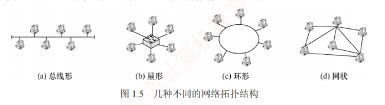

---

### 1.1.5 计算机网络的分类

**1. 按分布范围分类**

1. **广域网**（WAN）。广域网用于**长距离通信**，覆盖范围通常为几十至数千千米，常用于构建互联网的骨干部分，其节点交换机间通过高速链路互联，通信容量大。
    
2. **城域网**（MAN）。城域网的覆盖范围可跨越几个街区乃至整个城市，直径约为 5~50km。目前城域网大多采用**以太网**技术，因此有时也被归入**局域网**的讨论范畴。
    
3. **局域网**（LAN）。局域网通常将主机通过**高速线路**互连，覆盖范围较小，一般为几十米到几千米。传统上，**局域网采用广播技术**，而**广域网则采用交换技术**。
    
4. **个人区域网**（PAN）。个人区域网是指在个人工作或活动区域内，利用无线技术将消费电子设备（如平板电脑、智能手机等）互联而成的网络，也称无线个人区域网（WPAN）。
    

**2. 按传输技术分类**

1. **广播式网络**。所有联网计算机共享一个**公共通信信道**。  
   当一台计算机通过该信道发送报文分组时，所有其他计算机都能“收听”到该分组，并通过**检查目的地址**决定是否接收。  
   局域网普遍采用**广播式通信**；此外，**广域网中的无线和卫星通信网络也属于广播式网络**。
    
2. **点对点网络**。每条物理线路连接一对计算机。  
   若两台主机之间无直接连接，则分组需通过**中间节点**进行**存储转发**，直至到达目的主机。
    

**3. 按拓扑结构分类**

**网络拓扑结构**是指网络中**节点**（如路由器、主机等）与**通信线路**之间的**几何排列关系**，主要描述通信子网的结构。  
常见的拓扑结构包括**总线形**、**星形**、**环形**和**网状网络**，如图 1.5 所示。  
其中，总线形、星形和环形多用于**局域网**，网状结构则多用于**广域网**。

1. **总线形网络**。使用**单根传输线**连接所有计算机。优点是建网容易、增减节点方便、节省线路；缺点是重负载下通信效率低，并且总线任意一处故障都会影响全网。
    
2. **星形网络**。各终端或计算机通过**独立线路**连接到中央设备（通常为交换机或路由器）。  
   优点是便于集中控制与管理；  
   缺点是成本较高，且中央设备对故障敏感。
    
3. **环形网络**。所有计算机接口设备连接成一个**闭合环路**，信号沿路环**单向传输**。  
   典型的例子是**令牌环局域网**。  
   环可以是**单环或双环**，以提高可靠性。
    
4. **网状网络**。一般情况下，每个节点至少有两条路径与其他节点相连，广泛应用于**广域网**。  
   优点是可靠性高、容错能力强；  
   缺点是控制复杂、线路成本高。
    
    上述四种基本拓扑结构可相互组合，构成更复杂的混合网络。
    

**4. 按使用者分类**

1. **公用网**（Public Network）。由电信运营商出资建设，面向公众开放。任何愿意遵守规定并缴纳费用的用户均可接入使用。
    
2. **专用网**（Private Network）。由特定单位为满足自身业务需求而建设，仅限内部使用，不对外提供服务。例如铁路、电力、军队等部门的专用网络。
    

**5. 按传输介质分类**

传输介质分为**有线**和**无线**两大类，相应地，网络可分为**有线网络**和**无线网络**。  
有线网络包括双绞线网络、同轴电缆网络、光纤网络等；  
无线网络包括蓝牙、Wi-Fi、微波、无线电等类型。