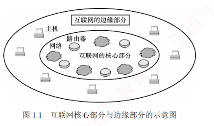

---

### 1.1.2 计算机网络的组成

从不同角度看，计算机网络的组成可分为以下几类。

1. 从**组成部分**看，计算机网络主要由**硬件**、**软件**、**协议**三大部分组成。  
   **硬件**包括**主机**（如台式机、笔记本电脑、平板电脑、智能手机等）、**通信链路**（如双绞线、光纤）以及**交换设备**（如路由器、交换机等）。  
   **软件**主要包括**实现资源共享的系统软件**和**便于用户使用的应用工具**（如 E-mail 程序、FTP 程序、聊天程序等）。  
   **协议**是计算机网络的核心，如同交通规则规范车辆行驶一样，它**规定了数据在网络中传输时必须遵循的规则**。
    
2. 从**工作方式**看，计算机网络（此处主要指 Internet，即互联网）可分为**边缘部分**和**核心部分**。  
   **边缘部分**由所有连接到互联网、供用户直接使用的**主机**组成，用于**通信**（如数据传输）和**资源共享**；  
   核心部分由**大量网络**及互连这些网络的**路由器**组成，为边缘部分提供连通性与交换服务。  
   图 1.1 展示了互联网核心部分与边缘部分的示意图。  
   
    

3. 从**功能组成**看，计算机网络由**通信子网**和**资源子网**组成。  
   **通信子网**由**传输介质**、**通信设备**及**相关网络协议**组成，负责数据的传输、交换、控制与存储，实现**联网计算机之间的通信**。  
   **资源子网**则是**实现资源共享功能的设备及其软件的集合**，向用户提供共享其他计算机上的硬件资源、软件资源和数据资源的服务。
    
