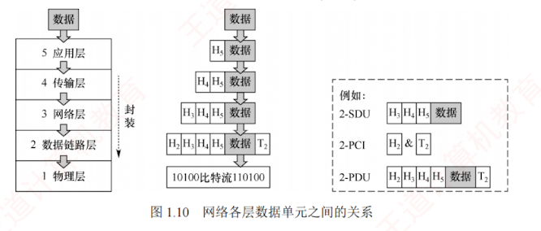

---

### 1.2.1 计算机网络分层结构

计算机网络是一个非常复杂的系统，因此在早期就采用了**分层**的设计思想。  
分层可将庞大而复杂的问题转换为若干较小的**局部问题**，而这些局部问题更容易于研究和处理。

计算机网络的各层及其协议的集合称为**网络的体系结构**（Architecture）。  
换言之，计算机网络的体系结构是对该网络及其所应完成**功能**的精确定义。  
需要强调的是，这些功能究竟由何种硬件或软件实现，属于**实现**（Implementation）问题。  
**体系结构是抽象的**，而**实现是具体的**，体现在实际运行的计算机硬件和软件中。  
计算机网络体系结构通常具有**可分层**的特性，能将复杂的操作系统分解为若干较易实现的层次。

分层的**基本原则**如下：

1. 每层实现一种相对独立的功能，以降低整个系统的复杂度。
    
2. 各层之间的接口清晰、简洁，相互依赖尽可能少，便于理解与维护。
    
3. 各层功能的定义独立于具体实现方法，可采用最合适的技术来实现。
    
4. 保持下层对上层的独立性，上层单向使用下层提供的服务。
    
5. 整个分层结构应有利于**标准化**工作。
    

在网络分层结构中，第 $n$ 层的**活动元素**通常称为第 $n$ 层**实体**。  
具体而言，**实体指任何可发送或接收信息的硬件或软件进程**，通常是**某个特定的软件模块**。  
**不同机器上的同一层称为对等层**，**同一层的实体互为对等实体**。  
第 $n$ 层向第 $n+1$ 层提供的服务，实际上是其**自身以及以下所有层所提供服务的总和**。  
第 $n$ 层的实体称为**服务提供者**，第 $n+1$ 层的实体称为**服务用户**。

- **协议数据单元（PDU）**：对等层之间传送的数据单位。第 $n$ 层的 PDU 记为 $n\text{-PDU}$。各层的 PDU 均由服务数据单元和协议控制信息两部分组成。
    
- **服务数据单元（SDU）**：相邻层之间交换的数据单位。第 $n$ 层的 SDU 记为 $n\text{-SDU}$。
    
- **协议控制信息（PCI）**：用于控制协议操作的信息。第 $n$ 层的 PCI 记为 $n\text{-PCI}$。
    

每层的 PDU 都有其通俗的名称：**物理层**的 PDU 称为**比特流**，**数据链路层**的 PDU 称为**帧**，**网络层**的 PDU 称为 **IP 分组**，**传输层**的 PDU 称为 TCP **报文段**或 UDP **数据报**。

当数据在各层之间传递时，将从第 $n+1$ 层接收到的 PDU 作为第 $n$ 层的 SDU，加上第 $n$ 层的 PCI 后封装成第 $n$ 层的 PDU，再交由第 $n-1$ 层作为其 SDU 发送。  
接收方收到后做相反的处理。

因此，三者的关系可表示为 $n\text{-SDU} + n\text{-PCI} = n\text{-PDU} = (n-1)\text{-SDU}$，如图 1.10 所示。

具体而言，**分层结构的含义**包括以下几个方面：

1. 第 $n$ 层的实体不仅要利用第 $n-1$ 层的服务来实现自身功能，还向第 $n+1$ 层提供本层的服务，该服务是第 $n$ 层及其下面各层所提供服务的总和。
    
2. 最低层只提供服务，是整个层次结构的基础；最高面向用户提供服务。
    
3. 上层只能通过相邻层的接口使用下层的服务，不能跨层调用。
    
4. 通信时，对等层在逻辑上如同存在一条直接信道，表现为能够直接交换信息。
    

