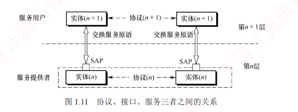

---

### 1.2.2 计算机网络协议、服务、接口的概念

#### 1. 协议

要有条不紊地在网络中实现数据交换，就必须遵循一些事先约定好的规则，这些规则规定了所交换**数据的格式**以及相关的**同步**问题。  
为在网络中进行数据交换而建立的这些规则、标准或约定称为**网络协议**（Network Protocol）。协议是控制**对等实体**之间通信的规则集合，是**水平**的。  
**不对等实体之间不存在协议**，例如，在使用 TCP/IP 协议栈通信的两个节点 A 和 B，节点 A 的传输层与节点 B 的传输层之间存在协议，但节点 A 的传输层与节点 B 的网络层之间则没有协议。

协议由**语法**、**语义**和**同步**三部分组成。

1. **语法**。规定**数据与控制信息的格式**。例如，TCP 报文段的结构由其语法定义。
    
2. **语义**。规定需要发出何种**控制信息**、完成何种**动作**以及做出何种**应答**。  
   例如，TCP 连接建立过程中每次握手所执行的操作由其语义定义。
    
3. **同步（或时序）**。规定执行各种**操作的条件**及**事件发生的先后顺序**。  
   例如，TCP 连接建立过程中三次握手的时序关系由其同步机制定义。
    

#### 2. 接口

同一节点内相邻两层实体交换信息的逻辑接口称为**服务访问点**（Service Access Point, SAP）。每层只能与紧邻的上下层定义接口，不允许跨层定义接口。  
服务是通过 SAP 提供给上层的，第 $n$ 层的 SAP 即为第 $n+1$ 层访问第 $n$ 层服务的入口。

#### 3. 服务

服务是指下层为紧邻的上层提供的**功能调用**，是**垂直**的。  
对等实体在协议的控制下协同工作，使得本层能够向上层提供服务；  
但要实现本层协议，又必须依赖下层所提供的服务。

需注意，**协议与服务在概念上有本质区别**。  
首先，只有本层协议的正确实现，才能保证向上一层提供服务。  
上层的服务用户只能感知到服务本身，而无法看到底层协议的细节，即下层协议对上层是**透明**的。其次，**协议是水平**的，用于规范**对等实体**之间的通信；  
**服务是垂直**的，**由下层通过层间接口向上层提供**。  
此外，并非某一层完成的全部功能都能称为服务，只有那些能被上层实体感知并调用的功能，才构成服务。

协议、接口、服务三者之间的关系如图 1.11 所示。

**计算机网络提供的服务可按以下三种方式分类**。

**(1) 面向连接服务与无连接服务**

**面向连接服务**要求通信双方在**传输前先建立连接并分配资源**（如缓冲区），传输结束后，释放连接与资源，全过程包括**连接建立**、**数据传输**和**连接释放**三个阶段，以保障通信可靠性。

**无连接服务无须预先建立连接**，发送方可直接发送**包含目的地址的分组**，由网络**动态选择**路径，各分组独立传输。  
该服务通常称为“**尽最大努力交付**”，属于**不可靠服务**。

**(2) 可靠服务和不可靠服务**

**可靠服务**是指网络具备**检错**、**纠错**和**应答**机制，能确保数据正确、完整、有序地送达目的地。  
不可靠服务是指网络仅提供“**尽最大努力交付**”，不保证可靠性。

对于提供**不可靠服务**的网络，**数据的可靠性需由高层保障**。  
例如，接收方校验数据完整性，出错时通知发送方重传，从而通过高层机制将不可靠服务转化为可靠服务。

**(3) 有应答服务和无应答服务**

**有应答服务**是指接收方在收到数据后，由传输系统自动向发送方返回应答（肯定或否定）。  
例如，文件传输通常采用有应答服务，以确保数据完整。

**无应答服务**是指接收方不自动返回应答；  
若需确认，须由高层协议或应用实现。  
例如，在 WWW 服务中，客户端收到网页后通常不向服务器发送应答。
