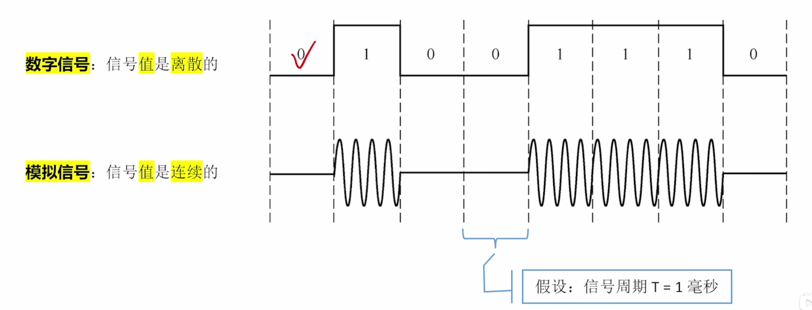
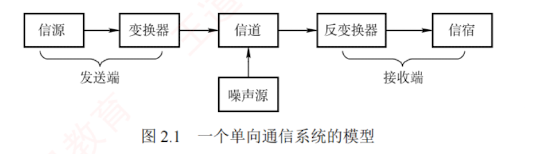

---

### 2.1.1 基本概念

**1. 数据、信号与码元**

**通信**的目的是**传输信息**，如文字、图像和视频等。  
**数据**是信息的载体，即用于传送信息的实体。  
**信号**则是数据的电气或电磁表现，是数据在传输过程中的**存在形式**。  
数据和信号均可分为**模拟**和**数字**两类：  
**模拟信号的取值是连续的**；  
**数字信号的取值是离散的**。

在通信系统中，通常用一个**固定时长**的**信号波形**表示一个 $k$ 进制符号，该波形称为**码元**（也称 $k$ 进制码元），而该时长称为**码元宽度**（或**信号周期**）。  
每个码元能够承载的信息量与其所表示的信号状态数量直接相关，1 码元可以携带**若干比特的信息量**。  
例如，若一个信号周期内可能出现 2 种信号，则每种信号可表示 1 位二进制数，意味着 1 码元可携带 1 比特信息；  
若可能出现 4 种信号，则每种信号可表示 2 位二进制数，意味着 1 码元携带 2 比特信息。

**2. 信源、信道与信宿**

图 2.1 所示为一个**单向通信**系统的模型，实际的通信系统大多数是双向的，可进行**双向通信**。  
数据通信系统主要划分为**信源**、**信道**和**信宿**三部分。  
**信源是产生和发送数据的源头**，**信宿是接收数据的终点**，它们通常都是计算机或其他数字终端装置。  
**信道是信号的传输介质**，一条双向通信的线路包含一个**发送信道**和一个**接收信道**。  
信源发出信息后，需经**发送变换器**转换为适合在信道传输的信号；  
该信号经信道传至接收端后，由**接收变换器**还原为原始信息，再交付给**信宿**。  
**噪声源**是信道上的噪声及分散在通信系统其他各处的噪声的**集中表示**。

按**传输信号形式**的不同，信道分为**传送模拟信号的模拟信道**和**传送数字信号的数字信道**；  
按**传输介质**的不同，分为**无线信道**和**有线信道**。

信道上传送的信号有**基带信号**和**宽带信号**之分。  
**基带信号**是由**信源**发出的未经过调制的**原始电信号**，当在信道中直接传送**基带信号**时，称为**基带传输**；  
**宽带信号**是将**基带信号**调制到**高频载波**上形成的信号，然后其在信道上传输，这种方式称为**宽带传输**。

数据传输方式分为**串行传输**和**并行传输**。  
**串行传输是指逐比特地按序依次传输**，**并行传输是指若干比特通过多个通信信道同时传输**。  
串行传输适用于**长距离通信**，如计算机网络。  
并行传输适用于**短距离通信**，常用于计算机内部，如 CPU 与主存之间。

从通信双方信息的**交互方式**看，可分为三种基本方式：

1. **单向通信**。只有一个方向的通信而没有反方向的交互，如无线电广播、电视广播等。
    
2. **半双工通信**。通信双方都可发送或接收信息，但任何一方都不能同时发送和接收。
    
3. **全双工通信**。通信双方可同时发送和接收信息。
    

单向通信只需一个信道；  
全双工通信需要**两个独立信道**（每个方向一个）；  
而半双工通信可在同一信道上分时双向传输，无须两个物理信道。

**3. 速率、波特与带宽**

**速率是指数据传输速率**，表示**单位时间内传输的数据量**，常有两种描述形式。

1. **码元传输速率**。也称**波特率**或**调制速率**，表示数字通信系统**每秒传输的码元数**，单位是**波特**（Baud）。  
   码元既可以是**多进制**的，也可以是**二进制**的，码元速率与进制无关。
    
2. **信息传输速率**。也称**比特率**，表示数字通信系统**每秒传输的比特数**，单位是 b/s。
    

> [!NOTE] 注意
> 
> 波特和比特是两个不同的概念，但波特率与比特率在数量上又有一定的关系。若一个码元携带 $n$ 比特的信息量，则波特率 $M$ Baud 对应的比特率为 $M \times n$ b/s。

在**模拟通信**中，**带宽**（也称频率带宽）表示信道所能传输信号的**频率范围**，即最高频率与最低频率之差，单位是赫兹（Hz）。  
而在**数字通信**或**计算机网络**中，带宽用来表示**通信线路所能传输数据的能力**，即**最大数据传输速率**，此时带宽的单位不再是 Hz，而是 b/s。

### 2.1.3 编码与调制

信号是数据的具体表示形式，数据无论是数字的还是模拟的，为了传输的目的，都要转换成信号。将数据转换为数字信号的过程称为编码，将数据转换为模拟信号的过程称为调制。

数字数据可以通过数字发送器转换为数字信号进行传输，也可以通过调制器转换为模拟信号进行传输；同样，模拟数据既可通过 PCM 编码器转换为数字信号进行传输，也可直接以模拟信号形式传输（例如传统电话中的语音信号）。由此形成了以下四种编码与调制方式。

**1. 数字数据编码为数字信号**

数字数据编码用于基带传输，即在基本不改变信号频率的情况下直接传输数字信号。编码的核心在于如何用电平或跳变来表示二进制数 0 和 1。常用编码方式有以下几种，如图 2.2 所示。

---

1. 归零（RZ）编码。用高电平表示 1，低电平表示 0（或相反），每个码元中间都会跳变回零电平（“归零”）。接收方可利用这一跳变来调整自身的时钟基准，从而实现收发双方的自同步。但由于归零过程占用了一部分带宽，传输效率会受到一定影响。
    

**考点追踪** >> NRZ 与 NRZI 编码的波形特性（2015）

2. 非归零（NRZ）编码。与 RZ 编码的区别是不进行归零，整个周期都可用于传输数据，因此编码效率最高。但由于缺乏内在时钟信息，收发双方需额外时钟线来实现同步。
    
3. 反向非归零（NRZI）编码。以码元起始处是否有跳变来表示数据：无跳变表示 1（或依协议约定），有跳变表示 0。跳变本身可用于辅助时钟恢复，兼顾了 NRZ 的高效率与一定的自同步能力，并且避免了 RZ 的带宽浪费。USB 2.0 等标准采用此编码。
    

**考点追踪** >> 曼彻斯特编码的波形特性（2013、2015）

4. 曼彻斯特编码。每个码元中间都有一次电平跳变，该跳变同时承担时钟同步与数据表示功能。常用下降沿（高$\to$低）表示 1，上升沿（低$\to$高）表示 0，或采用相反的约定。
    

**考点追踪** >> 差分曼彻斯特编码的波形特性（2021）

5. 差分曼彻斯特编码。同样，每个码元中间都有电平跳变，与曼彻斯特编码不同的是，该跳变仅用于时钟同步，而不表示数据。数据由码元起始处是否有跳变决定：无跳变表示 1，
    

---

有跳变表示 0。这种方式具有更强的抗干扰能力。

传统以太网采用的就是曼彻斯特编码，而差分曼彻斯特编码常用于令牌环网等高速网络。常见数字编码方式的特性对比如表 2.1 所示。

---

**2. 模拟数据编码为数字信号**

该过程通常采用 PCM（脉冲编码调制），包含三个步骤。

1. 采样：对模拟信号进行周期性采样，将其从时间连续变为时间离散。根据奈奎斯特定理，采样频率不得低于信号最高频率的两倍。
    
2. 量化：将采样所得的幅值按预设分级取整，将连续的模拟电平转换为离散的数值。
    
3. 编码：将量化后的整数转换为对应的二进制码。
    

**3. 数字数据调制为模拟信号**

数字数据调制技术在发送端将数字信号转换为模拟信号，在接收端则将模拟信号还原为数字信号，分别对应于调制解调器的调制和解调过程。图 2.3 显示了数字调制的三种方式。

---

1. 幅移键控（Amplitude Shift Keying, ASK）。通过改变载波的振幅来表示数字信号 1 和 0。例如，用有载波和无载波输出分别表示 1 和 0。这种方式容易实现，但抗干扰能力差。
    
2. 频移键控（Frequency Shift Keying, FSK）。通过改变载波的频率来表示数字信号 1 和 0。例如，用频率 $f_1$ 和频率 $f_2$ 分别表示 1 和 0。这种方式容易实现，并且抗干扰能力强。
    
3. 相移键控（Phase Shift Keying, PSK）。通过改变载波的相位来表示数字信号 1 和 0。例如，用相位 0 和 $\pi$ 分别表示 1 和 0，它是一种绝对调相方式。
    

---

> [!NOTE] 注意
> 
> 与 PSK 不同，DPSK（差分相移键控）是一种相对调相方式，它通过检测当前码元与前一个码元的载波相位差来传输数字信息。例如，用相位是否发生变化分别表示 1 和 0。

**考点追踪** >> QAM 调制阶数与码元比特数的关系（2009、2023）

4. 正交幅度调制（Quadrature Amplitude Modulation, QAM）。在载波频率相同的前提下，通过同时调制振幅和相位，形成复合信号，从而在有限带宽内实现更高的数据传输速率。
    
    QAM 基于正交载波，通常使用两路载波，分别对应正弦波和余弦波。两路载波的频率相同但相位相差 $90^\circ$，因此可在同一频带上独立传输而不会相互干扰。以 QAM-16 为例，常用如图 2.4(a) 所示的星座图表示：每路载波均有 4 种不同的振幅，其中横轴表示余弦波的幅度，纵轴表示正弦波的幅度。两路信号组合后可形成 16 种不同的信号状态，每个状态对应星座图上的一个点，并且代表一个 4 位二进制数。接收端收到信号后，通过判断该信号最接近哪个星座点，即可恢复出原始数据。若将每路载波的振幅调制成 8 种，则可组合成 64 种不同的信号状态（QAM-64），每个状态对应一个 6 位二进制数，如图 2.4(b) 所示。
    

---

假设波特率为 $B$，采用 $m$ 个相位，每个相位有 $n$ 种振幅，则该 QAM 的数据传输速率 $R$ 为

$$R = B \log_2(m \times n) \quad (\text{单位为 b/s})$$

**4. 模拟数据直接传输为模拟信号**

在某些场景下，模拟数据直接以模拟信号形式传输，无须数字化。例如，传统电话系统中，语音信号通过双绞线直接传送到本地交换机。此外，若需通过高频信道（如无线电波）传输，则可采用调幅（AM）、调频（FM）或调相（PM）等模拟调制技术，将信号加载到高频载波上。