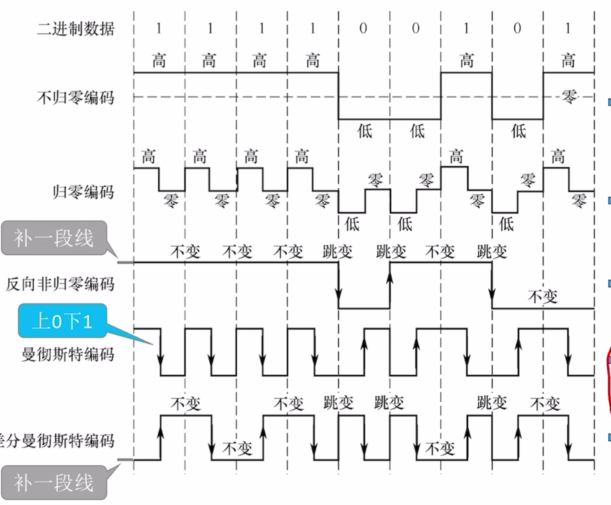
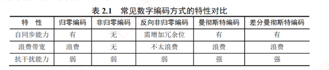
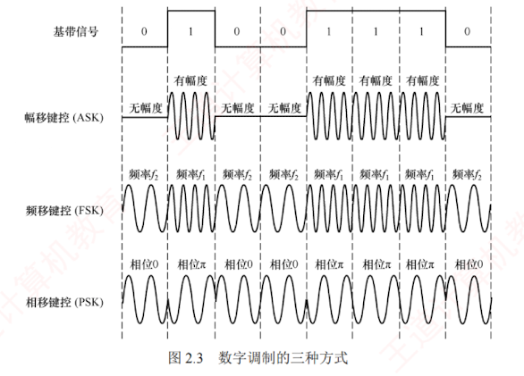
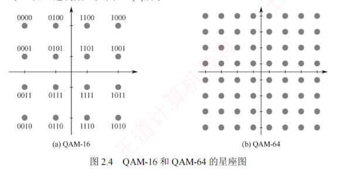

---

### 2.1.3 编码与调制

信号是数据的具体表示形式，数据无论是数字的还是模拟的，为了传输的目的，都要转换成信号。将**数据转换为数字信号**的过程称为**编码**，将**数据转换为模拟信号的过程称为调制**。

数字数据可以通过**数字发送器**转换为数字信号进行传输，  
也可以通过**调制器**转换为模拟信号进行传输；  
同样，**模拟数据**既可通过**PCM 编码器**转换为**数字信号**进行传输，也可直接以**模拟信号**形式传输（例如传统电话中的语音信号）。  

由此形成了以下**四种编码与调制方式**。

#### 1. 数字数据编码为数字信号

**数字数据编码用于基带传输**，即在基本不改变信号频率的情况下**直接传输数字信号**。  

编码的核心在于如何用**电平**或**跳变**来表示二进制数 0 和 1。  
常用编码方式有以下几种，如图 2.2 所示。

1. **归零（RZ）编码**。用高电平表示 1，低电平表示 0（或相反），每个**码元中间**都会跳变回**零电平**（“归零”）。  
   接收方可利用这一跳变来调整自身的**时钟基准**，从而实现收发双方的**自同步**。  
   但由于归零过程**占用了一部分带宽**，传输效率会受到一定影响。
    

2. **非归零（NRZ）编码**。与 RZ 编码的区别是**不进行归零**，整个周期都可用于传输数据，因此编码效率最高。  
   但由于**缺乏内在时钟信息**，收发双方需额外**时钟线**来实现同步。
    
3. **反向非归零（NRZI）编码**。以**码元起始处**是否有跳变来表示数据：  
   无跳变表示 1（或依协议约定），有跳变表示 0。  
   跳变本身可用于**辅助时钟恢复**，兼顾了 NRZ 的**高效率**与**一定的**自同步**能力，并且**避免了 RZ 的**带宽浪费****。  
   **USB 2.0 等标准采用此编码。**  
   [[为什么反向非归零编码拥有自同步能力]]
    
4. **曼彻斯特编码**。每个码元**中间**都有一次**电平跳变**，该跳变同时承担时钟同步与数据表示功能。常用下降沿（高$\to$低）表示 1，上升沿（低$\to$高）表示 0，或采用相反的约定。
    

5. **差分曼彻斯特编码**。同样，每个码元中间都有电平跳变，与曼彻斯特编码不同的是，该跳变仅用于时钟同步，而不表示数据。数据由码元起始处是否有跳变决定：无跳变表示 1，有跳变表示 0。这种方式具有**更强的抗干扰能力**。

**传统以太网**采用的就是**曼彻斯特编码**，而**差分曼彻斯特编码**常用于**令牌环网**等高速网络。  
常见**数字编码方式**的特性对比如表 2.1 所示。

[[如何理解各类数字编码方式的自同步能力]]
#### 2. 模拟数据编码为数字信号

该过程通常采用 **PCM**（**脉冲编码调制**），包含三个步骤。

1. **采样**：对模拟信号进行**周期性采样**，将其从**时间连续**变为**时间离散**。  
   根据**奈奎斯特定理**，采样频率不得低于信号最高频率的两倍。
    
2. **量化**：将采样所得的**幅值按预设分级取整**，将连续的模拟电平转换为离散的数值。
    
3. **编码**：将量化后的整数转换为对应的**二进制码**。
    

#### 3. 数字数据调制为模拟信号

**数字数据调制技术**在发送端将数字信号转换为模拟信号，在接收端则将模拟信号还原为数字信号，分别对应于**调制解调器**的调制和解调过程。

图 2.3 显示了**数字调制的三种方式**。

1. **幅移键控**（Amplitude Shift Keying, ASK）。通过改变载波的**振幅**来表示数字信号 1 和 0。  
   例如，用**有载波**和**无载波**输出分别表示 1 和 0。这种方式容易实现，但**抗干扰能力差**。
    
2. **频移键控**（Frequency Shift Keying, FSK）。通过改变载波的**频率**来表示数字信号 1 和 0。  
   例如，用频率 $f_1$ 和频率 $f_2$ 分别表示 1 和 0。  
   这种方式容易实现，并且**抗干扰能力强**。
    
3. **相移键控**（Phase Shift Keying, **PSK**）。通过改变载波的**相位**来表示数字信号 1 和 0。  
   例如，用相位 0 和 $\pi$ 分别表示 1 和 0，它是一种**绝对调相方式**。
    

> [!NOTE] 注意
> 
> 与 PSK 不同，DPSK（差分相移键控）是一种相对调相方式，它通过检测当前码元与前一个码元的载波相位差来传输数字信息。例如，用相位是否发生变化分别表示 1 和 0。

4. **正交幅度调制**（Quadrature Amplitude Modulation, **QAM**）。在**载波频率相同**的前提下，通过**同时调制振幅和相位**，形成**复合信号**，从而在**有限带宽**内实现**更高的数据传输速率**。
    
    QAM 基于**正交载波**，通常使用**两路载波**，分别对应**正弦波**和**余弦波**。  
    两路载波的频率相同但相位相差 $90^\circ$，因此可在同一频带上独立传输而不会相互干扰。  
    以 QAM-16 为例，常用如图 2.4(a) 所示的星座图表示：  
    每路载波均有 4 种不同的振幅，其中**横轴表示余弦波的幅度**，**纵轴表示正弦波的幅度**。  
    两路信号组合后可形成 16 种不同的信号状态，每个状态对应星座图上的一个点，并且代表一个 4 位二进制数。接收端收到信号后，通过判断该信号最接近哪个星座点，即可恢复出原始数据。  
    若将每路载波的振幅调制成 8 种，则可组合成 64 种不同的信号状态（QAM-64），每个状态对应一个 6 位二进制数，如图 2.4(b) 所示。
    

假设波特率为 $B$，采用 $m$ 个相位，每个相位有 $n$ 种振幅，则该 QAM 的数据传输速率 $R$ 为

$$R = B \log_2(m \times n) \quad (\text{单位为 b/s})$$

**4. 模拟数据直接传输为模拟信号**

在某些场景下，**模拟数据**直接以**模拟信号**形式传输，无须数字化。  
例如，传统电话系统中，语音信号通过双绞线直接传送到本地交换机。  
此外，若需通过高频信道（如无线电波）传输，则可采用调幅（AM）、调频（FM）或调相（PM）等模拟调制技术，将信号加载到高频载波上。