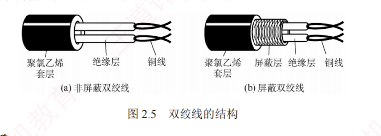
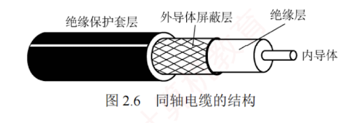
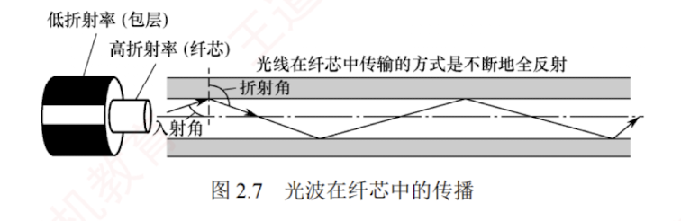
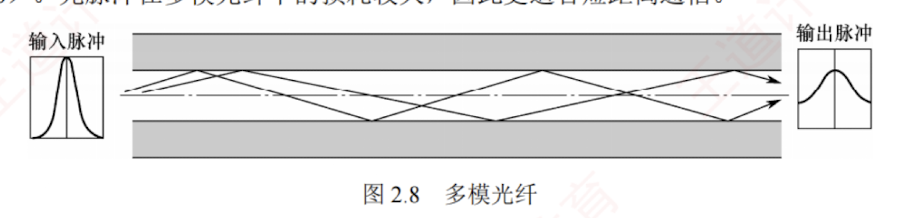
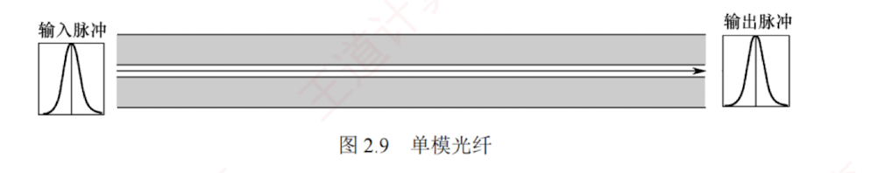

---

### 2.2.1 双绞线、同轴电缆、光纤与无线传输介质

**传输介质**也称**传输媒体**，是数据传输系统中**发送器**和**接收器**之间的**物理通路**。  

传输介质可分为**两类**：  
1. **导向传输介质**，如**铜线**或**光纤**等，电磁波被约束沿固体介质传播；
2. **非导向传输介质**，如**自由空间**（空气、真空或海水），电磁波在其中的传播称为**无线传输**。

#### 1. 双绞线

**双绞线**是最常用的传输介质，在**局域网**和**传统电话网**中广泛使用。  
它由**两根**相互**绝缘**、按**一定规则**绞合在一起的**铜导线**组成。  
**绞合结构**可有效**减少相邻导线间的电磁干扰**。  
为进一步提升抗干扰能力，可在双绞线外加一层金属丝编织的**屏蔽层**，称为**屏蔽双绞线**（**STP**）；  
**无屏蔽层**的则称为**非屏蔽双绞线**（**UTP**）。

双绞线的结构如图 2.5 所示。

双绞线价格低廉，既可用于**模拟传输**，也可用于**数字传输**，通信距离通常为几千米至数十千米。  
**其带宽取决于铜线的粗细和传输的距离**。  
距离太远时，对于模拟传输，要用**放大器**放大衰减的信号；  
对于数字传输，要用**中继器**来对**失真**的信号进行整形。

#### 2. 同轴电缆

**同轴电缆**由内导体、绝缘层、外导体屏蔽层和绝缘保护套层构成，如图 2.6 所示。  
通常分为两类：  
1. $50\Omega$ 同轴电缆，主要用于**基带数字信号传输**，曾广泛应用于**早期局域网**；
2. $75\Omega$ 同轴电缆，主要用于**宽带信号传输**，广泛应用于**有线电视系统**。  
3. 得益于外导体的屏蔽作用，同轴电缆具有良好的**抗干扰**性能，适合**较高速率的数据传输**。

随着交换技术和集线器的普及，局域网领域已基本采用**双绞线作为主流传输介质**。

---

#### 3. 光纤

**光纤**通信利用**光导纤维**（简称光纤）传输**光脉冲**来传递通信：  
有光脉冲表示 1，无光脉冲表示 0。  
可见光的频率约为 $10^{14}\text{MHz}$，因此光纤系统具有极大的**带宽潜力**。

光纤主要由**纤芯**和**包层**构成（见图 2.7）。  
纤芯直径极细，通常为 $8 \sim 100\mu\text{m}$；包层的折射率略低于纤芯，光波通过纤芯进行传导。  
当光从高折射率介质射向低折射率介质时，若入射角大于临界角，将会发生全反射，使光线在纤芯与包层界面反复反射而向前传播。

利用**全反射**原理，许多条不同角度入射的光线在同一根光纤中传输的类型称为**多模光纤**（见图 2.8）。  
光脉冲在多模光纤中的损耗较大，因此更适合**短距离通信**。

当光纤直径减小至接近光波波长时，仅允许单一模式的光传播，几乎无反射，此类光纤称为**单模光纤**（见图 2.9）。  
其纤芯极细，需使用定向性优良的半导体激光器作为光源。  
单模光纤衰减小，可实现数千米乃至数十千米的无中继传输，适用于**远距离通信**。

光纤不仅通信容量极大，还具备以下优势：

1. 传输损耗小，中继距离长，对远距离传输特别经济。
    
2. 抗雷电和电磁干扰性能强，在有大电流脉冲干扰的环境下，这尤为重要。
    
3. 无串音干扰，保密性好，不易被窃听或截取数据。
    
4. 体积小，重量轻，在现有电缆管道已拥塞不堪的情况下，这特别有利。
    

#### 4. 无线传输介质

无线通信已广泛应用于蜂窝移动通信。随着便携式计算机的普及，以及军事、野外等特殊场景对移动联网的需求不断增长，无线局域网（WLAN）得到了迅速发展。

##### （1）无线电波

无线电波具有较强的穿透能力，传播距离远，被广泛用于移动通信和 WLAN。其信号以全向方式扩散，接收端无须对准发射源即可建立连接，这是无线电波通信的重要优势。

##### （2）微波、红外线和激光

高带宽无线通信主要采用微波、红外线和激光三种技术，它们均需视距，具有强指向性。

微波通信工作在较高频段，带宽大、通信容量高。例如，一个 $2\text{MHz}$ 带宽的信道可容纳约 500 路语音信号。但由于微波沿直线传播，在地面传输时距离受限，通常需要中继站进行接力。

---

卫星通信利用地球同步卫星作为中继节点，有效突破了地面微波传输的距离限制。其优点是通信容量大、覆盖范围广、传输距离远；缺点是保密性较差，并且端到端传播时延较大。

红外线与激光通信将电信号转换为相应的光信号，在自由空间中直接传播，常用于短距离点对点链路（如遥控器）或室内通信。但这类通信极易受障碍物阻挡，且无法穿透墙壁。

