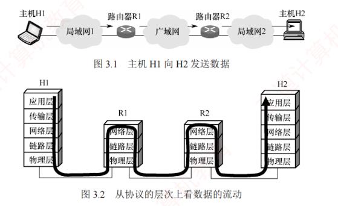
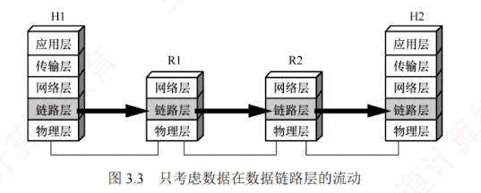

---

数据链路层的主要任务是让帧在一段链路或一个网络中传输。  
尽管数据链路层协议种类繁多，但它们都需要解决三个基本问题：**封装成帧、透明传输和差错检测**。

数据链路层使用的信道主要有两种：

1. **点对点信道**：一对一通信，通常通过一条专用物理链路连接两个节点。
    

2. **广播信道**：一对多通信，单个节点发送的数据可被连接在同信道上的所有节点接收。
    

### 3.1.1 数据链路层所处的地位

以两台主机通过**互联网通信**为例（见图 3.1）：  
局域网 1 中的主机 H1 经路由器 R1、广域网及路由器 R2，连接到局域网 2 中的主机 H2。

主机 H1 和 H2 均具备完整的**五层协议栈**；  
路由器在转发分组时仅使用协议栈的**下三层**。  
当 H1 向 H2 发送数据时，数据在各节点的协议栈中多次上下流动（见图 3.2）：  
进入路由器后，先从物理层上至网络层，在转发表中确定下一跳地址，再下至物理层转发出去。

然而，在学习数据链路层时，我们通常聚焦于**水平方向**的数据链路层交互。  
此时可将**通信过程**简化为：  
H1 的链路层 $\to$ R1 的链路层 $\to$ R2 的链路层 $\to$ H2 的链路层（见图 3.3）。  
这三段链路可能采用不同的数据链路层协议，但每一段都独立完成帧的传输任务。

下面介绍**点对点信道**的基本概念，其中部分也适用于广播信道。

1. **链路**。指从一个节点到相邻节点的一段**物理线路**，是通信路径的组成部分。
    
2. **数据链路**。在物理链路上添加实现通信协议的软硬件后所形成的**逻辑通信通道**。
    
3. **帧**。数据链路层**对等实体**间通信的协议数据单元。  
   发送方将网络层交下的数据封装为帧发送；  
   接收方从帧中提取数据并上交网络层。
    

[[数据链路]]

