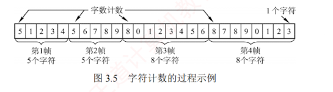

---
发送方依据特定规则，将网络层递交的分组封装成帧（也称**组帧**）。  
数据链路层以帧为单位传输数据，主要目的是：  
一旦出错，**只需重传出错的帧**，而不必重传全部数据，从而提高传输效率。  
组帧需解决**帧定界**、**帧同步**和**透明传输**等问题。  

常见的**组帧方法**有如下四种。

> [!NOTE] 注意
> 
> 组帧时通常**既要添加首部，也要添加尾部**。原因在于，网络中信息以帧为最小传输单位，接收方必须能准确识别一帧在比特流中的起始与结束位置，否则无法正确解析帧内容。

### 3.2.1 字符计数法

字符计数法在**帧首部**设置一个**计数字段**，用于记录该帧包含的**总字节数**（**包括计数字段自身占用的 1B**），如图 3.5 所示。  
接收方读取该计数值后，即可确定后续数据的长度，从而定位帧的结束位置；  
由于帧是**连续传输**的，下一帧的起始位置也随之确定。

字符计数法的主要**缺陷**是：  
当计数字段在传输过程中出错时，接收方将无法正确识别帧的边界，导致收发双方失去同步，可能引发**灾难性后果**。
