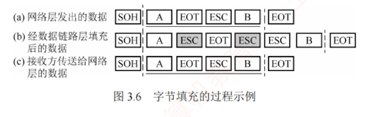

---

### 3.2.2 字节填充法

字节填充法通过**特定控制字符**实现帧定界。  
在图 3.6 中，控制字符 **SOH** 表示**帧的起始**，**EOT** 表示**帧的结束**。  
为避免数据中出现的 SOH 或 EOT 被误判为帧的定界符，发送方会在这些特殊字符前插入一个 **ESC** 字符（注意，ESC 是 ASCII 码中的一个单字节控制字符），以实现**透明传输**。  
若数据中原本就包含 ESC，则同样在其前再插入一个 ESC。  
接收方收到 ESC 后，会将其丢弃，并将紧随其后的字符视为**普通数据**（而非控制字符），从而**还原出原始数据**。

当帧的数据部分出现 ESC、EOT 或 SOH 时 [见图 3.6(a)]，发送方在每个 ESC、EOT 或 SOH 之前插入一个 ESC 字符 [见图 3.6(b)]，接收方处理后恢复原数据 [见图 3.6(c)]。
