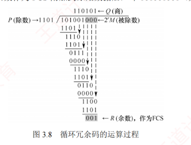

---

### 3.3.1 检错编码

**检错编码**均采用**冗余编码**技术，其**核心思想**是：  
在有效数据（信息位）发送前，按照特定规则附加若干**冗余位**（**校验位**），构成一个符合预设编码规则的码字后再发送。  
当信息位发生变化时，冗余位也会相应调整，以确保整个码字始终满足该编码规则。  
接收方通过校验收到的码字是否仍符合这一规则，来判断是否发生了差错。  
若某些比特在传输中出错，则可能违反原有的编码规则，进而使差错被有效检测出来。  
常见的检错编码包括**奇偶校验码**和**循环冗余码**。

#### 1. 奇偶校验码

奇偶校验码是**奇校验码和偶校验码的统称**，是最基本的检错码。  
它由 $n$ 位数据和 1 位检验位组成，检验位的取值（0 或 1）使得整个码字中“1”的个数为奇数（奇校验）或偶数（偶校验）。

1. 奇校验码：附加检验位后，码字中“1”的总数为奇数。
    
2. 偶校验码：附加检验位后，码字中“1”的总数为偶数。
    

例如，7 位数据 1001101 中有 4 个“1”（偶数），因此：对应的奇校验码为 1001101**1**（加 1 使“1”的总数为奇数），对应的偶校验码为 1001101**0**（加 0 使“1”的总数保持为偶数）。

**奇偶校验码只能检测奇数位错误，无法发现偶数位错误，也无法定位错误位置**。  
由于任意两个合法码字之间至少有 2 位不同，其码距为 2。  
根据码距理论，此类编码最多可检测 1 位错误。  
而实际上，只要发生奇数位错误，“1”的总数奇偶性必然改变，因此能检测所有奇数位错误。

#### 2. 循环冗余码

**循环冗余码**（Cyclic Redundancy Code, **CRC**）是数据链路层广泛采用的一种高效检错技术，具有检错能力强、实现简单、硬件支持成熟等显著优势，其**基本原理**如下。

CRC 的**核心思想**：  
将待发送的数据视为一个**二进制多项式**，通过与一个预定义的生成多项式 $G(x)$ 进行特定运算，生成一段**冗余校验信息**（称为帧检验序列，FCS），并将其附加在原始数据之后。接收方则使用相同的 $G(x)$ 对整个接收到的帧进行验证，从而判断传输过程中是否出现差错。

CRC 校验过程的具体描述如下。

- **约定生成多项式 $G(x)$**
    
    收发双方事先约定一个 $r + 1$ 阶的生成多项式 $G(x)$，其对应的二进制系数串长度为 $r + 1$ 位，且最高位和最低位必须为 1。例如，位串 1101 对应多项式 $x^3 + x^2 + 1$，其阶数 $r = 3$。
    
- **发送方生成 FCS**
    
    假设待发送数据为 $m$ 位，记作位串 $M$；在 $M$ 后面添加 $r$ 个 0，得到长度为 $m + r$ 的扩展串（相当于将 $M$ 左移 $r$ 位，即乘以 $2^r$）；用 $G(x)$ 对应的位串对该扩展串进行模 2 除法（不进位的二进制除法，其减法操作由异或实现）；所得余数（共 $r$ 位，不足时补前导 0）即为 FCS；将原扩展串末尾的 $r$ 个 0 替换为 FCS，形成最终发送帧（$2^rM + \text{FCS}$），总长度为 $m + r$ 位。
    
- **接收方校验**
    
    接收方收到整个帧（可能出错）后，用相同的 $G(x)$ 对其进行模 2 除法：若余数为 0，则认为传输无差错，接受该帧；若余数非 0，则认为存在差错，丢弃该帧。
    

以数据 $M = 101001$（$m = 6$）生成多项式 $G(x) = 1101$（对应 $r = 3$）为例。

CRC 校验码的**计算步骤**如下：

1. 左移补零：在 $M$ 后加 3 个 0，即 101001000。
    
2. 模 2 除法：用 1101 去除 101001000，如图 3.8 所示。模 2 除法规则：减法不借位，等价于按位异或；从最高位开始，每次对齐除数进行异或，直到处理完所有位。  
   
    

3. 取余数：最终余数为 001（必须保留为 3 位）。
    
4. 构造发送帧：将余数作为 FCS 附加到原始数据后，即 101001001（共 9 位）。
    

CRC 的生成与校验通常由**专用硬件电路**实现，速度极快，几乎不会引入额外的延迟。  
若传输过程中无差错，则 CRC 检验所得余数必定为 0；  
若出现误码，余数仍为 0 的概率极低。  
因此，在工程实践中通常认为“凡是被数据链路层接受的帧，几乎可以确定在传输过程中未发生差错”。  
而那些被丢弃的帧，尽管物理上曾被收到，却因 CRC 校验失败而未被上层接受。

