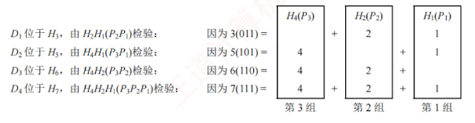

---

### 3.3.2 纠错编码

最常见的纠错编码是**海明码**。其基本原理是在原始信息位中插入若干检验位，构成具有检错与纠错能力的海明码。每个检验位对应一个校验组（通常采用偶校验），用于校验海明码中的若干信息位。通过将每个信息位分配到多个检验组中，当某一位出错时，会引发其所属的多个检验组同时出现校验错误，从而不仅能检测出错误，还能确定错误位置，实现单比特纠错。

下面以信息位 1010 为例，详细介绍海明码的构造与纠错过程。

(1) 确定海明码的总位数

设信息位有 $n$ 位，检验位有 $k$ 位。$k$ 个检验位可表示 $2^k$ 种状态：信息位和检验位共有 $n + k$ 种单比特出错的位置，此外还需要 1 种表示无错状态。因此，$n$ 与 $k$ 需满足

$$2^k \ge n + k + 1$$

本例中 $n = 4$，尝试 $k = 3$：$2^3 \ge 4 + 3 + 1$ 成立。故取 $k = 3$，海明码共 $n + k = 7$ 位。记信息位为 $D_4D_3D_2D_1 = 1010$，检验位为 $P_3P_2P_1$，海明码位号从右至左依次为 $H_7H_6H_5H_4H_3H_2H_1$。

(2) 确定检验位分布

规定：检验位 $P_i$ 放在海明位号为 $2^{i-1}$ 的位置上，其余各位放置信息位，因此：

$P_1$ 的海明位号为 $2^{i-1} = 2^0 = 1$，即 $H_1$ 为 $P_1$。

$P_2$ 的海明位号为 $2^{i-1} = 2^1 = 2$，即 $H_2$ 为 $P_2$。

$P_3$ 的海明位号为 $2^{i-1} = 2^2 = 4$，即 $H_4$ 为 $P_3。$

将信息位按原顺序放在剩余位置，得到海明码的分布如下：

$$\begin{aligned}

&H_7 & &H_6 & &H_5 & &H_4 & &H_3 & &H_2 & &H_1 \

&D_4 & &D_3 & &D_2 & &P_3 & &D_1 & &P_2 & &P_1

\end{aligned}$$

(3) 分组以形成检验关系

每个信息位由多个检验位共同校验，需满足条件：信息位所在位号 = 其所参与的所有检验位位号之和。另外，检验位不需要再被检验。分组形成的检验关系如下。

(4) 检验位取值

检验位 $P_i$ 的值为其对应校验组中所有位（含信息位）求异或（偶校验结果）。

根据 (3) 中的分组有

$$\begin{aligned}

P_1 \text{ 校验 } D_1, D_2, D_4 \quad &\to \quad P_1 = D_1 \oplus D_2 \oplus D_4 = 0 \oplus 1 \oplus 1 = 0 \\

P_2 \text{ 校验 } D_1, D_3, D_4 \quad &\to \quad P_2 = D_1 \oplus D_3 \oplus D_4 = 0 \oplus 0 \oplus 1 = 1 \\

P_3 \text{ 校验 } D_2, D_3, D_4 \quad &\to \quad P_3 = D_2 \oplus D_3 \oplus D_4 = 1 \oplus 0 \oplus 1 = 0

\end{aligned}$$

因此，1010 对应的海明码为 1010010（下划线为检验位，其余为信息位）。

(5) 海明码的检验原理

每个检验组分别利用检验位和参与形成该检验位的信息位进行奇偶校验检查，构成 $k$ 个检验方程：

$$\begin{aligned}

S_1 &= P_1 \oplus D_1 \oplus D_2 \oplus D_4 \\

S_2 &= P_2 \oplus D_1 \oplus D_3 \oplus D_4 \\

S_3 &= P_3 \oplus D_2 \oplus D_3 \oplus D_4

\end{aligned}$$

若 $S_3S_2S_1$ 的值为“000”，表示无错误；否则表示出错，且这个数就是错误位的位号，如 $S_3S_2S_1 = 001$，表示第 1 位出错，即 $H_1$ 出错，直接将其取反即可达到纠错的目的。

海明码的优势在于：通过少量冗余检验位，可实现单比特错误的自动定位与纠正。