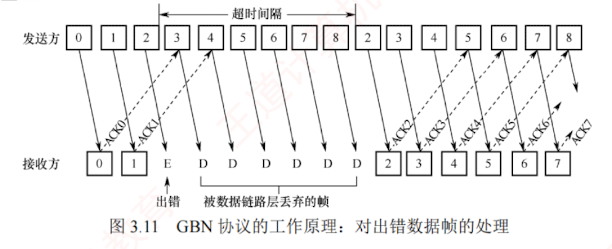

---

### 3.4.2 可靠传输机制

**可靠传输**是指**发送方发出的数据能够被接收方正确且完整地接收**，为实现这一目标，通常采用**确认**（**ACK**）和**超时重传**两种机制。

1. **确认**：接收方每成功接收到**一个数据帧**，就向发送方返回**一个确认帧**，表明该数据帧已被正确接收。
    
2. **超时重传**：发送方在发送一个数据帧后启动一个**计时器**，若在规定时间内**未收到对应的确认帧**，则认为该帧可能丢失或出错，从而自动**重传该帧**，直至成功收到确认为止。
    

结合这两种机制的可靠传输协议称为**自动重传请求**（Automatic Repeat reQuest, **ARQ**），它意味着：  **重传由发送方自主触发，无须接收方显式请求重传**。  
在 ARQ 协议中，数据帧和确认帧都必须**编号**，以便发送方和接收方能够准确识别确认帧对应的是哪个数据帧，以及判断哪些帧尚未被确认，从而决定是否需要重传。  
ARQ 协议主要包括三种类型：**停止-等待（Stop-and-Wait）协议**、**后退 $N$ 帧（Go-Back-N）协议**和**选择重传（Selective Repeat）协议**。  
这三种协议的基本原理不仅适用于数据链路层，也可应用于更高层的可靠传输设计。

在实际网络中，是否在数据链路层提供可靠传输服务**取决于链路特性**：有线网络的误码率较低，为降低开销，一般不要求数据链路层提供可靠传输服务；  
即使出现少量误码，也可由上层（如传输层）通过端到端机制处理。  
**无线网络的链路易受干扰**，误码率较高，因此要求**数据链路层必须向上层提供可靠传输服务**，以避免大量错误帧传递到上层，提升整体效率。

#### 1. 单帧滑动窗口与停止-等待协议（S-W）

在**停止-等待协议**中，发送方每次只能发送一个数据帧，只有在收到接收方对该帧的确认帧后，才能发送下一个帧。  
从**滑动窗口**的角度看，该协议的**发送窗口和接收窗口大小均为 1**。

在实际传输过程中，可能出现以下两类差错：

1. **数据帧出错或丢失**。接收方检测到数据帧存在**差错**时，**直接丢弃该帧**；  
   数据帧在传输途中**丢失**时，**接收方不会收到任何信息**。  
   为应对这两种情况，**发送方**需要配备一个**计时器**。  
   每**发送**完一个数据帧，发送方即**启动该计时器**；  
   计时器**超时**仍未收到对应的确认帧时，认为该帧可能已丢失或出错，于是**自动重传该帧**。  
   该过程重复进行，直至该帧被正确接收并**返回确认帧**为止。
    
2. **确认帧出错或丢失**。即使接收方已成功收到正确的数据帧，若其返回的确认帧在传输中**出错**或**丢失**，则发送方仍将因未收到确认而触发**超时重传**。  
   这时，接收方会再次收到一个**重复的数据帧**。  
   为避免重复处理，接收方会**丢弃该重复帧**，并**重新发送对应的确认帧**。
    

停止-等待协议**每次仅发送一帧**并等待确认，因此只需确保**相邻发送的帧具有不同的序号**即可区分新帧与重传帧。  
因此，仅需 **1 比特**序号空间就已足够：  
数据帧交替使用序号 0 和 1，对应的确认帧分别记为 **ACK0 和 ACK1**。  
若接收方连续收到相同序号的确认帧，则说明接收方收到了重复帧且重发了确认帧。

此外，为支持**超时重传**和**重复帧识别**，**发送方和接收方**均需设置**缓冲区**。  
**发送方**发送数据帧后，必须在**发送缓存中保留该帧的副本**，以便需要时重传；  
仅在**收到对应的确认帧**后，方可**清除该副本**。  
**接收方**也需**记录最近成功接收的帧序号**，以判断新到的帧是否是重复的。

停止-**等待协议的信道利用率很低** 。  
为提高传输效率，后续发展出了**连续 ARQ 协议**（后退 $N$ 帧协议和选择重传协议），允许发送方连续发送多个数据帧，而无须逐帧等待确认。

#### 2. 多帧滑动窗口与后退 $N$ 帧协议（GBN）

在**后退 $N$ 帧协议**中，发送方可在未收到确认帧的情况下，**连续发送多个序号**落在发送窗口内的数据帧。  
后退 $N$ 帧的含义是：**若某个已发送的数据帧因超时未收到确认而被判定为丢失或出错，则发送方不仅需要重传该帧，还需重传其后所有已发送但未被确认的帧**。  
这一机制的前提是：**接收方仅按序接收数据帧**，任何失序到达的帧都将被丢弃。

如图 3.11 所示，发送方向接收方连续发送数据帧，发送完 0 号帧后，可继续发送 1 号、2 号等后续帧。  
其通常**仅为最早未确认的帧维护一个超时计时器**，当该帧被确认后，计时器移至下一个未确认帧。由于连续发送了多个帧，确认帧必须明确指示所确认的**帧序号**。  
为降低开销，GBN 协议采用**累积确认机制**：接收方无须对每个正确接收的帧立即返回确认，而可在连续收到多个正确帧后，**仅对其中序号最大的帧发送一个确认**。  
具体而言，$\text{ACK}n$ 表示接收方已正确收到 $n$ 号帧及之前的所有帧，下一次期望接收的是 $n+1$ 号帧（若序号回绕，则可能是 0 号帧）。

由于接收方仅**按序接收帧**，当某帧**出错**或**丢失**时，其后所有**正确到达的帧**即使无误，也会被**丢弃**。  
例如，在图 3.11 中，尽管在出错的 2 号帧之后又收到了 6 个正确的数据帧，接收方仍必须将它们全部丢弃。  
此外，为了防止确认帧丢失，接收方可以**重复发送最近一次的确认帧**（如 $\text{ACK}1$），促使发送方尽快感知当前的接收状态。  
2 号帧的计时器**超时**后，发送方将从该帧开始，**重传窗口内所有未被确认的帧**（2 号及之后的帧）。

若采用 **$n$ 比特对帧编号**，则发送窗口 $W_{\text{T}}$ 应满足 $1 < W_{\text{T}} \le 2^n-1$。  
若 $W_{\text{T}} > 2^n-1$，而这可能导致**接收方无法区分新发送的帧与因序号回绕而重复出现的旧帧**（参见章末的疑难点 1）。

GBN 协议的**接收窗口大小固定为 $W_{\text{R}}=1$**，这保证了**帧的严格按序接收**。

不难看出，GBN 协议一方面通过连续发送多个帧显著提高了信道利用率；  
另一方面，在发生差错时却必须重传大量已正确到达的帧（仅因这些帧前面有一帧出错），从而造成带宽浪费。  
因此，当信道误码率较高时，GBN 协议的性能可能反而不如停止-等待协议。

#### 3. 多帧滑动窗口与选择重传协议（SR）

为了进一步提高信道的利用率，可以设法**仅重传出错或超时的数据帧**，而不影响其他已正确传输的帧。  
为此，接收方必须能够**暂存失序但正确到达**、且**序号仍落在接收窗口**内的**数据帧**，待缺失序号的帧收齐后，再按序交付给上层。  
这种机制即为**选择重传协议**。

为实现仅重传出错帧的目标，接收方不能再采用累积确认，而需对每个正确接收的数据帧**逐一发送确认**。显然，选择重传协议比后退 $N$ 帧协议更为复杂：

- 接收方需设置足够大的**帧缓冲区**（**其数量等于接收窗口大小**），用于暂存正确的失序帧；
    
- 发送方为每个未确认的帧维护**独立的计时器**，当某帧的计时器超时时，仅重传该帧；
    
- 若接收方收到重复的数据帧（表示确认帧丢失），则丢弃该帧，并重传对应的确认帧。
    

此外，选择重传协议还引入了更高效的差错处理策略：一旦接收方检测到某个数据帧出错，可立即向发送方发送否定帧（NAK），**请求重传 NAK 指定的帧**，从而避免等待超时。

在图 3.12 中，2 号帧丢失后，接收方仍可正常接收并缓存后续到达的数据帧（如 3～9 号帧）；发送方超时重传 2 号帧并被成功接收后，接收窗口即可向前滑动。在某个时刻，若接收方检测到 10 号帧出错，则会立即发送否定帧 NAK10；在此期间，接收方仍可继续接收并缓存后续帧；发送方收到 NAK10 后，立即重传 10 号帧，无须等待超时。

---

选择重传协议的接收窗口 $W_{\text{R}}$ 和发送窗口 $W_{\text{T}}$ 均大于 1，允许一次发送或接收多个数据帧。若采用 $n$ 比特对帧编号，需满足两个条件：① $W_{\text{R}}+W_{\text{T}} \le 2^n$（不满足此条件时，接收窗口向前滑动后，部分确认帧丢失，发送方可能重传旧序号的帧；由于序号空间不足，这些重传帧的序号可能与新帧重叠，导致接收方无法区分新帧与旧帧）。② $W_{\text{R}} \le W_{\text{T}}$（若接收窗口大于发送窗口，则接收窗口中超出发送窗口范围的部分永远无法被填满，造成资源浪费）。由①和②不难推出 $W_{\text{R}} \le 2^{n-1}$。在实际应用中，常取 $W_{\text{R}}=W_{\text{T}}=2^{n-1}$，以充分利用序号空间。

> **注意**
> 
> 为使内容精炼，本文未对三种 ARQ 协议的滑动窗口动态变化过程展开具体示例。此部分内容在配套视频中有丰富、形象的过程演示，强烈建议读者结合学习。

#### 4. 信道利用率的分析

信道利用率用于衡量信道的使用效率。从时间角度看，信道效率是针对发送方而言的，是指**发送方在一个发送周期（从发送方开始发送一个分组，到收到对该分组的确认所需的时间）内，有效发送数据的时间与整个发送周期之比**。本节使用分组而非帧，是为了增强表述的通用性。

##### （1）停止-等待协议的信道利用率

**考点追踪** ▶ 停止-等待协议的信道利用率分析（2018、2020）

停止-等待协议的优点是实现简单，但缺点是信道利用率极低。图 3.13 显示了停止-等待协议中数据帧和确认帧的发送时间关系。假定在发送方和接收方之间有一个直通的信道来传送分组。

---

发送方发送一个分组的发送时延为 $T_{\text{D}}$。显然，$T_{\text{D}}$ 等于分组长度除以数据传输速率。假定分组正确到达接收方后，其处理时间可忽略不计，接收方立即返回确认。接收方发送确认分组的发送时延为 $T_{\text{A}}$（通常可忽略不计）。再假设发送方处理确认分组的时间也可忽略不计，则发送方经过时间 $T_{\text{D}} + \text{RTT} + T_{\text{A}}$ 后就可再发送下一个分组，其中 $\text{RTT}$ 是往返时延。由于仅有 $T_{\text{D}}$ 时间用于有效发送数据，因此停止-等待协议的信道利用率 $U$ 为

$$U = \frac{T_{\text{D}}}{T_{\text{D}} + \text{RTT} + T_{\text{A}}}$$

假定某信道的 $\text{RTT} = 20\text{ms}$。分组长度为 1200 比特，数据传输速率为 $1\text{Mb/s}$。若忽略处理时延和 $T_{\text{A}}$，则可算出信道利用率 $U = 5.66\%$。若将数据传输速率提高至 $10\text{Mb/s}$，则 $U = 0.596\%$。由此可见，**当 $\text{RTT}$ 远大于 $T_{\text{D}}$ 时，停止-等待协议的信道利用率会非常低**。

##### （2）连续 ARQ 协议的信道利用率

**考点追踪** ▶ 停止、GBN 与 SR 协议的信道利用率对比分析（2023）

连续 ARQ 协议采用流水线传输（见图 3.14），允许发送方连续发送多个分组，从而在信道上维持持续的数据流动。只要发送窗口足够大，即可显著提升信道利用率。

---

设连续 ARQ 协议的发送窗口大小为 $N$（最多可连续发送 $N$ 个分组），分为两种情况：

1. 若 $N T_{\text{D}} < T_{\text{D}} + \text{RTT} + T_{\text{A}}$：即在一个发送周期内可发送完 $N$ 个分组，此时，信道无法被完全占满，信道利用率为
    
    $$U = \frac{N T_{\text{D}}}{T_{\text{D}} + \text{RTT} + T_{\text{A}}}$$
    
2. 若 $N T_{\text{D}} \ge T_{\text{D}} + \text{RTT} + T_{\text{A}}$：即在一个发送周期内发不完（或刚好发完）$N$ 个分组，只要无差错发生，发送方可持续不断地发送，信道被完全利用，此时信道利用率 $U = 1$。
    

在相同帧序号比特数下，GBN 的发送窗口大于停止-等待协议，因此理想条件下信道利用率更高。但是，当信道误码率较高时，其实际信道利用率甚至可能低于停止-等待协议。

**考点追踪** ▶ 滑动窗口协议的数据传输速率分析（2009、2010、2014）

此外，“信道平均（实际）数据传输速率 $=$ 信道利用率 $\times$ 信道带宽（最大数据传输速率）”，或“信道平均（实际）数据传输速率 $=$ 发送周期内发送的数据量 $/$ 发送周期”。

本节习题包含大量关于信道利用率与传输速率的习题，建议读者结合练习深入掌握。