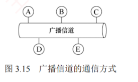
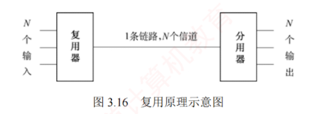
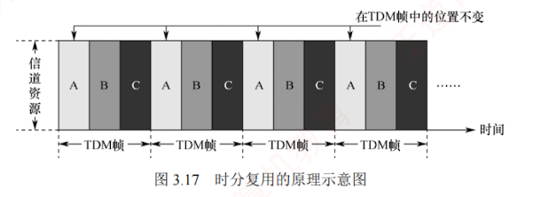
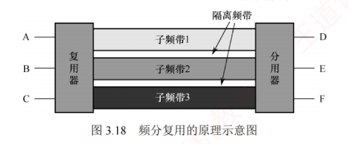

---

**介质访问控制的主要任务是协调共享同一信道的各节点的传输行为，以避免彼此之间的信号冲突**。如图 3.15 所示，在广播信道中，节点 A、B、C、D 和 E 共享同一信道。  
若 A 与 C、B 与 D 同时通信且未加控制，则可能因信号干扰而通信失败。  
用于**决定广播信道资源分配的协议**属于数据链路层的**介质访问控制**（**Medium Access Control**, **MAC**）子层。

常见的**介质访问控制方法**包括：  
**信道划分介质访问控制**、**随机访问介质访问控制**和**轮询访问介质访问控制**。  
其中，前者采用**静态划分信道**的方式，后两者则属于**动态分配信道**的方法。

### 3.5.1 信道划分介质访问控制

**信道划分介质访问控制**通过**复用**技术，将同一传输介质上的多个设备通信隔离开来，合理分配时域或频域资源。  
所谓**复用**，是指**在发送端将多个发送方的信号组合到一条物理信道上传输，在接收端再将复用信号分离，并交付给对应的接收方**，如图 3.16 所示。  
当传输介质的带宽超过单个信号所需带宽时，复用技术还能有效提高传输系统的利用率。

信道划分的实质是通过**分时**、**分频**、**分码**等方式，将一个广播信道在**逻辑**上划分为若干互不干扰的**子信道**，从而实现多个**点对点通信**。

信道划分介质访问控制主要包括以下四种方式。

#### 1. 时分复用（TDM）

**时分复用**（Time Division Multiplexing, **TDM**）将信道的传输时间划分为**等长的时间片**，构成一个 TDM 帧。  
每个用户在每个 TDM 帧中占用**固定序号**的**时隙**，且该时隙**周期性**出现（周期即为 TDM 帧长度）。所有用户在不同时间共享相同的信道资源，如图 3.17 所示。  
需注意，**TDM 帧是一段固定长度的时间间隔**，与数据链路层的“帧”概念不同。

从**某一时刻**看，信道上传送的是**某对用户之间的信号**；  
从**一段时间**看，则是**按时间分割的复用信号**。  
由于 TDM 按固定次序分配时隙，当某用户暂无数据发送时，其分配的时隙仍被保留，无法被其他用户利用，因此信道利用率较低。  
**统计时分复用**（Statistic TDM, **STDM**）也称**异步时分复用**，是对 TDM 的改进。  
STDM 不固定分配时隙，而是**按需动态分配**：  
仅当用户有数据要发送时，才为其分配 STDM 帧中的时隙，从而显著提高线路利用率。  
例如，假设线路数据速率为 6000b/s，3 个用户的平均速率均为 2000b/s。  
采用 TDM 时，每个用户固定分配 2000b/s 的带宽；  
而在 STDM 下，各用户可**动态共享全部带宽**。  
当其他用户无数据发送时，某一用户可利用接近线路总速率（此处为 6000b/s）的带宽进行突发传输，进而显著提高线路的平均利用率。

#### 2. 频分复用（FDM）

**频分复用**（Frequency Division Multiplexing, **FDM**）将信道的**总频带划分为多个子频带**，每个子频带作为一个**独立子信道**，供一对用户通信使用，如图 3.18 所示。  
所有用户在同一时间占用不同的频带资源。  
各子信道分配的带宽可以不同，但总和不得超过信道的总带宽。  
为防止相邻子信道间相互干扰，实际应用中通常还需在它们之间设置“**隔离频带**”。

频分复用的优点在于能充分利用传输介质的带宽，系统效率较高，且实现相对简单。

#### 3. 波分复用（WDM）

**波分复用**（Wavelength Division Multiplexing, **WDM**）即**光的频分复用**。  
它在一根光纤中同时传输多种不同波长的光信号。  
由于波长不同，各路光信号互不干扰，接收端通过光分用器将各波长分离出来。  
由于光波位于电磁频谱的高频段，具有极大的带宽，因此可支持多路的波分复用。

#### 4. 码分复用（CDM）

**码分复用**（Code Division Multiplexing, **CDM**）是一种采用**不同编码来区分各路原始信号**的复用方式。  
与 FDM 和 TDM 不同，CDM 既**共享信道的频率**，又**共享时间**。

实际上，更常用的名词是**码分多址**（Code Division Multiple Access, **CDMA**），其原理是将每个**比特时间**进一步划分为 $m$ 个短的时间槽，称为**码片**（Chip），通常 $m$ 的值为 64 或 128，为了简化说明，下例中设 $m = 8$。  
每个站点指派一个唯一的 $m$ 位**码片序列**。  
发送 1 时，站点发送其**码片序列**；  
发送 0 时，站点发送该码片序列的**反码**。  
当两个或多个站点同时发送时，各路数据在信道中**线性相加**。  
为了从信道中分离出各路信号，各个站点的**码片序列应相互正交**。

简单理解就是，A 站向 C 站发出的信号用一个向量表示，B 站向 C 站发出的信号用另一个向量表示，这**两个向量要求相互正交**。  
向量中的分量即所谓的**码片**。

##### 举例
下面举例说明 **CDMA 的原理**。

令向量 $\boldsymbol{S}$ 表示 A 站的码片向量，$\boldsymbol{T}$ 表示 B 站的码片向量。  
假设 A 站的码片序列被指派为 00011011，则 A 站发送 00011011 表示发送比特 1，发送 11100100 表示发送比特 0。  
为便于计算，将码片中的 0 写为 -1，1 写为 +1，因此 A 站的码片序列是 (-1 -1 -1 +1 +1 -1 +1 +1)。

不同站点的码片序列相互正交，即向量 $\boldsymbol{S}$ 和 $\boldsymbol{T}$ 的规格化内积为 0：

$$\boldsymbol{S} \cdot \boldsymbol{T} = \frac{1}{m} \sum_{i=1}^{m} S_i T_i = 0$$

任何站点的码片向量和该码片向量自身的规格化内积都是 1：

$$\boldsymbol{S} \cdot \boldsymbol{S} = \frac{1}{m} \sum_{i=1}^{m} S_i S_i = \frac{1}{m} \sum_{i=1}^{m} S_i^2 = \frac{1}{m} \sum_{i=1}^{m} (\pm 1)^2 = 1$$

任何站点的码片向量和该码片反码的向量的规格化内积都是 -1：

$$\boldsymbol{S} \cdot \overline{\boldsymbol{S}} = \frac{1}{m} \sum_{i=1}^{m} S_i \overline{S}_i = -\frac{1}{m} \sum_{i=1}^{m} S_i^2 = -1$$

令向量 $\boldsymbol{T}$ 为 (-1 -1 +1 -1 +1 +1 +1 -1)。

当 A 站向 C 站发送数据 1 时，就发送了向量 (-1 -1 -1 +1 +1 -1 +1 +1)。

当 B 站向 C 站发送数据 0 时，就发送了向量 (+1 +1 -1 +1 -1 -1 -1 +1)。

两个向量在公共信道上叠加，实际上是**线性相加**，得到

$$\boldsymbol{S} + \overline{\boldsymbol{T}} = (0 \quad 0 \quad -2 \quad 2 \quad 0 \quad -2 \quad 0 \quad 2)$$

到达 C 站后，进行**数据分离**。  
若要提取来自 A 站的数据，则 C 站需知道 A 站的码片向量 $\boldsymbol{S}$，并计算 $\boldsymbol{S}$ 与 $\boldsymbol{S} + \overline{\boldsymbol{T}}$ 的规格化内积。根据**叠加原理**，其他站点的信号都在内积结果中被过滤掉，内积的相关项都是 0，而保留 A 站发送的信号，得到

$$\boldsymbol{S} \cdot (\boldsymbol{S} + \overline{\boldsymbol{T}}) = 1$$

因此，A 站发出的数据是 1。同理，若要提取来自 B 站的数据，则

$$\boldsymbol{T} \cdot (\boldsymbol{S} + \overline{\boldsymbol{T}}) = -1$$

因此，从 B 站发送过来的信号向量是一个反码向量，代表 0。

规格化内积是线性代数的内容，它在计算两个向量的内积后，再除以向量的分量个数。

#### 频分复用、时分复用和码分复用的形象理解

下面举一个直观的例子来理解频分复用、时分复用和码分复用。

假设 A 站要向 C 站运送黄豆，B 站要向 C 站运送绿豆，A 站、B 站与 C 站之间有一条公共道路，可类比为**广播信道**。  
在**频分复用**方式下，公共道路被划分为两个车道，分别供 A 站到 C 站、B 站到 C 站的车通行，两类车可以同时通行，但都只使用了一半的道路，因此**频分复**用（波分复用也类似）**共享时间而不共享空间**。  
在**时分复用**方式下，先让 A 站到 C 站的车走一趟，再让 B 站到 C 站的车走一趟，两类车交替使用道路，因此**时分复用共享空间，但不共享时间**。  
**码分复用**与另外两种信道划分方式极为不同，在这种方式下，黄豆与绿豆放在同一辆车上运送，到达 C 站后，由 C 站负责把车上的黄豆和绿豆分开，因此码分复用**既共享空间，又共享时间**。

**码分复用**技术具有**频谱利用率高、抗干扰能力强、保密性好、语音质量好**等优点，还可以减少投资及降低运行成本，广泛应用于无线通信系统，特别是移动通信系统。

