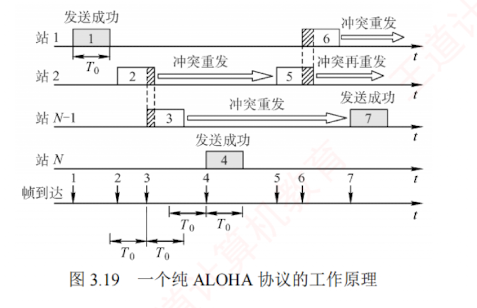
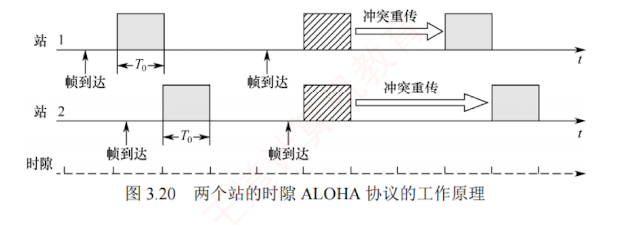

---
### 3.5.2 随机访问介质访问控制

在随机访问协议中，不采用**集中控制**方式来协调各站点的发送次序，而是允许所有用户**根据自身意愿随机发送信息**，并可占用信道的**全部带宽**。  
在**总线形网络**中，当两个或多个用户同时发送信息时，就会产生**冲突**（也称**碰撞**），导致所有冲突用户的发送均以失败告终。  
为解决此类冲突，每个用户需按照特定规则反复重传帧，直至该帧无冲突地成功传输。  
**随机访问介质访问控制**的核心思想是：**通过竞争获得信道使用权，胜者方可发送数据**。

可见，若采用**信道划分**机制，节点之间的通信要么共享时间，要么共享空间，要么两者兼有；  
而若采用**随机访问控制**机制，则节点在发送时既不预留时间，也不独占频段。  
因此，随机访问控制实质上是将**广播信道动态地转化为点到点信道**的机制。

#### 1. ALOHA 协议

ALOHA 协议分为**纯 ALOHA 协议**和**时隙 ALOHA 协议**两种。

##### 1. 纯 ALOHA 协议

纯 ALOHA 协议的**基本思想**：  
当**总线形网络**中的任一站点需要发送数据时，可**立即发送**，无须事先检测信道状态。  
若在一段时间内**未收到确认**，则认为传输过程中发生了**冲突**。  
此时，该站点需**等待一段随机时间后重传**，直至发送成功。

图 3.19 展示了纯 ALOHA 协议的**工作原理**。  
假设所有帧长度固定，帧长不用比特数表示，而用发送该帧所需的时间表示，图中以 $T_0$ 表示这一时间。

在图 3.19 的示例中，站 1 发送帧 1 时，其他站点均未发送数据，因此帧 1 成功传输。  
但随后站 2 和站 $N-1$ 发送的帧 2 与帧 3 在时间上部分重叠，**发生冲突**。  
发生冲突的**各站必须重传**，但不能立即重传（否则会再次冲突），而是**等待一段随机时间**后再尝试。若重传仍冲突，则重复此过程，直至成功。  
图中其他帧的发送情况为：帧 4 成功，帧 5 与帧 6 发生冲突。

由于**冲突概率较高**，该协议的**吞吐量很低**。  
为克服这一缺点，提出了时隙 ALOHA 协议。

##### 2. 时隙 ALOHA 协议

时隙 ALOHA 协议**将时间划分为等长的时隙**（Slot），并要求**所有站点同步时钟**。  
站点只能在每个时隙的**起始时刻**发送帧，且一帧的**发送时间必须小于或等于一个时隙长度**。  
这种约束减少了发送的随意性，从而降低了冲突概率，提高了信道利用率。

图 3.20 展示了两个站点的时隙 ALOHA 协议**工作原理**。  
每个帧到达后，通常需在缓存中**等待不足一个时隙的时间**，才能在**下一个时隙**开始时发送。  
若在**一个时隙内有两个或更多帧待发**，则它们将在下一可用时隙**同时发送**，导致**冲突**。  
冲突后的重传策略与纯 ALOHA 协议类似。

#### 2. CSMA 协议

ALOHA 协议网络的冲突概率较高。  
若每个站点在发送前先**监听信道**，仅在信道空闲时才发送，则可显著降低冲突概率，提高信道利用率。  
**载波监听多路访问**（Carrier Sense Multiple Access, **CSMA**）协议正是基于这一思想，在 ALOHA 协议基础上引入了**载波监听**机制。

根据监听策略及信道忙时的处理方式不同，CSMA 协议可分为以下三种类型。

##### 1. 1-坚持 CSMA 协议
    

1-坚持 CSMA 协议的**基本思想**：  
站点欲发送数据时，先监听信道；若信道空闲，则立即发送；  
若信道忙，则持续监听，直至信道变为空闲。  
“1-坚持”中的“1”表示**信道空闲时，以概率 1 立即发送**，“坚持”指**信道忙时持续监听**。

##### 2. 非坚持 CSMA 协议

非坚持 CSMA 协议的**基本思想**：  
站点欲发送数据时，先监听信道；  
若信道空闲，则立即发送；  
若信道忙，则**不再监听**，而是等待一段随机时间后重新尝试监听。  
该策略避免了多个站点在信道刚空闲时同时发送而导致的冲突，但因随机等待**增加了平均传输时延**。

##### 3. p-坚持 CSMA 协议

p-坚持 CSMA 协议适用于时隙化信道，基本思想：站点在时隙开始时监听信道；若信道忙，则等到下一时隙再监听；若信道空闲，则以概率 $p$ 发送数据，以概率 $1-p$ 推迟到下一时隙再尝试。

该机制通过概率延迟，降低了多个站点同时发送的冲突概率；通过持续监听（而非随机退避），又避免了非坚持 CSMA 协议的过长延迟。因此，p-坚持 CSMA 协议是 1-坚持与非坚持 CSMA 协议的折中。

三种不同类型的 CSMA 协议比较如表 3.1 所示。

---

介绍 ALOHA 协议和基本 CSMA 协议后，自然会引出两种重要的改进方案：CSMA/CD（载波监听多路访问/冲突检测）协议和 CSMA/CA（载波监听多路访问/冲突避免）协议。二者均在 CSMA 协议的基础上引入了冲突处理机制，但针对不同物理介质的特点采用了差异化策略：CSMA/CD 协议适用于有线总线形以太网，通过实时检测冲突并在发生后立即中止发送、执行退避重传，有效提升了通信效率；而 CSMA/CA 协议则专为无线局域网设计，由于无线环境难以有效检测冲突，因此转而采用主动避免机制来降低冲突概率。这两种协议将分别在 3.6.2 节和 3.6.3 节中展开介绍。
