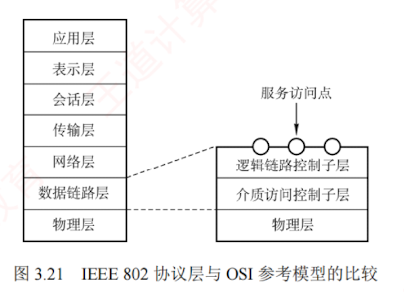

### 3.6.1 局域网的基本概念和体系结构

**局域网**（Local Area Network, **LAN**）是指在一个较小的地理范围（如一所学校）内，将各种**计算机**、**外部设备**和**数据库系统**等通过**双绞线**、**同轴电缆**或**光纤**等传输介质互连起来，构成一个可实现资源和信息共享的计算机网络。其主要**特点**如下：

1. 通常为一个单位所拥有，地理范围和站点数量均有限。
    
2. 所有站点共享较高的**总带宽**（较高的数据传输速率）。
    
3. 具有较低的**传输时延**和较低的**误码率**。
    
4. 各站点**地位平等**，不存在主从关系。
    
5. 支持广播和多播通信。
    

局域网的特性主要由三个要素决定：  
**拓扑结构**、**传输介质**和**介质访问控制方式**，其中介质访问控制方式最为关键，它直接决定局域网的技术特性。  

常见的局域网**拓扑结构**主要有四类：  
① 星形结构；② 环形结构；③ 总线形结构；④ 星形和总线形结合的复合型结构。  

局域网可采用铜缆、双绞线、同轴电缆和光纤等多种传输介质，其中**双绞线是目前的主流选择**。  

局域网的**介质访问控制**方法主要包括：  
CSMA/CD 协议、令牌总线协议和令牌环协议。  
其中，**CSMA/CD 协议**和**令牌总线协议**主要用于**总线形**局域网，而**令牌环协议**则主要用于**环形局域网**。

三种典型的局域网实现及其逻辑与物理拓扑如下：

- **以太网**（目前使用范围最广）。逻辑拓扑为**总线形**结构，物理拓扑为**星形**结构。
    
- **令牌环**（Token Ring，IEEE 802.5）。逻辑拓扑为**环形**结构，物理拓扑为**星形**结构。
    
- **光纤分布数字接口**（FDDI，IEEE 802.8）。逻辑拓扑为**环形**结构，物理拓扑为**双环**结构。
    

IEEE 802 标准定义的局域网参考模型仅对应于 OSI 参考模型的数据链路层和物理层，并将数据链路层进一步拆分为两个子层：**逻辑链路控制**（LLC）子层和**介质访问控制**（MAC）子层。  
与**接入传输介质**有关的内容都放在 MAC 子层，它向上层屏蔽对物理层访问的各种差异，主要功能包括：  
**组帧和拆卸帧**、**比特传输差错检测**、**透明传输**。  
LLC 子层与传输介质无关，它向网络层提供无确认无连接服务、面向连接服务、带确认无连接服务等多种服务类型。

由于以太网在局域网市场中的主导地位，它几乎成为局域网的代名词。  
与此同时，IEEE 802委员会定义的 LLC 子层在实际应用中作用已显著弱化，因此现代许多网卡仅实现 MAC 协议，而不包含 LLC 协议。  

IEEE 802 协议层与 OSI 参考模型的对比关系如图 3.21 所示。

