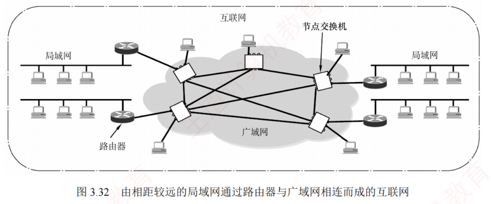
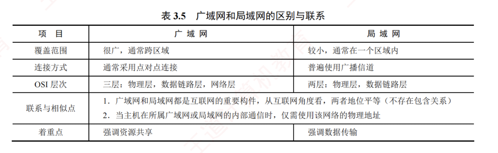

---
### 3.7.1 广域网的基本概念

**广域网**（Wide Area Network, WAN）通常指**覆盖范围很广**（远超一个城市）的**长距离网络**，其主要任务是**长距离运送主机所发送的数据**。  
连接广域网中各节点交换机的链路均为**高速链路**，因此广域网首要考虑的问题是通信容量是否足够大，以支持日益增长的通信需求。

**广域网不等于互联网**。  
互联网可以连接不同类型的网络，通常通过**路由器**实现互联。  
如图 3.32 所示，多个相距较远的局域网可通过**路由器**接入广域网，从而构成一个覆盖范围广泛的互联网。  
因此，**一个局域网可通过广域网与另一个远程局域网通信**。

广域网由若干**节点交换机**（注意**不是路由器**）及连接这些交换机的**链路**组成。  
节点交换机与路由器都用于**转发分组**，工作原理相似；  
但节点交换机工作在**单个网络内部**，而路由器用于连接多个网络构成的互联网。  
节点交换机的核心功能是**存储并转发分组**。  
广域网中节点之间采用**点到点连接**，但为提高网络可靠性，一个节点交换机通常与多个其他交换机相连。

在通信线路质量较差的年代，**高级数据链路控制**（HDLC）因其**可靠的传输机制**而成为**主流的数据链路层协议**。  
如今，在误码率极低的点对点有线链路上，更简单的**点对点协议**（**PPP**）则成为使用最广泛的数据链路层协议。

#### 广域网和局域网的区别与联系

