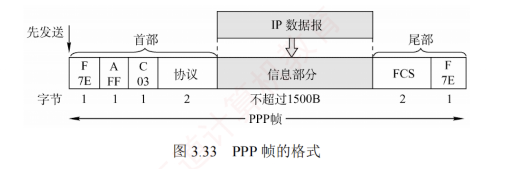
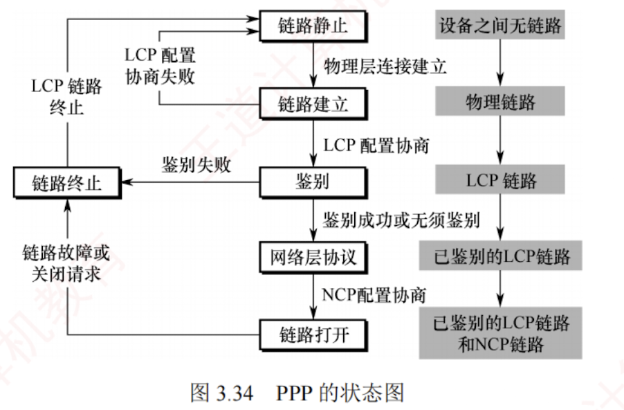

---

### 3.7.2 点对点协议

**点对点协议**（Point-to-Point Protocol, **PPP**）是目前最流行的**点对点链路控制协议**。  
主要有两种应用场景：  
**用户**接入互联网时与 **ISP** 之间的通信；  
两台网络设备之间通过**直连专线**通信。

在**以太网**中运行的 PPP 称为 **PPPoE**（PPP over Ethernet），它是对 **PPP 的扩展**。  
PPPoE 将 PPP 帧封装在**以太网帧**中，用户通过 ADSL 宽带上网时使用的就是 PPPoE。

PPP 由以下三个部分组成：

1. **一个链路控制协议**（**LCP**）。用来建立、配置、测试数据链路连接，及协商一些选项。
    
2. **一套网络控制协议**（**NCP**）。PPP 支持多种网络层协议（如 IP、IPX 等），每种网络层协议需通过对应的 NCP 进行配置，以建立和管理其逻辑连接。
    
3. **一种将 IP 数据报封装到串行链路的方法**。IP 数据报作为 PPP 帧的信息部分被封装在 PPP 帧中传输，其长度受**最大传送单元**（**MTU**）限制。
    

PPP 帧的格式如图 3.33 所示，首部包含 4 个字段，尾部包含 2 个字段。

1. **标志字段**（F）。首部和尾部各有一个，占 **1B**，规定为 0x7E（01111110），用作**帧的定界符**，标识帧的开始与结束。  
   为实现透明传输，当信息段中出现与标志字段相同的比特模式时，需要采取**填充**措施：  
   当 PPP 使用**异步传输**时，采用**字节填充法**，使用的转义字符为 0x7D（01111101）；  
   当 PPP 使用**同步传输**时，采用**零比特填充法**。  
   [[为什么异步采用字符填充，同步采用零比特填充]]
    
2. **地址字段**（A）。占 1B，规定为 0xFF，其意义暂未定义。
    
3. **控制字段**（C）。占 1B，规定为 0x03，其意义也暂未定义。
    
4. **协议字段**。占 2B，用于标识信息字段所承载的**分组类型**。  
   若为 0x0021，表示信息字段为 IP 数据报；  
   若为 0xC021，表示信息字段为 LCP 分组。
    
5. **信息字段**。长度可变，范围为 0~1500B。
    

> 注意
> 
> 由于 PPP 是点对点链路上（而非总线形网络），无须使用 CSMA/CD 协议，因此**不存在最短帧长的限制**，其信息字段最小可为 0B（相比之下，以太网帧的数据部分至少需 46B）。

6. **帧检验序列**（FCS）。占 2B，采用 **CRC 校验生成的冗余码**，用于差错检测。
    

以**用户拨号接入 ISP 的过程**为例：  
用户拨号后，首先建立一条从用户到 ISP 的**物理层连接**；  
随后，用户向 ISP 发送一系列 **LCP 分组**（封装为 **PPP 帧**），协商链路参数并建立 LCP 连接；  
接着通过 NCP 配置网络层，ISP 为用户分配一个**临时 IP 地址**；  
通信结束后，依次释放网络层、数据链路层和物理层连接。  
PPP 的状态转换如图 3.34 所示。

**具体解释**如下：

1. PPP 链路的起始和终止均为**链路静止状态**，此时用户与 ISP 之间无物理层连接。
    
2. 当检测到调制解调器的载波信号并成功建立**物理层连接**后，PPP 进入**链路建立状态**。
    
3. 在**链路建立状态**下，LCP 开始协商**配置选项**（如最大帧长、鉴别协议等）。  
   若**协商成功**，则 **LCP 链路建立完成**，PPP 进入**鉴别状态**。  
   若**协商失败**，则退回到**链路静止状态**。
    
4. 在**鉴别状态**下，若通信双方无须鉴别或身份鉴别成功，则进入**网络层协议状态**。  
   若**鉴别失败**，则直接进入**链路终止状态**。
    
5. 在**网络层协议状态**下，双方通过 **NCP** 配置**网络层参数**（如分配 IP 地址），配置完成后，PPP 进入**链路打开状态**，双方即可开始**数据通信**。
    
6. 数据通信结束后，若一方发送终止请求并在收到确认后，或链路发生故障，PPP 将进入**链路终止状态**；  
   待调制解调器的载波信号停止后，最终返回链路静止状态。
    

PPP 的**主要特点**如下：

1. PPP 在链路建立阶段使用**确认机制**，但在数据传输阶段仅提供无**差错接收**（通过 CRC 检验），不使用序号与确认机制，因此提供的是**不可靠服务**。
    
2. PPP 仅支持**全双工的点对点链路**，不支持多点线路。
    
3. PPP 链路**两端可运行不同的网络层协议**，但仍能通过同一 PPP 链路进行通信。
    
4. PPP 是**面向字节的协议**，所有 PPP 帧的长度均为整数个字节。
    

---
