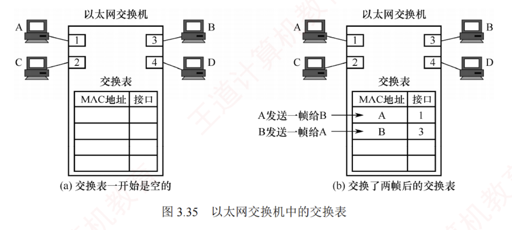

---

### 3.8.2 以太网交换机

#### 1. 交换机的原理和特点

**以太网交换机**也称**二层交换机**，其中“二层”指其工作在**数据链路层**。  
从实质上讲，它是一个**多端口**的**网桥**，能够将网络划分为多个较小的冲突域，从而为每个用户提供更高的带宽。

在使用**集线**器构建的传统**共享式以太网**中，所有用户**共享同一传输介质**。  
例如，在 10Mb/s 网络中，若有 $N$ 个用户，则每个用户的平均可用带宽仅为总带宽的 $1/N$，且在通信过程中极易发生冲突。  
而使用以太网交换机构建的**交换式以太网**则完全不同：  
**每个端口提供独立的信道**，主机通信时**独占端口带宽**（如 10Mb/s），无须与其他用户竞争介质。  
因此，一台有 $N$ 个端口的交换机的**总吞吐量**可达 $N \times 10\text{Mb/s}$，这正是交换机的最大优势所在。

##### 以太网交换机的特点

1. 当交换机端口直接连接主机或其他交换机时，通常工作在**全双工方式**。
    
2. 交换机具有**并行性**，可同时连通**多对端口**，使每对通信主机都能无冲突地传输数据，因此无须使用 CSMA/CD 协议。
    
3. 当交换机端口连接**集线器**时，由于集线器连接的所有设备均处于**同一冲突域**中，必须使用 **CSMA/CD 协议**，且只能工作在**半双工方式**。
    
4. 交换机是一种**即插即用**设备，其内部的帧转发表是通过**自学习**算法，基于网络中各主机间的实际通信自动建立和更新的。
    
5. 交换机采用**专用交换结构芯片**，因此交换速率较高。
    

##### 以太网交换机的两种交换方式

以太网交换机主要采用**两种交换模式**：

1. **直通交换方式**。接收到帧的**目的 MAC 地址**后，立即决定转发端口，无须等待整个帧接收完毕。  
   该方式的**转发时延非常小**，缺点是**不进行差错检测**，因此可能将一些**无效帧**转发给其他站。  
   因此，直通交换不适用于需要速率匹配、协议转换或差错检测的场景。
    
2. **存储转发交换方式**。先完整接收并缓存**整个帧**，然后检查帧是否正确（可能还需要进行速率匹配或协议转换），若帧正确，则根据目的 MAC 地址转发；  
   若帧出错，则直接丢弃。  
   其优点是**可靠性高**，且支持**不同速率端口**之间的通信；  
   缺点是**转发时延较大**。
    
[[直通交换方式和存储转发交换方式的对比]]  

交换机通常配备**多种速率的端口**，如 10Mb/s、100Mb/s 端口，以及多速率自适应端口。

#### 2. 交换机的自学习功能

以太网交换机的**转发和过滤**决策基于**帧的 MAC 地址**。  
其中，**过滤是指决定是否丢弃一个帧**，而**转发则是指决定将帧从哪个端口送出**。  
这两项功能依赖于交换机的**交换表**。  
每个表项至少包含两个字段：  
主机的 **MAC 地址**；  
该主机所连接的**交换机端口号**。 

例如，在图 3.35 中，一台 4 端口的交换机分别连接四台计算机，其 MAC 地址分别为 A、B、C 和 D。交换表初始为空。

交换机通过**自学习算法**动态构建并维护**转发表**，收到数据帧后，执行以下步骤：

1. **学习源 MAC 地址**：交换机读取帧的源 MAC 地址，并将 {MAC 地址，入端口} 写入或更新到**交换表**。  
   这一过程称为**自学习**，可使交换机动态掌握各主机的连接位置。
    
2. **查看目的 MAC 地址**：交换机解析帧的**目的 MAC 地址**，并根据其类型（单播、广播或组播）采取相应的**转发策略**。
    
3. **决策与转发**：
    
    - 为**单播帧**（**目的 MAC 地址为普通主机地址**）时，交换机在交换表中查找该**目的地址**：  
      若**找到对应表项**（已知目的地址），则**仅从该表项所指端口转发**，实现**精准交付**；  
      若**未找到对应表项**（未知目的地址），则执行未知单播帧**泛洪**（或称洪泛），即将帧从除接收端口外的所有其他活动端口转发出去，确保目标主机能收到。
        
    - 为**广播帧**（目的 MAC 地址为 FF:FF:FF:FF:FF:FF）时，交换机不查询转发表，直接将帧**泛洪**到**除接收端口外的所有其他活动端口**。
        
    - 为**组播帧**（目的地址为组播 MAC 地址）时，交换机通常也默认执行**泛洪**处理。
        

假设主机 A 从端口 1 向主机 B 发送帧。  
交换机收到后，**学习源地址**：  
将 {A, 1} 写入交换表，此后任何发往主机 A 的帧都将从端口 1 转发。  
执行未知目的地址**泛洪**：  
未找到主机 B 的对应表项，将帧发送到端口 2、3、4（除端口 1 外）。  
主机 C 和 D 收到帧后，发现目的地址非自身，丢弃该帧；  
仅主机 B 接收。

随后，假设主机 B 从端口 3 向主机 A 回复帧。  
交换机收到后，**学习源地址**：  
将 {B, 3} 写入交换表。  
执行已知目的地址**精准交付**：  
查表发现主机 A 对应端口 1，于是直接从端口 1 单播转发该帧。  
至此，交换机已通过“A$\to$B”和“B$\to$A”的通信，完整学习了主机 A 与 B 的位置信息。  
随着时间的推移，只要主机 C 和 D 也主动发送帧，交换机便会**逐步学习**其 **MAC 地址与端口的映射关系**。  
最终，**交换表将包含所有活跃主机的信息**，实现高效、精准的转发。

由于网络中的主机位置**动态变化**，交换表必须具备**自动更新**的能力。  
为此，每个表项均设有**老化时间**，超时未更新的表项会被**自动删除**，以确保表项始终反映当前网络的**实际连接状态**。

为了提高**可靠性**，以太网交换机组网中常引入**冗余链路**，但可能形成**环路**，导致广播风暴和帧无限循环。  
为此，交换机采用**生成树协议**（**STP**），在不改变物理拓扑的前提下，通过逻辑阻塞部分冗余端口，构建一棵覆盖所有交换机的无环生成树，确保任意两台主机间仅有一条有效路径，从而消除环路。  
同时，当主链路出现故障时，STP 可重新激活被阻塞端口，恢复连通性，实现自动容错。

