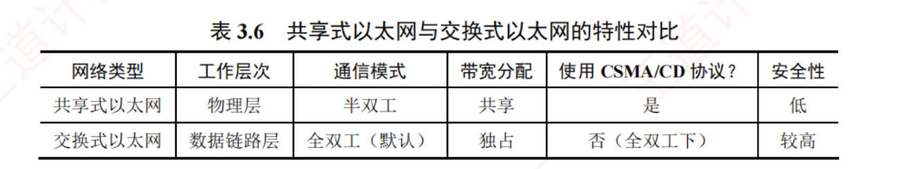

---

### 3.8.3 共享式以太网

#### 1. 共享式以太网的基本特点

**共享式以太网**是指以**集线器**（Hub）为中心连接设备构建的局域网。  
所有主机通过**双绞线**接入集线器，**共享**同一物理传输介质和总带宽。  
从逻辑上看，整个网络构成单一的局域网网段，所有通信均发生在**同一个冲突域和广播域**中。

共享式以太网的**主要特点**如下：

1. **工作在物理层**：集线器仅对电信号进行放大和再生，不具备帧解析能力，无法识别 MAC 地址，也无任何智能转发或过滤功能。
    
2. **采用半双工通信和 CSMA/CD 协议**：由于介质共享，任意时刻只能有一对主机成功通信，其他发送尝试将引发冲突，必须依赖 CSMA/CD 协议进行冲突检测与退避。
    
3. **单一冲突域与广播域**：所有主机处于同一个冲突域和同一个广播域内。
    
4. **带宽共享，效率低下**：若网络中有 $N$ 台主机，则每台主机的平均带宽仅为总带宽的 $1/N$。
    
5. **盲目广播所有帧**：集线器将接收到的帧无差别地转发至所有其他端口，各主机需自行判断是否接收，不仅浪费带宽，还存在通信隐私泄露的风险。
    

正由于上述缺陷，共享式以太网早已于 20 世纪末退出历史舞台，现代网络不再部署。

#### 2. 共享式与交换式以太网的转发行为对比

假设交换机已建立**完整的转发表**，以下从三种典型场景分析两类网络的处理差异：

1. **主机发送普通单播帧**。  
   对于**共享式以太网**，集线器将帧转发到除接收端口外的所有端口，各主机网卡根据帧的目的 MAC 地址决定是否接收。  
   对于**交换式以太网**，交换机查询转发表后，仅将帧从目标主机所在的端口转发，其他主机完全无感知。
    
2. **主机发送广播帧**。  
   对于**共享式以太网**，集线器将帧转发到除接收端口外的所有端口，各主机网卡识别目的 MAC 地址为广播地址后接收该帧。  
   对于**交换式以太网**，交换机识别目的 MAC 地址为广播地址，执行**泛洪处理**，各主机收到该广播帧后予以接收。  
   两种情况效果相同，但原理不同：前者是物理层**盲目**复制，后者是数据链路层**有意识**泛洪。
    
3. **多对主机同时通信**。  
   对于**共享式以太网**，必然发生**冲突**，需执行 **CSMA/CD 协议**的退避重传机制。  
   对于**交换式以太网**，支持**多端口并行交互**，各对通信互不干扰。
    

可见，集线器既不隔离广播域，也不隔离冲突域，而交换机不隔离广播域，但隔离冲突域。  

共享式以太网与交换式以太网的特性对比见表 3.6 所示。

